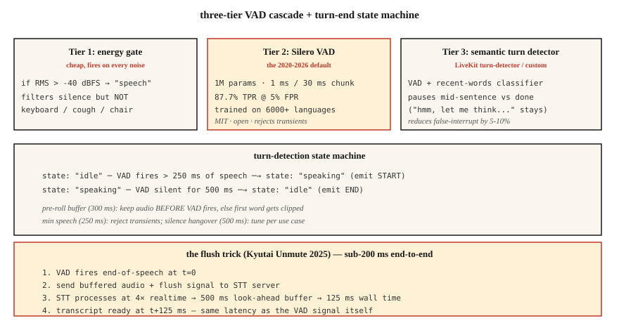

# 语音活动检测与话轮交替：Silero、Cobra 和强制输出技巧

> 每个语音智能体（voice agent）的成败都取决于两个判断：用户现在是否正在说话，以及用户是否已经说完？语音活动检测（Voice Activity Detection，VAD）回答前一个问题。话轮检测（turn detection，由 VAD + 静音延续等待时长（silence hangover）+ 语义端点模型（semantic endpoint model）组成）回答后一个问题。任何一个判断出错，你的助手就会要么打断用户，要么说个不停。

**Type:** Build
**Languages:** Python
**Prerequisites:** 阶段 6 · 11（实时音频）、阶段 6 · 12（语音助手）
**Time:** ~45 分钟

## 要解决的问题

语音智能体对每个 20 ms 的音频块（chunk）都要作出三个不同的判断：

1. **这一帧（frame）是语音吗？** — VAD，逐帧进行二分类判断。
2. **用户开始一段新的话语（utterance）了吗？** — 起始检测（onset detection）。
3. **用户说完了吗？** — 端点检测（end-pointing），即判断话轮结束（turn-end）。

最简单的做法是使用能量阈值（energy threshold），但只要遇到噪声就会失效，无论是车流声、键盘声还是人群嘈杂声。2026 年的答案是：Silero VAD（开放的深度学习模型）+ 话轮检测模型（语义端点检测，semantic endpointing）+ 根据 VAD 校准的静音延续等待时长。

## 核心概念



### 三级 VAD 级联（cascade）

**第 1 级：能量门控（energy gate）。** 成本最低。以 -40 dBFS（满刻度分贝）为阈值对 RMS（均方根）进行判断。它能过滤明显的静音，但任何超过阈值的噪声都会触发它。

**第 2 级：Silero VAD**（2020-2026，MIT）。参数量为 1M（百万）。使用 6000+ 种语言训练。在单个 CPU（中央处理器）线程上，处理每个 30 ms 音频块耗时 ~1 ms。在假阳性率（FPR）为 5% 时，真阳性率（TPR）为 87.7%。这是开源方案的默认选择。

**第 3 级：语义话轮检测器。** 使用 LiveKit 的话轮检测模型（2024-2026），或你自己的小型分类器。它区分“说到一半停顿”和“已经说完”，利用语言上下文（语调 + 最近说过的词），而非仅依据静音。

### 关键参数及其默认值

- **阈值（threshold）。** Silero 输出一个概率；概率 &gt; 0.5 时判为语音（默认），或采用 &gt; 0.3（更灵敏）。阈值越低，首词截断（first-word clip）越少，但假阳性（false positive）越多。
- **最短语音时长（minimum speech duration）。** 拒绝短于 250 ms 的语音，这些通常是咳嗽声或椅子发出的噪声。
- **静音延续等待时长（端点检测）。** VAD 返回 0 后，等待 500-800 ms，再判定话轮结束。太短 → 打断用户。太长 → 感觉反应迟钝。
- **预留音频缓冲区（pre-roll buffer）。** 保留 VAD 触发之前 300-500 ms 的音频，防止“嘿”被截掉。

### 强制输出技巧（Kyutai 2025）

流式语音转文本（streaming STT）模型存在前瞻延迟（look-ahead delay）：Kyutai STT-1B 为 500 ms，STT-2.6B 为 2.5 s。通常，语音结束后还要等这么久才能拿到转写文本（transcript）。强制输出技巧（flush trick）的做法是：当 VAD 触发语音结束事件时，**向 STT 发送强制输出信号（flush signal）**，让它立即输出。STT 的处理速度为实时速度的 ~4×，因此处理完 500 ms 的缓冲音频只需 ~125 ms。

端到端：125 ms 的 VAD + 强制输出 STT = 适合对话的延迟。

### 2026 年 VAD 对比

| VAD | TPR @ 5% FPR | 延迟 | 许可 |
|-----|--------------|---------|---------|
| WebRTC VAD（Google，2013） | 50.0% | 30 ms | BSD |
| Silero VAD（2020-2026） | 87.7% | ~1 ms | MIT |
| Cobra VAD（Picovoice） | 98.9% | ~1 ms | 商业许可 |
| pyannote segmentation | 95% | ~10 ms | MIT-ish |

Silero 是合适的默认选择。Cobra 是合规性 / 准确率方面的升级选项。仅基于能量的 VAD 不应出现在 2026 年的生产环境中。

```figure
sp-vad-cascade
```

## 动手实现

### 步骤 1：能量门控

```python
def energy_vad(chunk, threshold_dbfs=-40.0):
    rms = (sum(x * x for x in chunk) / len(chunk)) ** 0.5
    dbfs = 20.0 * math.log10(max(rms, 1e-10))
    return dbfs > threshold_dbfs
```

### 步骤 2：在 Python 中使用 Silero VAD

```python
from silero_vad import load_silero_vad, get_speech_timestamps

vad = load_silero_vad()
audio = torch.tensor(waveform_16k, dtype=torch.float32)
segments = get_speech_timestamps(
    audio, vad, sampling_rate=16000,
    threshold=0.5,
    min_speech_duration_ms=250,
    min_silence_duration_ms=500,
    speech_pad_ms=300,
)
for s in segments:
    print(f"{s['start']/16000:.2f}s - {s['end']/16000:.2f}s")
```

### 步骤 3：话轮结束状态机（state machine）

```python
class TurnDetector:
    def __init__(self, silence_hangover_ms=500, min_speech_ms=250):
        self.state = "idle"
        self.speech_ms = 0
        self.silence_ms = 0
        self.silence_hangover_ms = silence_hangover_ms
        self.min_speech_ms = min_speech_ms

    def update(self, is_speech, chunk_ms=20):
        if is_speech:
            self.speech_ms += chunk_ms
            self.silence_ms = 0
            if self.state == "idle" and self.speech_ms >= self.min_speech_ms:
                self.state = "speaking"
                return "START"
        else:
            self.silence_ms += chunk_ms
            if self.state == "speaking" and self.silence_ms >= self.silence_hangover_ms:
                self.state = "idle"
                self.speech_ms = 0
                return "END"
        return None
```

### 步骤 4：强制输出技巧的代码骨架

```python
def flush_on_end(stt_client, audio_buffer):
    stt_client.send_audio(audio_buffer)
    stt_client.send_flush()
    return stt_client.recv_transcript(timeout_ms=150)
```

要使这个方法奏效，STT（Kyutai、Deepgram、AssemblyAI）必须支持强制输出。Whisper 的流式处理不支持这种方式，因为它基于块处理，总要等待音频块。

## 实际使用

| 场景 | VAD 选择 |
|-----------|-----------|
| 开放、快速、通用 | Silero VAD |
| 商业呼叫中心 | Cobra VAD |
| 设备端（手机） | Silero VAD ONNX（开放神经网络交换格式） |
| 研究 / 说话人分离（diarization） | pyannote segmentation |
| 零依赖回退方案（fallback） | WebRTC VAD（旧方案） |
| 需要高质量的话轮结束判断 | 分层组合 Silero + LiveKit turn-detector |

经验法则：除非实在别无选择，否则绝不要交付仅基于能量的 VAD。

## 常见陷阱

- **固定阈值。** 安静时有效，嘈杂时失效。要么在设备端校准，要么改用 Silero。
- **静音延续等待时长太短。** 智能体会在用户说到一半时打断。对于对话语音，500-800 ms 是理想范围。
- **等待时长太长。** 感觉反应迟钝。请面向目标用户进行 A/B 测试。
- **没有预留音频缓冲区。** 用户音频开头的 200-300 ms 会丢失。始终用滚动缓冲区（rolling buffer）保留触发前的音频。
- **忽略语义端点检测。** “嗯，让我想想……”中会有长停顿。用户讨厌思路还没说完就被打断。请使用 LiveKit 的话轮检测器或类似方案。

## 交付成果

保存为 `outputs/skill-vad-tuner.md`。针对一个工作负载（workload），选择 VAD 模型、阈值、静音延续等待时长、预留音频和话轮检测策略。

## 练习

1. **简单。** 运行 `code/main.py`。它模拟一个语音 + 静音 + 语音 + 咳嗽声序列，并测试三级 VAD。
2. **中等。** 安装 `silero-vad`，处理一段 5 分钟的录音，调整阈值，让首词截断和误触发（false trigger）都尽可能少。报告精确率（precision）/ 召回率（recall）。
3. **困难。** 构建一个小型话轮检测器：Silero VAD + 一个 3 层多层感知机（MLP），输入为最近 10 个词的嵌入（embedding，使用 sentence-transformers）。在人工标注的话轮结束数据集上训练。让 F1 分数（精确率与召回率的调和平均）比仅使用 Silero 高 10%。

## 关键术语

| 术语 | 常见说法 | 实际含义 |
|------|-----------------|-----------------------|
| VAD | 语音检测器 | 逐帧二分类：这是语音吗？ |
| 话轮检测 | 端点检测 | VAD + 静音延续等待时长 + 语义端点。 |
| 静音延续等待时长 | 说完之后等一等 | 判定话轮结束前的等待时间；500-800 ms。 |
| 预留音频 | 语音前缓冲区 | 保留 VAD 触发之前 300-500 ms 的音频。 |
| 强制输出技巧 | Kyutai 的巧妙办法 | VAD → 强制输出 STT → 延迟由 500 ms 降为 125 ms。 |
| 语义端点 | “对方是有意停下来的吗？” | 关注词语、而不只是静音的机器学习（ML）分类器。 |
| TPR @ FPR 5% | 受试者工作特征曲线（ROC）上的工作点 | 标准 VAD 基准；Silero 为 87.7%，WebRTC 为 50%。 |

## 延伸阅读

- [Silero VAD](https://github.com/snakers4/silero-vad) — 开放 VAD 的参考实现。
- [Picovoice Cobra VAD](https://picovoice.ai/products/voice/voice-activity-detection/) — 准确率领先的商业方案。
- [Kyutai — Unmute + flush trick](https://kyutai.org/stt) — 将延迟降至低于 200 ms 的工程技巧。
- [LiveKit — turn detection](https://docs.livekit.io/agents/logic/turns/) — 生产环境中的语义端点检测。
- [WebRTC VAD](https://webrtc.googlesource.com/src/) — 旧有基线。
- [pyannote segmentation](https://github.com/pyannote/pyannote-audio) — 达到说话人分离要求的分段方案。
