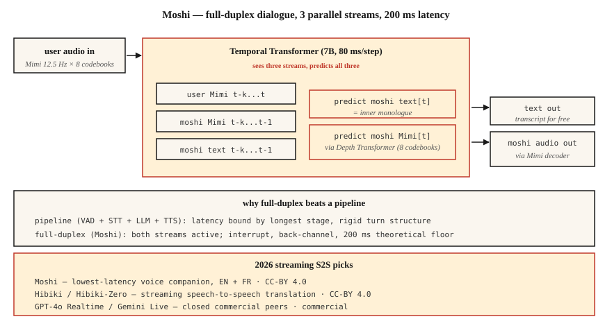

# 流式语音到语音：Moshi、Hibiki 与全双工对话

> 2024-2026 年重新定义了语音 AI。Moshi 用单个模型实现同时聆听和说话，延迟（latency）为 200 ms。Hibiki 逐个音频块（chunk）进行语音到语音（speech-to-speech）翻译。两者都放弃了自动语音识别（ASR）→ 大语言模型（LLM）→ 文本转语音（TTS）管线（pipeline），改用基于 Mimi 编解码器（codec）token（词元）的统一全双工（full-duplex）架构。这就是新的参考设计。

**Type:** Learn
**Languages:** Python
**Prerequisites:** 阶段 6 · 13（神经音频编解码器，Neural Audio Codecs）、阶段 6 · 11（实时音频）、阶段 7 · 05（完整 Transformer）
**Time:** ~75 分钟

## 要解决的问题

基于第 11 + 12 课构建的每个语音智能体（voice agent），都有约 300-500 ms 的固有延迟下限（latency floor）：语音活动检测（VAD）触发后，语音转文本（STT）进行处理，LLM 推理，TTS 生成。每个阶段都有自身的最低延迟。你可以调优，也可以并行化，但管线的结构决定了优化的极限。

Moshi（Kyutai，2024-2026）提出了另一个问题：如果根本没有管线呢？如果一个模型能持续接收音频并直接输出音频，而文本只是中间的“内在独白”（inner monologue），不再是一个必经阶段呢？

答案就是 **全双工语音到语音**。理论延迟为 160 ms（80 ms 的 Mimi 帧（frame）+ 80 ms 的声学延迟（acoustic delay））。在单张 L4 GPU 上，实际延迟为 200 ms。这只有顶尖管线式语音智能体延迟的一半。

## 核心概念



### Moshi 架构

**输入。** 两路 Mimi 编解码器流（stream），均为 12.5 Hz × 8 个码本（codebook）：

- 流 1：用户音频流（audio stream，经 Mimi 编码，持续到达）
- 流 2：Moshi 自身的音频（由 Moshi 生成）

**Transformer。** 一个参数量为 7B 的时序 Transformer（Temporal Transformer）处理这两路流，以及一路文本“内在独白”流（text stream）。每个 80 ms 的时间步中，它会：

1. 接收最新的用户 Mimi token（8 个码本）。
2. 接收刚生成的最新 Moshi Mimi token（8 个码本）。
3. 生成下一个 Moshi 文本 token（内在独白）。
4. 生成接下来的 Moshi Mimi token（通过一个小型深度 Transformer（Depth Transformer）生成 8 个码本的 token）。

用户音频、Moshi 音频、Moshi 文本这三路流并行运行。Moshi 可以边说边听；可以在用户打断时停止自己正在说的话；也可以给出附和回应（back-channeling，如“mhm”），同时不打断自己的主要话语（utterance）。

**深度 Transformer。** 在同一帧内，8 个码本不是并行预测的，因为它们之间存在码本间依赖（inter-codebook dependencies）。一个小型的 2 层“深度 Transformer”会在 80 ms 内依次预测这些码本。这是自回归编解码器语言模型（AR codec LMs）的标准分解方式（factorization），VALL-E 和 VibeVoice 也采用了这种方式。

### 为什么内在独白文本有帮助

没有显式文本时，模型必须在声学流（acoustic stream）中隐式地对语言建模。Moshi 的思路是：强制模型在输出音频的同时输出文本 token。文本流本质上就是 Moshi 所说内容的转写文本（transcript）。这样既能提升语义连贯性（semantic coherence），又能让语言模型输出头（language model head）更容易替换，还能顺带得到转写文本。

### Hibiki：流式语音到语音翻译

架构相同，使用翻译配对数据进行训练。源语言音频持续输入，目标语言音频持续输出。Hibiki-Zero（Feb 2026）不再需要词级对齐（word-level alignment）的训练数据，而是使用句级（sentence-level）数据 + GRPO 强化学习（reinforcement learning）来优化延迟。

最初支持四个语言对（language pair）；使用 ≈1000 小时的数据即可适配一种新语言。

### 更完整的 Kyutai 技术栈（2026）

- **Moshi**：全双工对话（优先支持法语，对英语的支持也很好）
- **Hibiki / Hibiki-Zero**：同声语音翻译（simultaneous speech translation）
- **Kyutai STT**：流式自动语音识别（streaming ASR），前瞻（look-ahead）为 500 ms 或 2.5 s
- **Kyutai Pocket TTS**：参数量为 100M、可在 CPU 上运行的 TTS（Jan 2026）
- **Unmute**：在公共服务器上将这些组件组合起来的完整管线

在 L40S GPU 上的吞吐量（throughput）：以 3× 实时速度处理 64 个并发会话（concurrent sessions）。

### Sesame CSM：采用相近思路的模型

Sesame CSM（2025）采用了类似思路：Llama-3 主干网络（backbone）搭配 Mimi 编解码器输出头（codec head）。不过，CSM 是单向（single-directional）的：接收上下文 + 文本，生成语音，并非全双工。它是市面上“声音临场感”（voice presence）最好的 TTS，但这与 Moshi 的全双工能力并不完全相同。

### 2026 年的性能数据

| 模型 | 延迟 | 使用场景 | 许可证 |
|-------|---------|----------|---------|
| Moshi | 200 ms（L4） | 英语 / 法语全双工对话 | CC-BY 4.0 |
| Hibiki | 12.5 Hz 帧率（frame rate） | 法语 ↔ 英语流式翻译 | CC-BY 4.0 |
| Hibiki-Zero | 同上 | 5 个语言对，无需对齐数据 | CC-BY 4.0 |
| Sesame CSM-1B | 200 ms 首段音频延迟（TTFA） | 以上下文为条件的（context-conditioned）TTS | Apache-2.0 |
| GPT-4o Realtime | ~300 ms | 闭源，OpenAI API（应用程序编程接口） | 商业许可 |
| Gemini 2.5 Live | ~350 ms | 闭源，Google API | 商业许可 |

```figure
sp-fullduplex
```

## 动手实现

### 步骤 1：接口

Moshi 提供一个 WebSocket 服务器，接收经 Mimi 编码的 80 ms 音频块，并返回经 Mimi 编码的 80 ms 音频块。两个方向都在持续传输。

```python
import asyncio
import websockets
from moshi.client_utils import encode_audio_mimi, decode_audio_mimi

async def moshi_chat():
    async with websockets.connect("ws://localhost:8998/api/chat") as ws:
        mic_task = asyncio.create_task(stream_mic_to(ws))
        spk_task = asyncio.create_task(stream_from_to_speaker(ws))
        await asyncio.gather(mic_task, spk_task)
```

### 步骤 2：全双工循环

```python
async def stream_mic_to(ws):
    async for chunk_80ms in mic_stream_at_12_5_hz():
        mimi_tokens = encode_audio_mimi(chunk_80ms)
        await ws.send(serialize(mimi_tokens))

async def stream_from_to_speaker(ws):
    async for msg in ws:
        mimi_tokens, text_token = deserialize(msg)
        audio = decode_audio_mimi(mimi_tokens)
        await play(audio)
```

两个方向同时运行。通常用 Python asyncio 或 Rust futures 来实现传输层（transport）。

### 步骤 3：训练目标（training objective，概念说明）

对于每个 80 ms 的帧 `t`：

- 输入：`user_mimi[0..t]`、`moshi_mimi[0..t-1]`、`moshi_text[0..t-1]`
- 预测：先预测 `moshi_text[t]`，再预测 `moshi_mimi[t, codebook_0..7]`

先预测文本（内在独白），再预测音频；音频在深度 Transformer 内按码本顺序预测。

### 步骤 4：Moshi 的优势与不足

Moshi 的优势：

- 在便宜的硬件上，端到端（end-to-end）延迟低于 250 ms。
- 自然的附和与打断（interruption）。
- 无需编写管线衔接代码（glue code）。

Moshi 不占优势的方面：

- 工具调用（tool calling）：它没有为此接受训练，需要单独的 LLM 路径。
- 较长的推理过程：Moshi 是一个约 8B 参数的对话模型，不是 Claude/GPT-4。
- 小众主题上的事实准确性。
- 大多数生产环境中的企业使用场景：到了 2026 年，这些场景仍然使用管线。

## 实际使用

| 场景 | 选择 |
|-----------|------|
| 追求最低延迟的语音伙伴 | Moshi |
| 实时翻译通话 | Hibiki |
| 语音演示 / 研究 | Moshi、CSM |
| 带工具的企业智能体 | 管线（第 12 课），而非 Moshi |
| 基于上下文、使用定制声音的 TTS | Sesame CSM |
| 任意语言的语音到语音 | GPT-4o Realtime 或 Gemini 2.5 Live（商业产品） |

## 常见陷阱

- **工具调用能力有限。** Moshi 是对话模型，不是智能体框架。需要工具时，要结合管线。
- **特定声音条件化（specific-voice conditioning）。** Moshi 使用单一的、经过训练的角色设定（persona）；声音克隆（voice cloning）需要单独进行一次训练。
- **语言覆盖范围。** 法语 + 英语表现出色，其他语言的支持有限。Hibiki-Zero 有所帮助，但仍需要训练数据。
- **资源成本。** 一个完整的 Moshi 会话会占用一个 GPU 资源槽位（GPU slot），并不属于低成本的多租户共享部署方式（shared-tenant deploy pattern）。

## 交付成果

保存为 `outputs/skill-duplex-pipeline.md`。针对某个语音智能体工作负载，在管线架构与全双工架构之间作出选择，并说明理由。

## 练习

1. **简单。** 运行 `code/main.py`。它用符号化的方式模拟双流 + 内在独白架构。
2. **中等。** 从 HuggingFace 拉取 Moshi，运行服务器并测试一次对话。测量从用户说话结束到 Moshi 开始回应之间的实际耗时（wall-clock latency）。
3. **困难。** 使用你在第 12 课构建的管线式智能体，在 20 条相同的测试话语上比较它与 Moshi 的 P50（中位数）延迟。写明在什么情况下，管线在架构上仍然更有优势。

## 关键术语

| 术语 | 常见说法 | 实际含义 |
|------|-----------------|-----------------------|
| 全双工 | 边听边说 | 同一个模型上的两路音频流同时处于活动状态。 |
| 内在独白 | 模型的文本流 | Moshi 在输出音频的同时输出文本 token。 |
| 深度 Transformer | 码本间预测器 | 在一个 80 ms 帧内预测 8 个码本的小型 Transformer。 |
| Mimi | Kyutai 的编解码器 | 12.5 Hz × 8 个码本；语义（semantic）+ 声学（acoustic）；为 Moshi 提供支持。 |
| 流式语音到语音（streaming speech-to-speech，S2S） | 实时音频 → 音频 | 逐块翻译或对话，不设管线阶段。 |
| 附和回应 | “Mhm”式回应 | Moshi 可以发出简短的回应，同时不中断自己的话轮（turn）。 |

## 延伸阅读

- [Défossez 等（2024）。Moshi：语音-文本基础模型](https://arxiv.org/html/2410.00037v2)：论文。
- [Kyutai Labs（2026）。Hibiki-Zero](https://arxiv.org/abs/2602.12345)：无需对齐数据的流式翻译。
- [Sesame（2025）。跨越声音的恐怖谷](https://www.sesame.com/research/crossing_the_uncanny_valley_of_voice)：CSM 规范。
- [Kyutai：Moshi 仓库](https://github.com/kyutai-labs/moshi)：安装与服务器。
- [OpenAI：Realtime API](https://platform.openai.com/docs/guides/realtime)：闭源商业同类产品。
- [Kyutai：Delayed Streams Modeling](https://github.com/kyutai-labs/delayed-streams-modeling)：底层的 STT/TTS 框架。
