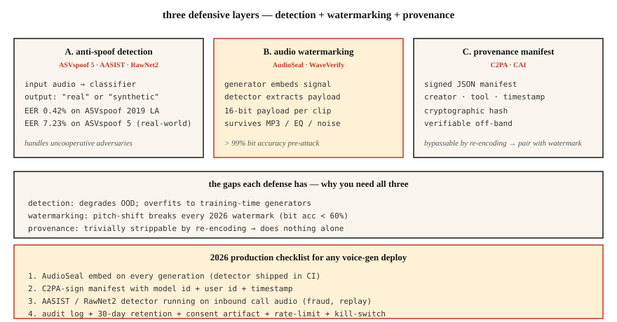

# 语音反欺骗与音频水印：ASVspoof 5、AudioSeal、WaveVerify

> 声音克隆的落地速度快于防御措施的部署速度。2026 年的生产语音系统需要两样东西：区分真实与伪造语音的检测器（AASIST、RawNet2），以及能在压缩和编辑后保留下来的水印（AudioSeal）。要么两者一起交付，要么就不要交付声音克隆功能。

**Type:** Build
**Languages:** Python
**Prerequisites:** 阶段 6 · 06（说话人识别），阶段 6 · 08（声音克隆）
**Time:** ~75 分钟

## 要解决的问题

三种相关的防御措施：

1. **反欺骗（anti-spoofing）/ 深度伪造检测（deepfake detection）。** 给定一段音频，它是合成的还是真实的？ASVspoof 基准（ASVspoof 2019 → 2021 → 5）是黄金标准。
2. **音频水印嵌入（audio watermarking）。** 在生成的音频中嵌入不可感知的信号，以便检测器日后提取。AudioSeal（Meta）和 WavMark 是开放的选项。
3. **经认证的来源信息（authenticated provenance）。** 对音频文件 + 元数据进行密码学签名。C2PA / 内容真实性倡议（Content Authenticity Initiative）。

检测用于应对不配合的对手。水印用于满足合规要求：AI 生成的音频应当能够被识别为 AI 生成。2026 年，两者都不可少。

## 核心概念



### ASVspoof 5：2024-2025 年的基准

相较于往届，最大的变化是：

- **众包数据** （不是录音棚里的干净数据）：更贴近真实条件。
- **~2000 名说话人** （此前为 ~100 名）。
- **32 种攻击算法。** 文本转语音（TTS）+ 声音转换 + 对抗扰动。
- **两个赛道。** 反欺骗措施（Countermeasure，CM）赛道进行独立检测；抗欺骗自动说话人验证（Spoofing-robust ASV，SASV）赛道面向生物特征识别系统。

ASVspoof 5 上的当前最佳水平：等错误率（EER）为 ~7.23%。在较早的 ASVspoof 2019 LA 上：EER 为 0.42%。真实部署时：对于自然场景中的音频片段，预期 EER 为 5-10%。

### AASIST 与 RawNet2：检测模型家族

**AASIST** （2021 年，持续更新至 2026 年）。在频谱特征上应用图注意力。在 ASVspoof 5 反欺骗任务上达到当前最佳水平（SOTA）。

**RawNet2。** 处理原始波形的卷积前端 + TDNN 主干网络。这是一种更简单的基线；经过微调（fine-tuning）后仍有竞争力。

**NeXt-TDNN + 自监督学习（SSL）特征。** 2025 年的变体：ECAPA 风格 + WavLM 特征 + 焦点损失（focal loss）。在 ASVspoof 2019 LA 上达到 0.42% 的 EER。

### AudioSeal：2024 年的默认水印方案

Meta 的 **AudioSeal** （2024 年一月，v0.2 于 2024 年十二月发布）。关键设计：

- **可定位。** 以 16 kHz 的采样点分辨率（1/16000 s）逐帧检测水印。
- **生成器 + 检测器联合训练。** 生成器学习嵌入不可听见的信号；检测器通过数据增强学习找到它。
- **稳健。** 能经受 MP3 / AAC 压缩、均衡处理（EQ）、±10% 的变速，以及混入噪声（+10 dB 信噪比，SNR）。
- **快速。** 检测器的运行速度为实时速度的 485×；比 WavMark 快 1000×。
- **容量。** 每段话语均可嵌入 16 比特载荷（payload），可编码模型 ID、生成时间戳、用户 ID。

### WavMark

AudioSeal 之前的开放基线。采用可逆神经网络，32 bits/sec。问题：

- 以穷举方式进行同步，速度很慢。
- 可被高斯噪声或 MP3 压缩去除。
- 不适合实时场景。

### WaveVerify（2025 年七月）

针对 AudioSeal 的弱点，特别是时间维度操纵（反转、变速）。采用基于 FiLM 的生成器 + 混合专家模型（Mixture-of-Experts，MoE）检测器。在标准攻击下与 AudioSeal 具有竞争力；能够应对时间维度的编辑。

### 对手利用的缺口

AudioMarkBench 指出：“在音高变换下，所有水印的比特恢复准确率（Bit Recovery Accuracy）均低于 0.6，表明水印几乎被完全去除。” **音高变换是一种通用攻击。** 2026 年没有任何水印能完全抵御大幅度的音高修改。这就是为什么除了水印，你还需要检测（AASIST）。

### C2PA / 内容真实性倡议（Content Authenticity Initiative）

这不是一种机器学习（ML）技术，而是一种清单格式。音频文件携带经密码学签名的元数据，记录创建工具、作者和日期。Audobox / Seamless 使用这种格式。它有助于提供来源信息；但如果恶意行为者重新编码并剥离元数据，它就毫无作用。

```figure
v4-audio-watermark
```

## 动手实现

### 步骤 1：简单的频谱特征检测器（玩具示例）

```python
def spectral_rolloff(spec, percentile=0.85):
    cum = 0
    total = sum(spec)
    if total == 0:
        return 0
    threshold = total * percentile
    for k, v in enumerate(spec):
        cum += v
        if cum >= threshold:
            return k
    return len(spec) - 1

def is_suspicious(audio):
    spec = magnitude_spectrum(audio)
    rolloff = spectral_rolloff(spec)
    return rolloff / len(spec) > 0.92
```

合成语音的高频能量往往异常平坦。生产检测器使用 AASIST，而不是这个示例。但其中的直觉仍然成立。

### 步骤 2：AudioSeal 嵌入 + 检测

```python
from audioseal import AudioSeal
import torch

generator = AudioSeal.load_generator("audioseal_wm_16bits")
detector = AudioSeal.load_detector("audioseal_detector_16bits")

audio = load_wav("generated.wav", sr=16000)[None, None, :]
payload = torch.tensor([[1, 0, 1, 1, 0, 1, 0, 0, 1, 1, 0, 1, 0, 1, 1, 0]])
watermark = generator.get_watermark(audio, sample_rate=16000, message=payload)
watermarked = audio + watermark

result, decoded_payload = detector.detect_watermark(watermarked, sample_rate=16000)
# result: float in [0, 1] — probability of watermark presence
# decoded_payload: 16 bits; match against embedded payload
```

### 步骤 3：评估：EER

```python
def eer(real_scores, fake_scores):
    thresholds = sorted(set(real_scores + fake_scores))
    best = (1.0, 0.0)
    for t in thresholds:
        far = sum(1 for s in fake_scores if s >= t) / len(fake_scores)
        frr = sum(1 for s in real_scores if s < t) / len(real_scores)
        if abs(far - frr) < best[0]:
            best = (abs(far - frr), (far + frr) / 2)
    return best[1]
```

### 步骤 4：生产集成

```python
def safe_tts(text, voice, clone_reference=None):
    if clone_reference is not None:
        verify_consent(user_id, clone_reference)
    audio = tts_model.synthesize(text, voice)
    audio_with_wm = audioseal_embed(audio, payload=build_payload(user_id, model_id))
    manifest = c2pa_sign(audio_with_wm, user_id, timestamp=now())
    return audio_with_wm, manifest
```

每次生成都交付：(1) 水印，(2) 经签名的清单，(3) 符合保留策略的审计日志。

## 实际使用

| 使用场景 | 防御措施 |
|----------|---------|
| 交付 TTS / 声音克隆功能 | 对每个输出都嵌入 AudioSeal 水印（不可妥协） |
| 生物特征语音解锁 | AASIST + ECAPA 集成；活体检测挑战 |
| 呼叫中心欺诈检测 | 对来电进行 20% 抽样，并用 AASIST 检测 |
| 播客真实性 | 上传时进行 C2PA 签名；若由 AI 生成，则使用 AudioSeal |
| 研究 / 训练检测器 | ASVspoof 5 训练/开发/评估集 |

## 常见陷阱

- **嵌入水印，却从不运行检测器。** 毫无意义。将检测器纳入持续集成（CI）。
- **进行检测，却不做校准。** 在 ASVspoof LA 上训练的 AASIST 会过拟合；真实场景中的准确率会下降。应在你的领域上进行校准。
- **音高变换缺口。** 大幅度音高变换会去除大多数水印。准备一个检测回退方案。
- **剥离元数据后重新托管。** 重新编码就能轻易绕过 C2PA。务必同时采用密码学 + 感知层面（水印）的防御。
- **把活体检测当作检测手段。** 让用户说一句随机短语。这能防止重放攻击，却无法防止实时声音克隆。

## 交付成果

保存为 `outputs/skill-spoof-defender.md`。为语音生成部署选择检测模型、水印、来源信息清单和运营操作手册。

## 练习

1. **简单。** 运行 `code/main.py`。在合成音频上演示玩具检测器 + 玩具水印嵌入/检测。
2. **中等。** 安装 `audioseal`，在一个 TTS 输出中嵌入 16 比特载荷，再次解码。用噪声破坏音频，并测量比特恢复准确率。
3. **困难。** 在 ASVspoof 2019 LA 上微调 RawNet2 或 AASIST。测量 EER。在留出的 F5-TTS 生成音频片段集上测试，观察分布外（OOD）检测如何退化。

## 关键术语

| 术语 | 通常的说法 | 实际含义 |
|------|-----------------|-----------------------|
| ASVspoof | 那个基准 | 每两年举办一次的挑战赛；2024 = ASVspoof 5。 |
| CM（反欺骗措施） | 检测器 | 分类器：区分真实语音与合成 / 转换语音。 |
| SASV | 说话人验证 + CM | 集成生物特征识别 + 欺骗检测。 |
| AudioSeal | Meta 水印 | 可定位、16 比特载荷，比 WavMark 快 485×。 |
| 比特恢复准确率 | 水印存留情况 | 攻击后恢复的载荷比特所占的比例。 |
| C2PA | 来源信息清单 | 关于创建 / 创作者身份的密码学元数据。 |
| AASIST | 检测器家族 | 基于图注意力的反欺骗当前最佳模型。 |

## 延伸阅读

- [Todisco et al. (2024). ASVspoof 5](https://dl.acm.org/doi/10.1016/j.csl.2025.101825) — 当前基准。
- [Defossez et al. (2024). AudioSeal](https://arxiv.org/abs/2401.17264) — 默认水印方案。
- [Chen et al. (2025). WaveVerify](https://arxiv.org/abs/2507.21150) — 应对时间维度攻击的 MoE 检测器。
- [Jung et al. (2022). AASIST](https://arxiv.org/abs/2110.01200) — 达到当前最佳水平的检测主干网络。
- [AudioMarkBench (2024)](https://proceedings.neurips.cc/paper_files/paper/2024/file/5d9b7775296a641a1913ab6b4425d5e8-Paper-Datasets_and_Benchmarks_Track.pdf) — 稳健性评估。
- [C2PA specification](https://spec.c2pa.org/specifications/specifications/2.4/index.html) — 来源信息清单格式。
