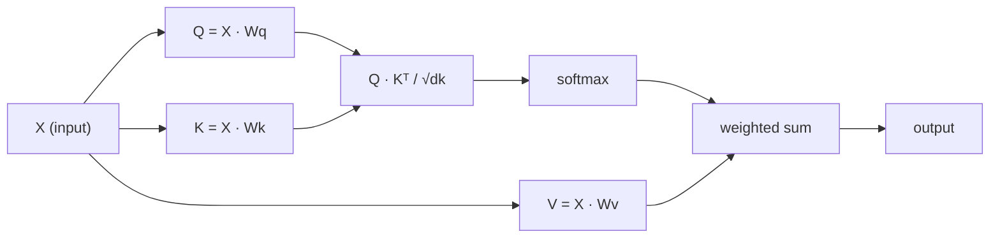

# 从零实现自注意力

> 注意力就像一张查找表，每个词都在问“谁对我重要？”，并通过学习找到答案。

**Type:** Build
**Languages:** Python
**Prerequisites:** 阶段 3（深度学习核心），阶段 5 第 10 课（序列到序列）
**Time:** 约 90 分钟

## 学习目标

- 仅使用 NumPy 从零实现缩放点积自注意力（scaled dot-product self-attention），包括查询、键、值投影以及以 softmax 权重计算的加权和
- 构建多头注意力（multi-head attention）层，拆分注意力头、并行计算注意力，再拼接结果
- 追踪注意力矩阵如何捕捉 token（词元）之间的关系，并解释为什么除以 sqrt(d_k) 进行缩放能防止 softmax 饱和
- 应用因果掩码操作，将双向注意力转换为自回归注意力（解码器式注意力）

## 要解决的问题

循环神经网络（RNN）每次处理序列中的一个 token。等处理到第 50 个 token 时，第 1 个 token 的信息已经经历了 50 步压缩。长距离依赖被挤进一个固定大小的隐藏状态中；无论增加多少 LSTM 门控，都无法彻底解决这个瓶颈。

2014 年的 Bahdanau 注意力论文给出了解法：让解码器回看编码器的每一个位置，判断哪些位置对当前步骤重要。但这种机制仍然依附于 RNN。2017 年的“Attention Is All You Need”论文提出了一个更直指核心的问题：如果注意力是 *唯一* 的机制呢？没有循环，没有卷积，只有注意力。

自注意力（self-attention）让序列中的每个位置都能在一次并行步骤中关注其他所有位置。正是这一点让 Transformer 速度快、易于扩展，并占据主导地位。

## 核心概念

### 数据库查找类比

可以把注意力看作一种软数据库查找：

```text
Traditional database:
  Query: "capital of France"  -->  exact match  -->  "Paris"

Attention:
  Query: "capital of France"  -->  similarity to ALL keys  -->  weighted blend of ALL values
```

每个 token 都会生成三个向量：
- **查询（Query，Q）**：“我在寻找什么？”
- **键（Key，K）**：“我包含什么？”
- **值（Value，V）**：“如果被选中，我能提供什么信息？”

查询与所有键之间的点积产生注意力分数。分数高意味着“这个键与我的查询匹配”。这些分数用于对值加权，输出就是值的加权和。

### Q、K、V 的计算

每个 token 嵌入（embedding）都会通过三个学习得到的权重矩阵进行投影：

```text
Input embeddings (sequence of n tokens, each d-dimensional):

  X = [x1, x2, x3, ..., xn]       shape: (n, d)

Three weight matrices:

  Wq  shape: (d, dk)
  Wk  shape: (d, dk)
  Wv  shape: (d, dv)

Projections:

  Q = X @ Wq    shape: (n, dk)      each token's query
  K = X @ Wk    shape: (n, dk)      each token's key
  V = X @ Wv    shape: (n, dv)      each token's value
```

对于单个 token，可以直观地表示为：

```text
             Wq
  x_i ------[*]------> q_i    "What am I looking for?"
       |
       |     Wk
       +----[*]------> k_i    "What do I contain?"
       |
       |     Wv
       +----[*]------> v_i    "What do I offer?"
```

### 注意力矩阵

得到所有 token 的 Q、K、V 后，注意力分数就组成了一个矩阵：

```text
Scores = Q @ K^T    shape: (n, n)

              k1    k2    k3    k4    k5
        +-----+-----+-----+-----+-----+
   q1   | 2.1 | 0.3 | 0.1 | 0.8 | 0.2 |   <- how much q1 attends to each key
        +-----+-----+-----+-----+-----+
   q2   | 0.4 | 1.9 | 0.7 | 0.1 | 0.3 |
        +-----+-----+-----+-----+-----+
   q3   | 0.2 | 0.6 | 2.3 | 0.5 | 0.1 |
        +-----+-----+-----+-----+-----+
   q4   | 0.9 | 0.1 | 0.4 | 1.7 | 0.6 |
        +-----+-----+-----+-----+-----+
   q5   | 0.1 | 0.3 | 0.2 | 0.5 | 2.0 |
        +-----+-----+-----+-----+-----+

Each row: one token's attention over the entire sequence
```

观察查询如何逐个扫过所有键：每一行都为每个 token 打分，softmax 将分数转换为权重，而上下文向量就是值的加权组合。

```figure
attention-matrix
```

### 为什么要缩放？

点积会随着维度 dk 增大而增大。如果 dk = 64，点积可能达到几十，将 softmax 推入梯度消失的区域。解决办法是除以 sqrt(dk)。

```text
Scaled scores = (Q @ K^T) / sqrt(dk)
```

这样可以将数值保持在 softmax 能产生有效梯度的范围内。

### softmax 将分数转换为权重

softmax 将每一行的原始分数转换为一个概率分布：

```text
Raw scores for q1:   [2.1, 0.3, 0.1, 0.8, 0.2]
                            |
                         softmax
                            |
Attention weights:   [0.52, 0.09, 0.07, 0.14, 0.08]   (sums to ~1.0)
```

现在，每个 token 都有一组权重，表示它应当对其他每个 token 关注多少。

### 值的加权和

每个 token 的最终输出是所有值向量的加权和：

```text
output_i = sum( attention_weight[i][j] * v_j  for all j )

For token 1:
  output_1 = 0.52 * v1 + 0.09 * v2 + 0.07 * v3 + 0.14 * v4 + 0.08 * v5
```

### 完整流程



用一行公式表示：

```text
Attention(Q, K, V) = softmax( Q @ K^T / sqrt(dk) ) @ V
```

```figure
softmax-attention-scaling
```

## 动手实现

### 步骤 1：从零实现 softmax

softmax 将原始 logits（未经归一化的分数）转换为概率。减去最大值可以提高数值稳定性。

```python
import numpy as np

def softmax(x):
    shifted = x - np.max(x, axis=-1, keepdims=True)
    exp_x = np.exp(shifted)
    return exp_x / np.sum(exp_x, axis=-1, keepdims=True)

logits = np.array([2.0, 1.0, 0.1])
print(f"logits:  {logits}")
print(f"softmax: {softmax(logits)}")
print(f"sum:     {softmax(logits).sum():.4f}")
```

### 步骤 2：缩放点积注意力

这是核心函数：接收 Q、K、V 矩阵，返回注意力输出和权重矩阵。

```python
def scaled_dot_product_attention(Q, K, V):
    dk = Q.shape[-1]
    scores = Q @ K.T / np.sqrt(dk)
    weights = softmax(scores)
    output = weights @ V
    return output, weights
```

### 步骤 3：带有学习得到的投影的自注意力类

这是一个完整的自注意力模块，Wq、Wk、Wv 权重矩阵采用类似 Xavier 的缩放方式初始化。

```python
class SelfAttention:
    def __init__(self, d_model, dk, dv, seed=42):
        rng = np.random.default_rng(seed)
        scale = np.sqrt(2.0 / (d_model + dk))
        self.Wq = rng.normal(0, scale, (d_model, dk))
        self.Wk = rng.normal(0, scale, (d_model, dk))
        scale_v = np.sqrt(2.0 / (d_model + dv))
        self.Wv = rng.normal(0, scale_v, (d_model, dv))
        self.dk = dk

    def forward(self, X):
        Q = X @ self.Wq
        K = X @ self.Wk
        V = X @ self.Wv
        output, weights = scaled_dot_product_attention(Q, K, V)
        return output, weights
```

### 步骤 4：在一个句子上运行

为一个句子创建模拟嵌入，观察注意力权重。

```python
sentence = ["The", "cat", "sat", "on", "the", "mat"]
n_tokens = len(sentence)
d_model = 8
dk = 4
dv = 4

rng = np.random.default_rng(42)
X = rng.normal(0, 1, (n_tokens, d_model))

attn = SelfAttention(d_model, dk, dv, seed=42)
output, weights = attn.forward(X)

print("Attention weights (each row: where that token looks):\n")
print(f"{'':>6}", end="")
for token in sentence:
    print(f"{token:>6}", end="")
print()

for i, token in enumerate(sentence):
    print(f"{token:>6}", end="")
    for j in range(n_tokens):
        w = weights[i][j]
        print(f"{w:6.3f}", end="")
    print()
```

### 步骤 5：用 ASCII 热力图可视化注意力

将注意力权重映射为字符，快速查看其分布。

```python
def ascii_heatmap(weights, tokens, chars=" ░▒▓█"):
    n = len(tokens)
    print(f"\n{'':>6}", end="")
    for t in tokens:
        print(f"{t:>6}", end="")
    print()

    for i in range(n):
        print(f"{tokens[i]:>6}", end="")
        for j in range(n):
            level = int(weights[i][j] * (len(chars) - 1) / weights.max())
            level = min(level, len(chars) - 1)
            print(f"{'  ' + chars[level] + '   '}", end="")
        print()

ascii_heatmap(weights, sentence)
```

## 实际使用

PyTorch 的 `nn.MultiheadAttention` 完成的工作与我们实现的完全相同，另外还提供多头拆分和输出投影：

```python
import torch
import torch.nn as nn

d_model = 8
n_heads = 2
seq_len = 6

mha = nn.MultiheadAttention(embed_dim=d_model, num_heads=n_heads, batch_first=True)

X_torch = torch.randn(1, seq_len, d_model)

output, attn_weights = mha(X_torch, X_torch, X_torch)

print(f"Input shape:            {X_torch.shape}")
print(f"Output shape:           {output.shape}")
print(f"Attention weight shape: {attn_weights.shape}")
print(f"\nAttn weights (averaged over heads):")
print(attn_weights[0].detach().numpy().round(3))
```

关键区别在于：多头注意力并行运行多个注意力函数，每个函数都有各自大小为 dk = d_model / n_heads 的 Q、K、V 投影，之后再拼接结果。这使模型能够同时关注不同类型的关系。

## 交付成果

本课产出：
- `outputs/prompt-attention-explainer.md`：通过数据库查找类比解释注意力的提示词（prompt）

## 练习

1. 修改 `scaled_dot_product_attention`，让它接收一个可选的掩码矩阵，在 softmax 之前将某些位置设为负无穷（因果掩码和解码器掩码就是这样工作的）
2. 从零实现多头注意力：将 Q、K、V 拆分为 `n_heads` 个块，分别计算注意力，再拼接，并通过最终权重矩阵 Wo 进行投影
3. 取两个长度相同、内容不同的句子，将它们输入同一个 SelfAttention 实例，并比较各自的注意力模式。哪些发生了变化？哪些保持不变？

## 关键术语

| 术语 | 常见说法 | 实际含义 |
|------|----------------|----------------------|
| 查询（Q） | “问题向量” | 通过学习得到的输入投影，表示这个 token 正在寻找什么信息 |
| 键（K） | “标签向量” | 学习得到的投影，表示这个 token 包含什么信息，用于与查询匹配 |
| 值（V） | “内容向量” | 学习得到的投影，承载根据注意力分数进行聚合的实际信息 |
| 缩放点积注意力 | “注意力公式” | softmax(QK^T / sqrt(dk)) @ V；缩放可防止高维情况下的 softmax 饱和 |
| 自注意力 | “token 看自己，也看其他 token” | Q、K、V 全部来自同一序列的注意力，让每个位置都能关注其他所有位置 |
| 注意力权重 | “关注程度” | 对缩放后的点积应用 softmax，得到的各位置上的概率分布 |
| 多头注意力 | “并行注意力” | 使用不同投影运行多个注意力函数，再拼接结果，以获得更丰富的表示 |

## 延伸阅读

- [Attention Is All You Need（Vaswani 等，2017）](https://arxiv.org/abs/1706.03762)：Transformer 的原始论文
- [The Illustrated Transformer（Jay Alammar）](https://jalammar.github.io/illustrated-transformer/)：完整架构的最佳可视化讲解
- [The Annotated Transformer（Harvard NLP）](https://nlp.seas.harvard.edu/annotated-transformer/)：逐行讲解的 PyTorch 实现
