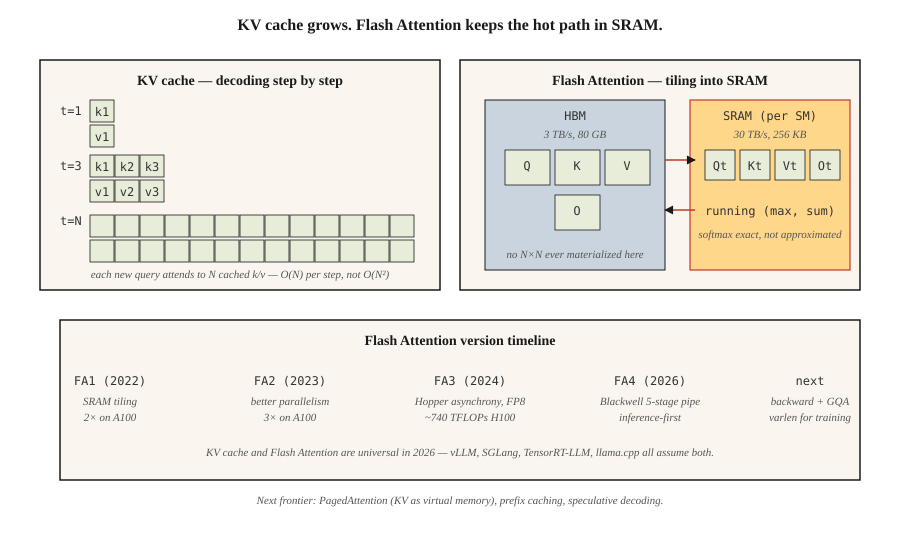

# KV Cache、Flash Attention 与推理优化

> 训练可并行，瓶颈在浮点运算量。推理是串行的，瓶颈在内存。瓶颈不同，优化手段也不同。

**Type:** Build
**Languages:** Python
**Prerequisites:** 阶段 7 · 02（自注意力）、阶段 7 · 05（完整 Transformer）、阶段 7 · 07（GPT）
**Time:** ~75 分钟

## 要解决的问题

朴素的自回归解码器需要完成 `O(N²)` 的计算才能生成 `N` 个 token（词元，即模型处理文本的单位）：每一步都会重新计算整个前缀上的注意力。对于包含 4K 个 token 的响应，这意味着 16M 次注意力运算，其中大部分都是重复计算。前缀中每个 token 的隐藏状态一经算出就已确定；你只需要将新 token 的查询与此前所有 token 缓存下来的键和值进行计算。

此外，注意力计算本身就需要搬运大量数据。标准注意力会实际生成 N×N 的分数矩阵、N×d 的 softmax 输出和 N×d 的最终输出，对 HBM（高带宽内存）的读写次数过多。当 N≥2K 时，注意力会先受到内存瓶颈限制，然后才受到浮点运算量限制。传统注意力内核对现代 GPU 的利用率不足，造成 4–10× 的性能差距。

两项均来自 Dao 等人的优化，让前沿模型的推理从“慢”变成了“快”：

1. **KV cache（键值缓存）。** 保存前缀中每个 token 的 K 和 V 向量。对每个新 token，只需用一次查询与缓存的键计算注意力。每个生成步骤的推理复杂度从 `O(N²)` 降至 `O(N)`。
2. **Flash Attention。** 将注意力计算分块，使完整的 N×N 矩阵始终不写入 HBM。softmax + matmul 全部在 SRAM（静态随机存取存储器）中完成。在 A100 上，实际运行时间可获得 2–4× 加速；在采用 FP8 的 H100 上可获得 5–10× 加速。

到 2026 年，两者都已普及。所有生产级推理技术栈（vLLM、TensorRT-LLM、SGLang、llama.cpp）都以它们为基础。所有前沿模型交付时都启用了 Flash Attention。

## 核心概念



### KV cache 的数学计算

对于每个解码器层、每个 token、每个注意力头：

```text
bytes_per_token_per_layer = 2 * d_head * dtype_size
                          ^
                          K and V
```

对于一个有 32 层、32 个注意力头、d_head=128、采用 fp16 的 7B 模型：

```text
per token per layer = 2 * 128 * 2 = 512 bytes
per token (32 layers) = 16 KB
per 32K context = 512 MB
```

对于 Llama 3 70B（80 层、d_head=128、采用 GQA，即分组查询注意力，包含 8 个 KV 头）：

```text
per token per layer = 2 * 8 * 128 * 2 = 4096 bytes (4 KB)
per 32K context = 10.4 GB
```

正是这 10 GB 的开销，使 Llama 3 70B 在 128K 上下文、批大小为 1 时，仅 KV cache 就需要占用一张 40 GB A100 的大部分显存。

**GQA 的优势在于节省 KV cache。** 若采用具有 64 个头的 MHA（多头注意力），则会占用 32 GB。MLA（多头潜在注意力）还能进一步压缩。

拖动各维度参数，观察缓存大小的变化。调高序列长度或批大小，看看它多快就会超出单张 GPU 的容量：

```figure
kv-cache-sizer
```

### Flash Attention：分块技巧

标准注意力：

```text
S = Q @ K^T          (HBM read, N×N, HBM write)
P = softmax(S)       (HBM read, HBM write)
O = P @ V            (HBM read, HBM write)
```

需要往返访问 HBM 三次。在 H100 上，HBM 带宽为 3 TB/s，SRAM 带宽为 30 TB/s。与将所有数据留在芯片上相比，每次访问 HBM 都会慢 10 倍。

Flash Attention：

```text
for each block of Q (tile size ~128 × 128):
    load Q_tile into SRAM
    for each block of K, V:
        load K_tile, V_tile into SRAM
        compute S_tile = Q_tile @ K_tile^T     (SRAM)
        running softmax aggregation             (SRAM)
        accumulate into O_tile                  (SRAM)
    write O_tile to HBM
```

每个分块只需往返访问 HBM 一次。总内存占用从 `O(N²)` 降至 `O(N)`。反向传播时会重新计算前向传播中的部分值，而不是将其存储下来，这又进一步节省了内存。

**数值技巧。** 在线 softmax 跨分块维护 `(max, sum)`，从而使最终归一化结果保持精确。这不是近似计算：Flash Attention 与标准注意力的输出逐位相同（不计 fp16 运算不满足结合律的影响）。

**版本演进：**

| 版本 | 年份 | 关键变化 | 在参考硬件上的加速比 |
|---------|------|-----------|-------------------------------|
| Flash 1 | 2022 | 分块 SRAM 内核 | A100 上为 2× |
| Flash 2 | 2023 | 更好的并行性、因果优先的处理顺序 | A100 上为 3× |
| Flash 3 | 2024 | Hopper 异步执行、FP8 | H100 上为 1.5–2×（~740 TFLOPs FP16） |
| Flash 4 | 2026 | Blackwell 的 5 级流水线、软件实现的 exp2 | 优先面向推理（最初仅支持前向传播） |

Flash 4 刚发布时仅支持前向传播。训练仍使用 Flash 3。Flash 4 对 GQA 和变长序列（varlen）的支持尚未就绪（2026 年中）。

### 推测解码：另一项降低延迟的优化

低成本模型提出 N 个候选 token。大模型并行验证全部 N 个。如果验证接受了 k 个 token，那么只需付出 1 次大模型前向传播的代价，就能生成 k 个 token。在代码和普通文本上，典型值为 k=3–5。

2026 年的常用方案：
- **EAGLE 2 / Medusa。** 内置的草稿头共享验证模型的隐藏状态。在不损失质量的情况下获得 2–3× 加速。
- **采用草稿模型的推测解码。** 在消费级硬件上获得 2–4× 加速。
- **前瞻解码。** 采用 Jacobi 迭代，不需要草稿模型。较为小众，但免费。

### 连续批处理

传统的批量推理需要等最慢的序列完成，才能开始处理下一个批次。当较短的响应提前完成时，GPU 资源就被浪费了。

连续批处理（最早由 Orca 实现，如今已用于 vLLM、TensorRT-LLM、SGLang）：一旦旧请求完成，就立即将新请求加入批次。在典型聊天工作负载上，吞吐量可提升 5–10×。

### PagedAttention：将 KV cache 视为虚拟内存

这是 vLLM 的招牌功能。KV cache 按每块 16 个 token 分配；页表将逻辑位置映射到物理块。这样就能在并行样本之间共享 KV（束搜索、并行采样），通过热切换前缀来缓存提示词（prompt，即提供给模型的指令或输入），并整理内存碎片。相较于朴素的连续内存分配，吞吐量可提升 4×。

```figure
flash-attention-memory
```

## 动手实现

参见 `code/main.py`。我们将实现：

1. 一个朴素的 `O(N²)` 增量解码器。
2. 一个使用 KV cache 的 `O(N)` 解码器。
3. 一个分块 softmax，用来模拟 Flash Attention 的动态最大值算法。

### 第 1 步：KV cache

```python
class KVCache:
    def __init__(self, n_layers, n_heads, d_head):
        self.K = [[[] for _ in range(n_heads)] for _ in range(n_layers)]
        self.V = [[[] for _ in range(n_heads)] for _ in range(n_layers)]

    def append(self, layer, head, k, v):
        self.K[layer][head].append(k)
        self.V[layer][head].append(v)

    def read(self, layer, head):
        return self.K[layer][head], self.V[layer][head]
```

很简单：按层、按头分别维护列表，不断追加每个 token 的 K、V 向量。

### 第 2 步：分块 softmax

```python
def tiled_softmax_dot(q, K, V, tile=4):
    """Flash-attention-style softmax(qK^T)V with running max/sum."""
    m = float("-inf")
    s = 0.0
    out = [0.0] * len(V[0])
    for start in range(0, len(K), tile):
        k_block = K[start:start + tile]
        v_block = V[start:start + tile]
        scores = [sum(qi * ki for qi, ki in zip(q, k)) for k in k_block]
        new_m = max(m, *scores)
        exp_old = math.exp(m - new_m) if m != float("-inf") else 0.0
        exp_new = [math.exp(sc - new_m) for sc in scores]
        s = s * exp_old + sum(exp_new)
        for j in range(len(out)):
            out[j] = out[j] * exp_old + sum(e * v[j] for e, v in zip(exp_new, v_block))
        m = new_m
    return [o / s for o in out]
```

输出与一次性计算 `softmax(qK) V` 的结果逐位相同，但任意时刻的工作集都只是一个 `tile × d_head` 块，而不是完整的 `N × d_head`。

### 第 3 步：比较生成 100 个 token 时的朴素解码与缓存解码

统计注意力运算次数。朴素方法：`O(N²)` = 5050。缓存方法：`O(N)` = 100。代码会将两者都打印出来。

## 实际使用

```python
# HuggingFace transformers auto-enables KV cache on decoder-only generate().
from transformers import AutoModelForCausalLM
model = AutoModelForCausalLM.from_pretrained(
    "meta-llama/Llama-3.2-3B",
    attn_implementation="flash_attention_2",  # use FA3 if Hopper
    torch_dtype="bfloat16",
)
# generate() uses KV cache automatically
```

vLLM 的生产环境用法：

```bash
pip install vllm
vllm serve meta-llama/Llama-3.1-70B-Instruct \
    --tensor-parallel-size 4 \
    --max-model-len 32768 \
    --enable-prefix-caching \
    --kv-cache-dtype fp8
```

跨请求的前缀缓存是 2026 年的一项重要优化：相同的系统提示词、少样本示例或长上下文文档，可在多次调用之间复用 KV。对于反复使用工具提示词的智能体（agent）工作负载，前缀缓存通常能带来 5× 的吞吐量提升。

## 交付成果

参见 `outputs/skill-inference-optimizer.md`。这个技能会为新的推理部署选择注意力实现、KV cache 策略、量化（quantization，即降低数值表示精度）方案和推测解码方案。

## 练习

1. **简单。** 运行 `code/main.py`。确认朴素解码器和缓存解码器产生相同输出，并记录运算次数的差异。
2. **中等。** 实现前缀缓存：给定提示词 P 和多个补全文本，对 P 执行一次前向传播以填充 KV cache，然后为每个补全文本分别建立分支。测量其相较于为每个补全文本重新编码 P 的加速比。
3. **困难。** 实现一个简化版 PagedAttention：将 KV cache 放在固定大小、每块容纳 16 个 token 的块中，并维护空闲块列表。序列完成时，将其占用的块归还到池中。模拟 1,000 次长度不同的聊天补全。比较这种方式与连续分配方式的内存碎片情况。

## 关键术语

| 术语 | 常见说法 | 实际含义 |
|------|-----------------|-----------------------|
| KV cache | “让解码变快的技巧” | 保存前缀中每个 token 的 K 和 V；新查询直接对它们计算注意力，无需重新计算。 |
| HBM | “GPU 主内存” | 高带宽内存；H100 上为 80 GB，B200 上为 192 GB。带宽为 ~3 TB/s。 |
| SRAM | “片上内存” | 每个 SM 上的高速内存，H100 上每个 SM 有 ~256 KB。带宽为 ~30 TB/s。 |
| Flash Attention | “分块注意力内核” | 计算注意力时，无需在 HBM 中实际生成 N×N 矩阵。 |
| 连续批处理 | “无需等待的批处理” | 无需等整个批次清空，就可移出已完成序列、加入新序列。 |
| PagedAttention | “vLLM 的招牌功能” | 按固定大小的块分配 KV cache，并使用页表管理；消除碎片。 |
| 前缀缓存 | “复用长提示词” | 跨请求缓存共享前缀的 KV；可大幅降低智能体的成本。 |
| 推测解码 | “起草 + 验证” | 低成本草稿模型提出候选 token；大模型在一次前向传播中验证 k 个。 |

## 延伸阅读

- [Dao 等（2022）。FlashAttention：具有 IO 感知能力的快速、内存高效的精确注意力](https://arxiv.org/abs/2205.14135) — Flash 1。
- [Dao（2023）。FlashAttention-2：通过改进并行性与工作划分实现更快的注意力](https://arxiv.org/abs/2307.08691) — Flash 2。
- [Shah 等（2024）。FlashAttention-3：利用异步执行与低精度实现快速、准确的注意力](https://arxiv.org/abs/2407.08608) — Flash 3。
- [FlashAttention-4 发布说明（Dao-AILab，2026）](https://github.com/Dao-AILab/flash-attention) — Blackwell 的 5 级流水线和软件 exp2 技巧；本课提到的首发版本仅支持前向传播等注意事项，请参阅仓库 README。
- [Kwon 等（2023）。利用 PagedAttention 高效管理大语言模型（LLM）服务的内存](https://arxiv.org/abs/2309.06180) — vLLM 论文。
- [Leviathan 等（2023）。通过推测解码加速 Transformer 推理](https://arxiv.org/abs/2211.17192) — 推测解码。
- [Li 等（2024）。EAGLE：推测采样需要重新思考特征不确定性](https://arxiv.org/abs/2401.15077) — EAGLE-1/2 论文，介绍了本课引用的内置草稿方案。
- [Cai 等（2024）。Medusa：采用多个解码头的简单 LLM 推理加速框架](https://arxiv.org/abs/2401.10774) — 与 EAGLE 一同提到的 Medusa 方案。
- [vLLM 文档：PagedAttention](https://docs.vllm.ai/en/latest/design/kernel/paged_attention.html) — 深入介绍 16 个 token 一块的分块方式和页表设计的权威资料。
