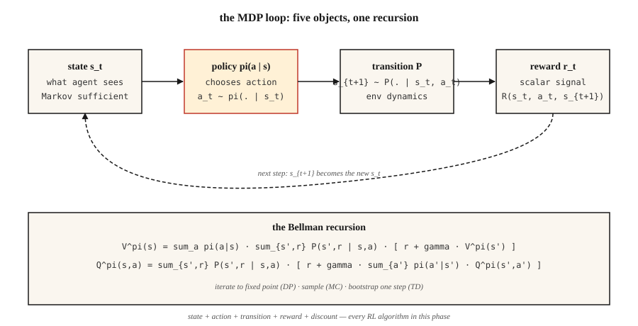

# 马尔可夫决策过程：状态、动作与奖励

> 马尔可夫决策过程（MDP）由五样东西组成：状态、动作、转移、奖励和折扣因子。强化学习（RL）中的一切方法，包括 Q-learning、PPO、DPO、GRPO，都是围绕这一结构进行优化。掌握它，后续强化学习内容就能触类旁通。

**Type:** Learn
**Languages:** Python
**Prerequisites:** 阶段 1 · 06（概率与分布），阶段 2 · 01（机器学习分类体系）
**Time:** ~45 分钟

## 要解决的问题

你正在编写一个国际象棋机器人，或一个库存规划器，或一个交易智能体（agent），又或者是用于训练推理模型的 PPO 循环。四个不同领域，却有一个令人意外的共同点：它们都可以归结为同一个数学对象。

监督学习给你 `(x, y)` 样本对，让你拟合一个函数。强化学习不给你标签，只有接连出现的状态、你采取的动作，以及一个标量奖励。这步棋赢下对局了吗？这次补货决策省钱了吗？这笔交易盈利了吗？大语言模型（LLM）刚生成的 token（词元），是否让评判者给出了更高的奖励？

只有将这段交互序列形式化，才能从中学习。“我看到了什么”“我做了什么”“接下来发生了什么”“结果有多好”，都必须成为可以推理分析的对象。这种形式化描述就是马尔可夫决策过程。本阶段的每一种强化学习算法，包括最后的 RLHF 和 GRPO 循环，都是围绕这一结构进行优化。

## 核心概念



**五个对象。**

- **状态** `S`。智能体作决策所需的全部信息。在 GridWorld（网格世界）中，是所在的格子；在国际象棋中，是棋盘；在 LLM 中，是上下文窗口加上所有记忆。
- **动作** `A`。可作出的选择：向上、向下、向左或向右移动，走一步棋，或输出一个 token。
- **转移** `P(s' | s, a)`。给定状态 `s` 和动作 `a` 时，下一状态的概率分布。在国际象棋中是确定性的，在库存管理中是随机的，在 LLM 解码中则几乎是确定性的。
- **奖励** `R(s, a, s')`。标量信号。赢 = +1，输 = -1；收入减去成本；GRPO 中的对数似然比项。
- **折扣因子** `γ ∈ [0, 1)`。未来奖励相对于当前奖励有多重要。`γ = 0.99` 对应 ~100 步的时域；`γ = 0.9` 对应 ~10 步。

**马尔可夫性质** `P(s_{t+1} | s_t, a_t) = P(s_{t+1} | s_0, a_0, …, s_t, a_t)`。未来只依赖当前状态。如果不是这样，就说明状态表示不完整：问题出在状态，而不是方法。

**策略与回报。** 策略（policy）`π(a | s)` 将状态映射为动作分布。回报 `G_t = r_t + γ r_{t+1} + γ² r_{t+2} + …` 是未来奖励的折扣和。价值 `V^π(s) = E[G_t | s_t = s]` 是遵循策略 `π`、从 `s` 出发的期望回报。Q 值 `Q^π(s, a) = E[G_t | s_t = s, a_t = a]` 是以某个特定动作开始时的期望回报。每种强化学习算法都会估计这两者之一，再据此改进 `π`。

**Bellman 方程。** 本阶段的所有方法都会用到以下不动点方程：

`V^π(s) = Σ_a π(a|s) Σ_{s', r} P(s', r | s, a) [r + γ V^π(s')]`
`Q^π(s, a) = Σ_{s', r} P(s', r | s, a) [r + γ Σ_{a'} π(a'|s') Q^π(s', a')]`

这些方程把期望回报拆成“当前这一步的奖励”加上“到达状态的折扣价值”。这是递归关系。阶段 9 的每种算法，要么迭代这个方程直至收敛（动态规划），要么对它进行采样（蒙特卡洛），要么进行一步自举（时序差分）。

```figure
discount-horizon
```

## 动手实现

### 步骤 1：一个微型确定性 MDP

一个 4×4 的 GridWorld。智能体从左上角出发，右下角是终止状态，每步奖励为 -1，动作是 `{up, down, left, right}`。参见 `code/main.py`。

```python
GRID = 4
TERMINAL = (3, 3)
ACTIONS = {"up": (-1, 0), "down": (1, 0), "left": (0, -1), "right": (0, 1)}

def step(state, action):
    if state == TERMINAL:
        return state, 0.0, True
    dr, dc = ACTIONS[action]
    r, c = state
    nr = min(max(r + dr, 0), GRID - 1)
    nc = min(max(c + dc, 0), GRID - 1)
    return (nr, nc), -1.0, (nr, nc) == TERMINAL
```

五行，这就是整个环境。确定性转移、恒定的每步惩罚，以及作为吸收状态的终止状态。

### 步骤 2：对策略进行轨迹采样

策略是从状态到动作分布的函数。最简单的是均匀随机策略。

```python
def uniform_policy(state):
    return {a: 0.25 for a in ACTIONS}

def rollout(policy, max_steps=200):
    s, total, steps = (0, 0), 0.0, 0
    for _ in range(max_steps):
        a = sample(policy(s))
        s, r, done = step(s, a)
        total += r
        steps += 1
        if done:
            break
    return total, steps
```

将随机策略运行 1000 次。在这个 4×4 棋盘上，平均回报约为 -60 到 -80。最优回报为 -6（沿向下、向右的直达路径前进）。缩小这个差距，就是阶段 9 的全部任务。

### 步骤 3：通过 Bellman 方程精确计算 `V^π`

对于小型 MDP，Bellman 方程是一个线性方程组。枚举状态，计算期望，反复迭代，直到价值不再变化。

```python
def policy_evaluation(policy, gamma=0.99, tol=1e-6):
    V = {s: 0.0 for s in all_states()}
    while True:
        delta = 0.0
        for s in all_states():
            if s == TERMINAL:
                continue
            v = 0.0
            for a, pi_a in policy(s).items():
                s_next, r, _ = step(s, a)
                v += pi_a * (r + gamma * V[s_next])
            delta = max(delta, abs(v - V[s]))
            V[s] = v
        if delta < tol:
            return V
```

这就是迭代策略评估。它是 Sutton & Barto 书中的第一个算法，也是后续所有强化学习方法的理论基础。

### 步骤 4：`γ` 是具有物理含义的超参数

有效时域大致为 `1 / (1 - γ)`。`γ = 0.9` → 10 步。`γ = 0.99` → 100 步。`γ = 0.999` → 1000 步。

取值过低，智能体就会目光短浅；取值过高，信用分配就会充满噪声，因为许多早期步骤共同影响遥远未来的奖励。LLM 的 RLHF 通常使用 `γ = 1`，因为回合较短且有界。控制任务使用 `0.95–0.99`，长时域策略游戏使用 `0.999`。

## 常见陷阱

- **非马尔可夫状态。** 如果你需要最近三次观测才能作决策，那么“状态”就不只是当前观测。解决办法是堆叠帧（Atari 上的 DQN 堆叠 4 帧），或使用循环状态（用 LSTM/GRU 处理观测序列）。
- **稀疏奖励。** 在大型状态空间中，仅在获胜时给予奖励会让学习几乎无法进行。可以对奖励进行塑形（提供中间信号），或借助模仿来启动学习（阶段 9 · 09）。
- **奖励投机。** 优化代理奖励往往会产生异常行为。OpenAI 的赛艇智能体一直绕圈收集道具，却不完成比赛。始终根据目标结果定义奖励，而不是根据代理指标。
- **折扣因子设定错误。** 在无限时域任务中，`γ = 1` 会让所有价值都变为无穷。始终用有限时域或 `γ < 1` 来加以限制。
- **奖励尺度。** 奖励为 {+100, -100} 与 {+1, -1} 时，最优策略相同，但梯度大小会相差很大。接入 PPO/DQN 之前，应将奖励归一化到大致 `[-1, 1]` 的范围。

## 实际使用

2026 年的技术栈会在动手写代码之前，先将每条强化学习管线归结为一个 MDP：

| 场景 | 状态 | 动作 | 奖励 | γ |
|-----------|-------|--------|--------|---|
| 控制（移动、操作） | 关节角度 + 速度 | 连续力矩 | 针对任务塑形的奖励 | 0.99 |
| 游戏（国际象棋、围棋、扑克） | 棋盘 + 历史 | 合法走法 | 赢=+1 / 输=-1 | 1.0（有限时域） |
| 库存 / 定价 | 库存 + 需求 | 订货量 | 收入 - 成本 | 0.95 |
| LLM 的 RLHF | 上下文 token | 下一个 token | 结束时的奖励模型评分 | 1.0（回合 ~200 个 token） |
| 用于推理的 GRPO | 提示词（prompt）+ 部分回答 | 下一个 token | 结束时验证器给出的 0/1 | 1.0 |

在编写任何训练循环之前，先写出这五个元组。大多数“强化学习不起作用”的缺陷报告，都能追溯到在纸面上就已经有问题的 MDP 建模。

## 交付成果

保存为 `outputs/skill-mdp-modeler.md`：

```markdown
---
name: mdp-modeler
description: Given a task description, produce a Markov Decision Process spec and flag formulation risks before training.
version: 1.0.0
phase: 9
lesson: 1
tags: [rl, mdp, modeling]
---

Given a task (control / game / recommendation / LLM fine-tuning), output:

1. State. Exact feature vector or tensor spec. Justify Markov property.
2. Action. Discrete set or continuous range. Dimensionality.
3. Transition. Deterministic, stochastic-with-known-model, or sample-only.
4. Reward. Function and source. Sparse vs shaped. Terminal vs per-step.
5. Discount. Value and horizon justification.

Refuse to ship any MDP where the state is non-Markovian without explicit mention of frame-stacking or recurrent state. Refuse any reward that was not defined in terms of the target outcome. Flag any `γ ≥ 1.0` on an infinite-horizon task. Flag any reward range >100x the typical step reward as a likely gradient-explosion source.
```

## 练习

1. **简单。** 在 `code/main.py` 中实现 4×4 GridWorld 和随机策略的轨迹采样（rollout）。运行 10,000 个回合，报告回报的均值和标准差，并与最优回报（-6）比较。
2. **中等。** 对均匀随机策略，分别使用 `γ ∈ {0.5, 0.9, 0.99}` 运行 `policy_evaluation`。将每次的 `V` 打印为 4×4 网格。解释为什么随着 `γ` 增大，靠近终止状态的状态价值增长得更快。
3. **困难。** 将 GridWorld 改为随机环境：每个动作都以概率 `p = 0.1` 滑向相邻方向。重新评估均匀策略。`V[start]` 会变好还是变差？为什么？

## 关键术语

| 术语 | 常见说法 | 实际含义 |
|------|-----------------|-----------------------|
| MDP | “强化学习设定” | 满足马尔可夫性质的元组 `(S, A, P, R, γ)`。 |
| 状态 | “智能体看到的内容” | 在所选策略类下，描述未来动态的充分统计量。 |
| 策略 | “智能体的行为” | 条件分布 `π(a \| s)` 或确定性映射 `s → a`。 |
| 回报 | “总奖励” | 从当前步骤开始的折扣和 `Σ γ^t r_t`。 |
| 价值 | “一个状态有多好” | 遵循 `π`、从 `s` 出发的期望回报。 |
| Q 值 | “一个动作有多好” | 遵循 `π`、从 `s` 出发且首个动作为 `a` 的期望回报。 |
| Bellman 方程 | “动态规划递归式” | 将价值 / Q 分解为单步奖励加上折扣后的后继价值的不动点关系。 |
| 折扣因子 `γ` | “未来与当前的权衡” | 遥远未来奖励的几何权重；有效时域为 `~1/(1-γ)`。 |

## 延伸阅读

- [Sutton & Barto（2018）。《强化学习导论》，第 2 版。](http://incompleteideas.net/book/RLbook2020.pdf)——本领域的教科书。第 3 章涵盖 MDP 和 Bellman 方程；第 1 章阐明奖励假设的出发点，后续每一课都以此为基础。
- [Bellman（1957）。《动态规划》](https://press.princeton.edu/books/paperback/9780691146683/dynamic-programming)——Bellman 方程的起源。
- [OpenAI Spinning Up，第 1 部分：关键概念](https://spinningup.openai.com/en/latest/spinningup/rl_intro.html)——从深度强化学习角度介绍 MDP 的简明入门资料。
- [Puterman（2005）。《马尔可夫决策过程》](https://onlinelibrary.wiley.com/doi/book/10.1002/9780470316887)——运筹学领域关于 MDP 及其精确求解方法的参考书。
- [Littman（1996）。《序贯决策算法》（博士论文）](https://cs.brown.edu/media/filer_public/d1/a6/d1a6f66a-289a-4b81-9596-417114843489/littman.pdf)——将 MDP 推导为动态规划特例的最清晰论述。
