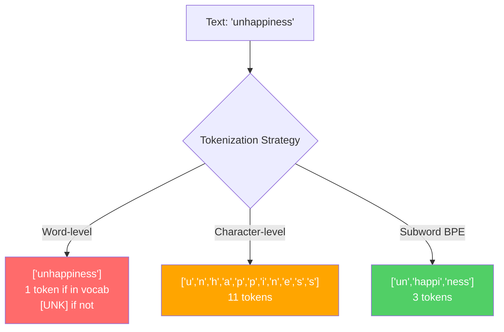
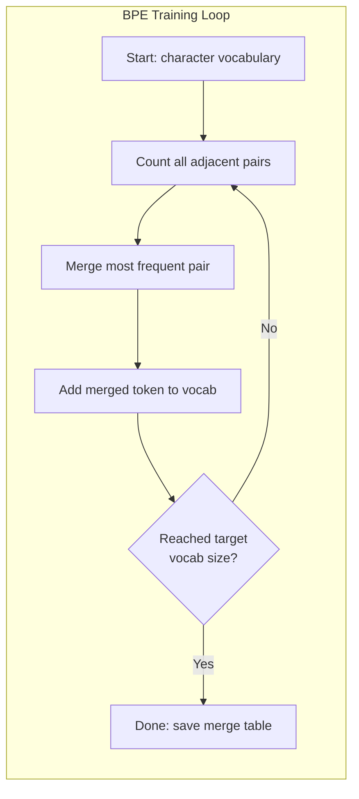
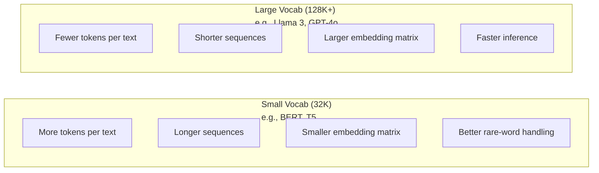

# 分词器：BPE、WordPiece、SentencePiece

> 你的大语言模型（LLM）读不懂英语，它读取的是整数。分词器（tokenizer）负责将文本与 token（词元）ID 相互映射，决定这些整数是在承载意义，还是在浪费表达能力。

**Type:** Build
**Languages:** Python
**Prerequisites:** 阶段 05（自然语言处理基础）
**Time:** ~90 分钟

## 学习目标

- 从零实现 BPE（字节对编码）、WordPiece 和 Unigram 分词算法，并比较它们的合并策略
- 解释词表大小如何影响模型效率：太小会导致序列过长，太大则会浪费嵌入（embedding）参数
- 分析不同语言和代码中的分词结果，找出特定分词器失效的情况
- 使用 tiktoken 和 sentencepiece 库对文本分词，并检查生成的 token ID

## 要解决的问题

你的 LLM 不读取英语，也不读取任何语言。它读取的是数字。

将 "Hello, world!" 变成 [15496, 11, 995, 0] 的，就是分词器。每个单词、每个空格、每个标点符号，都必须先转换成整数，模型才能处理。这种转换并非中性的：它把一些假设固化进模型，之后无法撤销。

这一步做错了，模型就会浪费容量，用多个 token 编码常见单词。"unfortunately" 会变成四个 token，而不是一个。对于包含大量多音节词的文本，原本 128K 的上下文窗口就相当于缩小了 75%。做对了，同样的上下文窗口就能承载两倍的信息。“这个模型擅长处理代码”和“这个模型一遇到 Python 就应付不来”之间的差异，往往取决于分词器的训练方式。

你向 GPT-4 或 Claude 发起的每次 API（应用程序编程接口）调用，都是按 token 计费的。模型每生成一个 token 都要消耗计算资源。表示同一段输出所需的 token 越少，端到端推理就越快。分词不只是预处理，它是架构的一部分。

## 核心概念

### 三种失败的方法，以及一种胜出的方法

将文本转换为数字，有三种显而易见的方法。其中两种无法适应大规模应用。

**词级分词**按空格和标点符号切分。"The cat sat" 会变成 ["The", "cat", "sat"]，很简单。但 "tokenization" 怎么办？"GPT-4o" 呢？像 "Geschwindigkeitsbegrenzung" 这样的德语复合词呢？词级分词需要庞大的词表，才能覆盖每种语言的每一个词。漏掉一个词，就会出现令人头疼的 `[UNK]` token，相当于模型在说“我完全不知道这是什么”。仅英语就有超过一百万种词形。再加上代码、URL、科学记数法和其他 100 种语言，你就需要一个无限大的词表。

**字符级分词**则走向另一个方向。"hello" 会变成 ["h", "e", "l", "l", "o"]。词表很小，只有几百个字符，永远不会出现未知 token。但序列会变得极长。一个在词级分词下只需 10 个 token 的句子，会变成 50 个字符级 token。模型还必须学会 "t"、"h"、"e" 合在一起就是 "the"，把注意力容量耗费在人类三岁就能学会的事情上。

**子词分词**找到了折中点。常见词保持完整："the" 是一个 token。生僻词则拆成有意义的片段："unhappiness" 变成 ["un", "happi", "ness"]。词表规模可控，包含 30K 到 128K 个 token，序列也保持较短。未知 token 基本消失，因为任何单词都可以由子词片段构成。

所有现代 LLM 都采用子词分词，GPT-2、GPT-4、BERT、Llama 3、Claude 都是如此。区别在于使用哪种算法。



### BPE：字节对编码

BPE 原本是一种贪心压缩算法，后来被用于分词。它的思路简单到一张索引卡就能写下。

从单个字符开始，统计训练语料中每一对相邻 token 的出现次数。将最常见的一对合并为一个新 token。反复执行，直到达到目标词表大小。

```figure
tokenizer-bpe
```

下面是在由 "lower"、"lowest" 和 "newest" 构成的微型语料上运行 BPE 的过程：

```text
Corpus (with word frequencies):
  "lower"  x5
  "lowest" x2
  "newest" x6

Step 0 -- Start with characters:
  l o w e r       (x5)
  l o w e s t     (x2)
  n e w e s t     (x6)

Step 1 -- Count adjacent pairs:
  (e,s): 8    (s,t): 8    (l,o): 7    (o,w): 7
  (w,e): 13   (e,r): 5    (n,e): 6    ...

Step 2 -- Merge most frequent pair (w,e) -> "we":
  l o we r        (x5)
  l o we s t      (x2)
  n e we s t      (x6)

Step 3 -- Recount and merge (e,s) -> "es":
  l o we r        (x5)
  l o we s t      (x2)    <- 'es' only forms from 'e'+'s', not 'we'+'s'
  n e we s t      (x6)    <- wait, the 'e' before 'we' and 's' after 'we'

Actually tracking this precisely:
  After "we" merge, remaining pairs:
  (l,o): 7   (o,we): 7   (we,r): 5   (we,s): 8
  (s,t): 8   (n,e): 6    (e,we): 6

Step 3 -- Merge (we,s) -> "wes" or (s,t) -> "st" (tied at 8, pick first):
  Merge (we,s) -> "wes":
  l o we r        (x5)
  l o wes t       (x2)
  n e wes t       (x6)

Step 4 -- Merge (wes,t) -> "west":
  l o we r        (x5)
  l o west        (x2)
  n e west        (x6)

...continue until target vocab size reached.
```

合并表就是分词器。编码新文本时，按照训练时学到的顺序执行合并。训练语料决定有哪些合并规则，而这些选择会永久影响模型看到的内容。



### 字节级 BPE（GPT-2、GPT-3、GPT-4）

标准 BPE 操作 Unicode 字符，字节级 BPE 操作原始字节（0-255）。这样，基础词表恰好包含 256 项，能够处理任何语言或编码，并且永远不会产生未知 token。

GPT-2 引入了这种做法。基础词表涵盖所有可能的字节，BPE 合并在此基础上继续构建。OpenAI 的 tiktoken 库实现了字节级 BPE，其词表大小如下：

- GPT-2：50,257 个 token
- GPT-3.5/GPT-4：~100,256 个 token（cl100k_base 编码）
- GPT-4o：200,019 个 token（o200k_base 编码）

### WordPiece（BERT）

WordPiece 看起来与 BPE 相似，但选择合并对象的方式不同。它不直接依据出现频率，而是使训练数据的似然最大化：

```text
BPE merge criterion:      count(A, B)
WordPiece merge criterion: count(AB) / (count(A) * count(B))
```

BPE 问的是：“哪一对出现得最多？”WordPiece 问的是：“哪一对共同出现的频率，比随机情况下的预期更高？”这个细微差别会产生不同的词表。WordPiece 倾向于合并共现程度出乎预期的组合，而不只是频繁出现的组合。

WordPiece 还使用 "##" 前缀表示接续前一个片段的子词：

```text
"unhappiness" -> ["un", "##happi", "##ness"]
"embedding"   -> ["em", "##bed", "##ding"]
```

"##" 前缀表示这个片段延续了前一个 token。BERT 使用 WordPiece，词表包含 30,522 个 token。BERT 的各种变体，例如 DistilBERT……不过，RoBERTa 的分词器实际上是 BPE，BERT 本身则使用 WordPiece。

### SentencePiece（Llama、T5）

SentencePiece 将输入视为原始 Unicode 字符流，其中也包括空白字符。它没有预分词步骤，也没有针对特定语言的词边界规则。因此，它真正做到了与语言无关，可以处理中文、日语、泰语等不用空格分隔词语的语言。

SentencePiece 支持两种算法：
- **BPE 模式**：与标准 BPE 使用相同的合并逻辑，但直接作用于原始字符序列
- **Unigram 模式**：从一个较大的词表出发，迭代删除对整体似然影响最小的 token。它与 BPE 的方向相反：采用剪枝，而不是合并。

Llama 2 使用 SentencePiece BPE，词表包含 32,000 个 token。T5 使用 SentencePiece Unigram，词表也包含 32,000 个 token。注意：Llama 3 已改用基于 tiktoken 的字节级 BPE 分词器，词表包含 128,256 个 token。

### 词表大小的权衡

这是一项切实的工程决策，产生的影响可以量化。



来看具体数字。对于 128K 的词表和 4,096 维嵌入，仅嵌入矩阵就有 128,000 x 4,096 = 524 million（百万）个参数。对于 32K 的词表，则为 131 million 个参数。仅分词器的选择，就造成了 400M 个参数的差异。

但更大的词表能更充分地压缩文本。同一段英文，在 32K 词表下需要 100 个 token，在 128K 词表下可能只需 70 个。这意味着生成时的前向传播次数减少 30%。对于服务数百万次请求的模型，这会直接降低计算成本。

趋势很明确：词表在不断扩大。GPT-2 使用 50,257 项，GPT-4 使用 ~100K 项，Llama 3 使用 128K 项，GPT-4o 使用 200K 项。

| 模型 | 词表大小 | 分词器类型 | 每个英文单词的平均 token 数 |
|-------|-----------|----------------|---------------------------|
| BERT | 30,522 | WordPiece | ~1.4 |
| GPT-2 | 50,257 | 字节级 BPE | ~1.3 |
| Llama 2 | 32,000 | SentencePiece BPE | ~1.4 |
| GPT-4 | ~100,256 | 字节级 BPE | ~1.2 |
| Llama 3 | 128,256 | 字节级 BPE（tiktoken） | ~1.1 |
| GPT-4o | 200,019 | 字节级 BPE | ~1.0 |

### 多语言的额外开销

主要用英语训练的分词器，对其他语言很不友好。GPT-2 的分词器处理韩语时，平均每个词需要 2-3 个 token，中文可能更糟。这意味着，韩语用户实际可用的上下文窗口只有英语用户的一半：付出相同价格，却获得更低的信息密度。

这就是 Llama 3 将词表从 32K 扩大四倍至 128K 的原因。为非英语文字分配更多 token，可以让不同语言获得更公平的压缩效果。

```figure
tokenizer-tradeoff
```

## 动手实现

### 第 1 步：字符级分词器

从基础开始。字符级分词器将每个字符映射到它的 Unicode 码点。不需要训练，不会出现未知 token，只做直接映射。

```python
class CharTokenizer:
    def encode(self, text):
        return [ord(c) for c in text]

    def decode(self, tokens):
        return "".join(chr(t) for t in tokens)
```

"hello" 会变成 [104, 101, 108, 108, 111]。每个字符各自对应一个 token。这就是我们要改进的基线。

### 第 2 步：从零实现 BPE 分词器

现在开始真正的实现。我们像 GPT-2 一样，在原始字节上训练，统计相邻对，合并最常见的一对，并按顺序记录每次合并。合并表就是分词器。

```python
from collections import Counter

class BPETokenizer:
    def __init__(self):
        self.merges = {}
        self.vocab = {}

    def _get_pairs(self, tokens):
        pairs = Counter()
        for i in range(len(tokens) - 1):
            pairs[(tokens[i], tokens[i + 1])] += 1
        return pairs

    def _merge_pair(self, tokens, pair, new_token):
        merged = []
        i = 0
        while i < len(tokens):
            if i < len(tokens) - 1 and tokens[i] == pair[0] and tokens[i + 1] == pair[1]:
                merged.append(new_token)
                i += 2
            else:
                merged.append(tokens[i])
                i += 1
        return merged

    def train(self, text, num_merges):
        tokens = list(text.encode("utf-8"))
        self.vocab = {i: bytes([i]) for i in range(256)}

        for i in range(num_merges):
            pairs = self._get_pairs(tokens)
            if not pairs:
                break
            best_pair = max(pairs, key=pairs.get)
            new_token = 256 + i
            tokens = self._merge_pair(tokens, best_pair, new_token)
            self.merges[best_pair] = new_token
            self.vocab[new_token] = self.vocab[best_pair[0]] + self.vocab[best_pair[1]]

        return self

    def encode(self, text):
        tokens = list(text.encode("utf-8"))
        for pair, new_token in self.merges.items():
            tokens = self._merge_pair(tokens, pair, new_token)
        return tokens

    def decode(self, tokens):
        byte_sequence = b"".join(self.vocab[t] for t in tokens)
        return byte_sequence.decode("utf-8", errors="replace")
```

训练循环就是 BPE 的核心：统计相邻对、合并频率最高的一对、重复。每次合并都会减少 token 总数。经过 `num_merges` 轮后，词表从 256 个基础字节扩展到 256 + num_merges 项。

编码时，严格按照学习顺序执行合并。这一点很重要。如果第 1 次合并创建了 "th"，第 5 次合并创建了 "the"，那么编码时必须先执行第 1 次合并，这样到第 5 次合并时，才能由 "th" + "e" 组成 "the"。

解码则是逆过程：在词表中查询每个 token ID，拼接对应字节，再按 UTF-8 解码。

### 第 3 步：编码与解码往返验证

```python
corpus = (
    "The cat sat on the mat. The cat ate the rat. "
    "The dog sat on the log. The dog ate the frog. "
    "Natural language processing is the study of how computers "
    "understand and generate human language. "
    "Tokenization is the first step in any NLP pipeline."
)

tokenizer = BPETokenizer()
tokenizer.train(corpus, num_merges=40)

test_sentences = [
    "The cat sat on the mat.",
    "Natural language processing",
    "tokenization pipeline",
    "unhappiness",
]

for sentence in test_sentences:
    encoded = tokenizer.encode(sentence)
    decoded = tokenizer.decode(encoded)
    raw_bytes = len(sentence.encode("utf-8"))
    ratio = len(encoded) / raw_bytes
    print(f"'{sentence}'")
    print(f"  Tokens: {len(encoded)} (from {raw_bytes} bytes) -- ratio: {ratio:.2f}")
    print(f"  Roundtrip: {'PASS' if decoded == sentence else 'FAIL'}")
```

压缩率能反映分词器的效果。压缩率为 0.50，表示分词后得到的 token 数量只有原始字节数的一半。这个值越低越好。在训练语料上，压缩率会表现良好；在 "unhappiness" 这种分布外文本上，由于它没有出现在语料中，压缩率会变差：对于未见过的模式，分词器会退回字符级编码。

### 第 4 步：与 tiktoken 比较

```python
import tiktoken

enc = tiktoken.get_encoding("cl100k_base")

texts = [
    "The cat sat on the mat.",
    "unhappiness",
    "Hello, world!",
    "def fibonacci(n): return n if n < 2 else fibonacci(n-1) + fibonacci(n-2)",
    "Geschwindigkeitsbegrenzung",
]

for text in texts:
    our_tokens = tokenizer.encode(text)
    tiktoken_tokens = enc.encode(text)
    tiktoken_pieces = [enc.decode([t]) for t in tiktoken_tokens]
    print(f"'{text}'")
    print(f"  Our BPE:   {len(our_tokens)} tokens")
    print(f"  tiktoken:  {len(tiktoken_tokens)} tokens -> {tiktoken_pieces}")
```

tiktoken 使用完全相同的算法，只是在数百 gigabytes 的文本上训练，并执行了 100,000 次合并。算法相同，差异在于训练数据和合并次数。你的分词器只在一段文本上训练了 40 次合并，自然无法与 tiktoken 在海量语料上进行的 100K 次合并相抗衡。但两者的机制是一样的。

### 第 5 步：词表分析

```python
def analyze_vocabulary(tokenizer, test_texts):
    total_tokens = 0
    total_chars = 0
    token_usage = Counter()

    for text in test_texts:
        encoded = tokenizer.encode(text)
        total_tokens += len(encoded)
        total_chars += len(text)
        for t in encoded:
            token_usage[t] += 1

    print(f"Vocabulary size: {len(tokenizer.vocab)}")
    print(f"Total tokens across all texts: {total_tokens}")
    print(f"Total characters: {total_chars}")
    print(f"Avg tokens per character: {total_tokens / total_chars:.2f}")

    print(f"\nMost used tokens:")
    for token_id, count in token_usage.most_common(10):
        token_bytes = tokenizer.vocab[token_id]
        display = token_bytes.decode("utf-8", errors="replace")
        print(f"  Token {token_id:4d}: '{display}' (used {count} times)")

    unused = [t for t in tokenizer.vocab if t not in token_usage]
    print(f"\nUnused tokens: {len(unused)} out of {len(tokenizer.vocab)}")
```

这会展示词表中的 Zipf 分布。少数 token 占据主要份额，例如空格、"the" 和 "e"，而大多数 token 很少使用。生产级分词器会针对这种分布进行优化：常见模式获得较短的 token ID，罕见模式则用更长的表示。

## 实际使用

你从零实现的 BPE 已经能工作了。现在来看看生产级工具。

### tiktoken（OpenAI）

```python
import tiktoken

enc = tiktoken.get_encoding("cl100k_base")

text = "Tokenizers convert text to integers"
tokens = enc.encode(text)
print(f"Tokens: {tokens}")
print(f"Pieces: {[enc.decode([t]) for t in tokens]}")
print(f"Roundtrip: {enc.decode(tokens)}")
```

tiktoken 用 Rust 编写，并提供 Python 绑定。它每秒可以编码数百万个 token。算法仍是 BPE，实现则达到了工业级强度。

### Hugging Face tokenizers

```python
from tokenizers import Tokenizer
from tokenizers.models import BPE
from tokenizers.trainers import BpeTrainer
from tokenizers.pre_tokenizers import ByteLevel

tokenizer = Tokenizer(BPE())
tokenizer.pre_tokenizer = ByteLevel()

trainer = BpeTrainer(vocab_size=1000, special_tokens=["<pad>", "<eos>", "<unk>"])
tokenizer.train(["corpus.txt"], trainer)

output = tokenizer.encode("The cat sat on the mat.")
print(f"Tokens: {output.tokens}")
print(f"IDs: {output.ids}")
```

Hugging Face tokenizers 库的底层同样使用 Rust。它能在几秒内对 gigabyte 级语料完成 BPE 训练。训练自己的模型时，就可以使用这个工具。

### 加载 Llama 的分词器

```python
from transformers import AutoTokenizer

tokenizer = AutoTokenizer.from_pretrained("meta-llama/Llama-3.1-8B")

text = "Tokenizers are the unsung heroes of LLMs"
tokens = tokenizer.encode(text)
print(f"Token IDs: {tokens}")
print(f"Tokens: {tokenizer.convert_ids_to_tokens(tokens)}")
print(f"Vocab size: {tokenizer.vocab_size}")

multilingual = ["Hello world", "Hola mundo", "Bonjour le monde"]
for text in multilingual:
    ids = tokenizer.encode(text)
    print(f"'{text}' -> {len(ids)} tokens")
```

Llama 3 的 128K 词表对非英语文本的压缩效果，明显优于 GPT-2 的 50K 词表。你可以自行验证：将同一个句子写成多种语言，分别编码并统计 token 数量。

## 交付成果

本课将产出 `outputs/prompt-tokenizer-analyzer.md`，这是一份可复用的提示词（prompt），用于分析任意文本与模型组合的分词效率。给它一份文本样本，它就会告诉你哪个模型的分词器处理得最好。

## 练习

1. 修改 BPE 分词器，让它在每次合并时打印词表。观察 "t" + "h" 如何变成 "th"，再由 "th" + "e" 变成 "the"。追踪常见英文单词如何逐片组装起来。

2. 为 BPE 分词器添加特殊 token（`<pad>`、`<eos>`、`<unk>`）。将它们的 ID 分别设为 0、1、2，并相应调整其他所有 token 的 ID。实现一个预分词步骤，在运行 BPE 之前按空白字符切分。

3. 实现 WordPiece 的合并准则，使用似然比，而不是频率。在相同语料上，用相同的合并次数分别训练 BPE 和 WordPiece。比较得到的词表：哪一种产生的子词更符合语言学意义？

4. 构建一个多语言分词效率基准。选取英语、西班牙语、中文、韩语和阿拉伯语的 10 个句子。用 tiktoken（cl100k_base）分别分词，并测量平均每个字符对应的 token 数。量化每种语言的“多语言额外开销”。

5. 在更大的语料上训练 BPE 分词器，例如下载一篇 Wikipedia 文章。调整合并次数，使其在同一文本上的压缩率与 tiktoken 相差不超过 10%。这会促使你理解语料规模、合并次数和压缩效果之间的关系。

## 关键术语

| 术语 | 常见说法 | 实际含义 |
|------|----------------|----------------------|
| token | “一个单词” | 模型词表中的一个单位，可能是字符、子词、单词，也可能是包含多个词的片段 |
| BPE | “某种压缩方法” | 字节对编码：迭代合并最频繁的相邻 token 对，直到达到目标词表大小 |
| WordPiece | “BERT 的分词器” | 类似 BPE，但合并时最大化似然比 count(AB)/(count(A)\*count(B))，而不是直接依据出现频率 |
| SentencePiece | “一个分词器库” | 与语言无关的分词器，直接处理原始 Unicode，无需预分词，支持 BPE 和 Unigram 算法 |
| 词表大小 | “它认识多少个词” | 不同 token 的总数：GPT-2 有 50,257 个，BERT 有 30,522 个，Llama 3 有 128,256 个 |
| Fertility（平均每词 token 数） | “不是分词器术语” | 平均每个词对应的 token 数，用于衡量分词器在不同语言上的效率（1.0 为理想值，3.0 表示模型要付出三倍的工作量） |
| 字节级 BPE | “GPT 的分词器” | 在原始字节（0-255）上而非 Unicode 字符上运行的 BPE，保证任何输入都不会出现未知 token |
| 合并表 | “分词器文件” | 训练中学到的相邻对合并规则的有序列表；这就是分词器本身，而且顺序很重要 |
| 预分词 | “按空格切分” | 在子词分词前应用的规则，包括按空白字符切分、数字分隔和标点处理 |
| 压缩率 | “分词器的效率” | 输出 token 数除以输入字节数；越低表示压缩效果越好、推理越快 |

## 延伸阅读

- [Sennrich 等，2016：《使用子词单元进行生僻词的神经机器翻译》](https://arxiv.org/abs/1508.07909) -- 将 BPE 引入自然语言处理的论文，使一种 1994 年的压缩算法成为现代分词的基础
- [Kudo 与 Richardson，2018：《SentencePiece：一种简单且与语言无关的子词分词器》](https://arxiv.org/abs/1808.06226) -- 与语言无关的分词方法，让多语言模型具备了实用性
- [OpenAI tiktoken 仓库](https://github.com/openai/tiktoken) -- 用 Rust 实现、提供 Python 绑定的生产级 BPE，供 GPT-3.5/4/4o 使用
- [Hugging Face Tokenizers 文档](https://huggingface.co/docs/tokenizers) -- 具有 Rust 性能的生产级分词器训练工具
