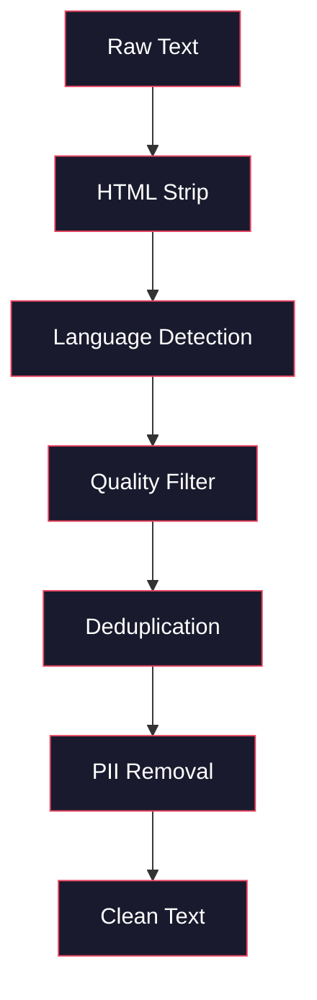
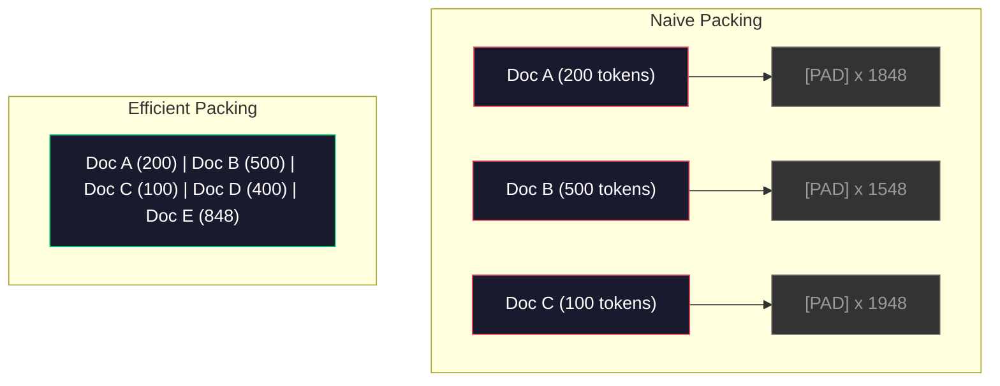

# 预训练数据处理流水线

> 模型就像一面镜子：你喂给它什么数据，它就映照出什么。喂进去的是垃圾，它也会用无比流畅的语言复现垃圾。

**Type:** Build
**Languages:** Python
**Prerequisites:** 阶段 10，第 01-02 课（分词器、从零构建分词器）
**Time:** ~90 分钟

## 学习目标

- 构建采用流式读取（streaming）的数据处理流水线（data pipeline），对太字节级的文本进行分词（tokenization）、分块、随机打乱和分批处理，而无需将全部文本载入内存
- 实现真实预训练（pre-training）流水线中使用的数据质量过滤器，包括去重（deduplication）、语言检测（language detection）和内容过滤（content filtering）
- 创建固定长度的训练序列，正确设置注意力掩码（attention mask）并处理文档边界
- 剖析流水线的吞吐量（throughput），确保数据加载器（dataloader）跟得上 GPU 的训练速度

## 要解决的问题

你已经有了分词器（tokenizer），现在需要的是数据。

不是一个数据集（dataset），也不是一个 CSV 文件，而是太字节级的文本：先清洗、去重、按质量过滤，再分词并组织成固定长度的序列，最后以随机批次供给模型。供给速度必须足够快，不能让你的 8-GPU 集群停下来等下一批数据。

大多数人以为，训练大语言模型（LLM）的关键是模型架构，其实不然。Llama 3 使用了 15.6 万亿个 token（词元）。GPT-3 使用了 300 billion（三千亿）个。DeepSeek-V2 使用了 8.1 万亿个。这三者的架构大致相同：堆叠多个包含注意力（attention）和前馈层（feedforward layer）的 Transformer 块。它们的输出质量之所以不同，绝大部分原因在于数据。

DeepMind 的 Chinchilla 论文将这一点量化了：在给定的计算预算下，模型参数量与训练 token 数之间存在最优比例。Chinchilla 表明，2022 年的大多数模型都严重训练不足：相对于见过的数据量，它们的参数太多了。一个用 1.4 万亿个 token 训练的 70B 参数模型（符合 Chinchilla 最优配比），胜过了用 300 billion（三千亿）个 token 训练的 280B 模型（Gopher）。

你的数据处理流水线决定了模型学到的究竟是语言，还是噪声。

## 核心概念

### 数据从哪里来

每个大语言模型都会混合使用多种来源的数据进行训练。大多数实验室都对具体构成严格保密，但我们已知的信息足以让我们了解这些数据的类别。

| 来源 | 规模 | 质量 | 使用者 |
|--------|------|---------|---------|
| Common Crawl | 原始数据约 250 TB | 低（需要大量过滤） | GPT-3、Llama 及大多数开放模型 |
| Wikipedia | ~20 GB | 高 | 各大主流 LLM |
| GitHub 代码 | ~1 TB+ | 中（大量重复代码、死代码） | StarCoder、CodeLlama、DeepSeek-Coder |
| 书籍（BookCorpus、Pile） | ~100 GB | 高 | GPT-2、GPT-3 及早期模型 |
| 学术论文（arXiv、S2ORC） | ~100 GB | STEM（科学、技术、工程、数学）领域质量高 | Llama、Galactica |
| StackOverflow、Reddit | ~100 GB | 中 | Llama、Falcon |
| 精选网页数据（C4、RefinedWeb） | ~5 TB | 中到高（已经预先过滤） | T5、Falcon |

Llama 3 公布了其数据混合配比（data mix）：约 50% 为网页数据，25% 为代码，13% 为书籍和学术论文，8% 为数学数据，4% 为多语言网页数据。总量为 15.6 万亿个 token，源数据包含超过 5 TB 的原始文本。

配比和总量同样重要。网页数据太多，模型就会变成复述 Reddit 的鹦鹉；代码太少，它就不会编程；数学数据太少，它的推理能力就会欠佳。调好这个配比是训练 LLM 最难的环节之一，而且没有现成公式，必须靠实验和评估。

### 数据清洗

原始网页数据杂乱不堪。一份典型的 Common Crawl 数据转储中包含：

- HTML 标签和 JavaScript
- 模板化的页眉、页脚和导航菜单
- 重复页面，包括完全重复和近重复页面
- 机器生成的垃圾内容
- 个人身份信息（PII）
- 低质量文本，如关键词列表、SEO（搜索引擎优化）垃圾内容
- 编码成文本的非文本内容

这些内容非清洗不可。它决定了模型是生成连贯的段落，还是输出混杂着商品列表的 HTML 标签。



每一步都会去掉一类噪声：

**剥离 HTML：** 移除所有标记，只保留可见的文本内容。`trafilatura`、`readability` 等库可以提取文章正文，同时丢弃导航、广告和模板化内容。

**语言检测：** 使用 fastText 的语言识别模型（lid.176.bin）对每篇文档分类，只保留目标语言的文档。如果一篇文档被判定为英语，但置信度（confidence）低于 0.8，它很可能不是干净的英语文本。

**质量过滤：** 这一步就有意思了。RefinedWeb（Falcon 所用的数据集）采用基于困惑度（perplexity）的过滤器：先用 Wikipedia 训练一个小型语言模型，再给每篇文档打分。困惑度高，说明文档不像 Wikipedia，很可能是垃圾内容、关键词列表或机器生成的内容。困惑度超过阈值的文档会被移除。

**去重：** 这是影响最大的一项清洗步骤。Common Crawl 包含海量重复页面，例如法律免责声明、cookie 提示和服务条款。在重复数据上训练既浪费算力，也可能让模型记住并逐字复述特定段落。

**移除 PII：** 需要移除的信息包括姓名、电子邮件地址、电话号码和社会保障号码。对于结构化的 PII，可基于正则表达式（regex）检测；对于上下文中的姓名，则使用命名实体识别（NER）模型。

### 使用 MinHash 去重

完全去重很简单：计算每篇文档的哈希值，移除重复项。但真正棘手的是近重复文档。同一篇新闻的两个版本，如果周围的广告略有不同，就属于近重复文档。它们的内容有 95% 相同，逐字节比较却不一样。

MinHash 与局部敏感哈希（Locality-Sensitive Hashing，LSH）相结合，可以高效解决这个问题。


基本思路如下：

1. **构造片段集合（shingling）：** 将每篇文档转换为一个 n-gram（连续 n 元片段）集合，例如由 5 个单词或字符组成的片段。对 "the quick brown fox" 构造 3 词片段（shingle），会得到 {"the quick brown", "quick brown fox"}。

2. **MinHash：** 对每篇文档的片段集合计算 k 个哈希值。每个值都对应一个不同的哈希函数，并取该函数对所有片段计算所得的最小哈希值。这样就得到一个固定大小的“签名”（signature），用于近似估计任意两篇文档之间的 Jaccard 相似度。

3. **LSH：** 根据 MinHash 签名的分带（band），将文档分到不同的桶（bucket）中。同一桶中的文档是近重复候选。这样就不必比较每一对文档，只需要比较候选对。

4. **核验：** 对每个候选对，计算精确的 Jaccard 相似度。如果相似度超过阈值（通常为 0.8），就移除其中一个副本。

Llama 团队报告称，他们通过去重移除了约 38% 的网页数据。这个比例可不小：Common Crawl 中超过三分之一的内容是重复或近重复内容。

### 序列打包

模型需要固定长度的输入序列，但文档长短不一：有的只有 50 个 token，有的却有 50,000 个。

简单的做法是将每篇文档填充到最大序列长度。这样会把大量算力浪费在对学习毫无帮助的填充 token（padding token）上。

更好的做法是进行序列打包（sequence packing）：将多篇文档装入同一个序列，并用序列结束 token（end-of-sequence token）分隔。一个长度为 2048 个 token 的序列可以包含三篇拼接起来的短文档，文档之间用 [EOS] token 隔开。



注意力掩码必须正确设置。在同一个打包序列中，文档 A 的 token 不应关注文档 B 的 token。这需要使用分块对角注意力掩码（block-diagonal attention mask）。

长文档会被截断，或在序列边界处切分成块。切分点很重要：在句子中间切开，会迫使模型看到表达不完整的内容。有些流水线会尽可能让切分点与段落或句子边界对齐。

### Chinchilla 缩放定律

对于固定的计算预算 C（以 FLOPs，即浮点运算次数计量），最优模型规模 N 和数据集规模 D 遵循：

```text
N_opt ~ C^0.5
D_opt ~ C^0.5
```

实际应用中，这意味着模型规模与数据集规模应按大致相同的比例扩大。参数量扩大到 10 倍的模型，需要大约 10 倍的训练 token 才能达到相同的损失。

| 模型 | 参数量 | 训练 token 数 | 是否符合 Chinchilla 最优配比？ |
|-------|-----------|----------------|-------------------|
| GPT-3 | 175B | 300B | 否（训练不足，所需训练量为当前的 3-4 倍） |
| Chinchilla | 70B | 1.4T | 是（按此目标设计） |
| Llama 2 | 70B | 2T | 超量训练（有意为之） |
| Llama 3 | 70B | 15T | 大幅超量训练 |

Llama 3 有意偏离了 Chinchilla 定律。Meta 发现，用更多数据进行超量训练（overtraining），即远远超过计算最优（compute-optimal）配比，会得到更适合推理的模型。额外的训练成本只需付出一次，而较小模型的长期服务成本始终更低。这种缩放方式有时被称为“推理最优”（inference-optimal），自 2024 年以来已成为行业标准。

```figure
l5-data-pipeline
```

## 动手实现

### 步骤 1：文本清洗

剥离 HTML、规范化空白字符并移除非文本内容。我们将使用一份来自 Project Gutenberg 的公有领域文本，作为小型语料库（corpus）。

```python
import re

def clean_text(text):
    text = re.sub(r"<[^>]+>", "", text)
    text = re.sub(r"http\S+", "", text)
    text = re.sub(r"[^\x20-\x7E\n]", "", text)
    text = re.sub(r"\n{3,}", "\n\n", text)
    text = re.sub(r" {2,}", " ", text)
    return text.strip()

def quality_filter(text, min_words=50, max_ratio_caps=0.3, max_ratio_special=0.1):
    words = text.split()
    if len(words) < min_words:
        return False
    caps_ratio = sum(1 for w in words if w.isupper()) / len(words)
    if caps_ratio > max_ratio_caps:
        return False
    special_chars = sum(1 for c in text if not c.isalnum() and not c.isspace())
    if special_chars / max(len(text), 1) > max_ratio_special:
        return False
    return True
```

这个质量过滤器可以识别 SEO 垃圾内容（全部使用大写字母）、机器生成的噪声（特殊字符比例过高），以及只有零星内容的页面（太短）。仅这三项检查，就能从网页抓取结果中去掉数量惊人的垃圾内容。

### 步骤 2：MinHash 去重

从零实现 MinHash，不需要外部库，只需 `hashlib`。

```python
import hashlib
from collections import defaultdict

def get_shingles(text, k=5):
    words = text.lower().split()
    if len(words) < k:
        return set()
    return {" ".join(words[i:i+k]) for i in range(len(words) - k + 1)}

def minhash_signature(shingles, num_hashes=128):
    signature = []
    for i in range(num_hashes):
        min_hash = float("inf")
        for shingle in shingles:
            h = int(hashlib.sha256(f"{i}:{shingle}".encode()).hexdigest(), 16)
            min_hash = min(min_hash, h)
        signature.append(min_hash)
    return signature

def lsh_buckets(signature, bands=16):
    rows_per_band = len(signature) // bands
    buckets = []
    for b in range(bands):
        start = b * rows_per_band
        band_data = tuple(signature[start:start + rows_per_band])
        bucket_hash = hashlib.md5(str(band_data).encode()).hexdigest()
        buckets.append((b, bucket_hash))
    return buckets

def deduplicate(documents, threshold=0.8, num_hashes=128, bands=16):
    signatures = []
    shingle_sets = []
    for doc in documents:
        shingles = get_shingles(doc)
        shingle_sets.append(shingles)
        signatures.append(minhash_signature(shingles, num_hashes))

    bucket_map = defaultdict(list)
    for doc_idx, sig in enumerate(signatures):
        for band_id, bucket_hash in lsh_buckets(sig, bands):
            bucket_map[(band_id, bucket_hash)].append(doc_idx)

    duplicate_pairs = set()
    for bucket_docs in bucket_map.values():
        if len(bucket_docs) < 2:
            continue
        for i in range(len(bucket_docs)):
            for j in range(i + 1, len(bucket_docs)):
                duplicate_pairs.add((bucket_docs[i], bucket_docs[j]))

    removed = set()
    for i, j in duplicate_pairs:
        if i in removed or j in removed:
            continue
        s1, s2 = shingle_sets[i], shingle_sets[j]
        if not s1 or not s2:
            continue
        jaccard = len(s1 & s2) / len(s1 | s2)
        if jaccard >= threshold:
            removed.add(j)

    return [doc for idx, doc in enumerate(documents) if idx not in removed], len(removed)
```

`num_hashes=128` 和 `bands=16` 这两个参数控制精确率（precision）与召回率（recall）之间的权衡。哈希值越多，相似度估计就越准确；分带越多，召回率就越高，也就是能发现更多重复项，但代价是误报更多。这组取值适合典型的网页文本。

### 步骤 3：分词并打包序列

将清洗并去重后的文本分词，打包成固定长度的序列，用于训练。

```python
def tokenize_corpus(documents, tokenizer):
    all_tokens = []
    for doc in documents:
        tokens = tokenizer.encode(doc)
        all_tokens.extend(tokens)
        all_tokens.append(tokenizer.eos_id)
    return all_tokens

def pack_sequences(token_ids, seq_length, pad_id=0):
    sequences = []
    attention_masks = []
    for i in range(0, len(token_ids), seq_length):
        seq = token_ids[i:i + seq_length]
        mask = [1] * len(seq)
        if len(seq) < seq_length:
            pad_count = seq_length - len(seq)
            seq = seq + [pad_id] * pad_count
            mask = mask + [0] * pad_count
        sequences.append(seq)
        attention_masks.append(mask)
    return sequences, attention_masks
```

### 步骤 4：训练用 DataLoader

将打包好的序列以随机批次逐批产出，供训练循环使用。

```python
import random

class PreTrainingDataLoader:
    def __init__(self, sequences, attention_masks, batch_size, shuffle=True):
        self.sequences = sequences
        self.attention_masks = attention_masks
        self.batch_size = batch_size
        self.shuffle = shuffle

    def __len__(self):
        return (len(self.sequences) + self.batch_size - 1) // self.batch_size

    def __iter__(self):
        indices = list(range(len(self.sequences)))
        if self.shuffle:
            random.shuffle(indices)
        for start in range(0, len(indices), self.batch_size):
            batch_idx = indices[start:start + self.batch_size]
            batch_seqs = [self.sequences[i] for i in batch_idx]
            batch_masks = [self.attention_masks[i] for i in batch_idx]
            yield batch_seqs, batch_masks
```

### 步骤 5：数据集统计

计算关键指标：token 总数、不同 token 的数量、压缩率（compression ratio），以及文档长度分布。

```python
from collections import Counter

def compute_statistics(documents, token_ids, sequences, tokenizer_vocab_size):
    total_chars = sum(len(d) for d in documents)
    total_tokens = len(token_ids)
    unique_tokens = len(set(token_ids))
    compression_ratio = total_chars / total_tokens

    doc_lengths = [len(d.split()) for d in documents]
    avg_doc_length = sum(doc_lengths) / max(len(doc_lengths), 1)
    max_doc_length = max(doc_lengths) if doc_lengths else 0
    min_doc_length = min(doc_lengths) if doc_lengths else 0

    token_counts = Counter(token_ids)
    top_tokens = token_counts.most_common(10)

    non_pad_tokens = sum(sum(1 for t in seq if t != 0) for seq in sequences)
    total_positions = sum(len(seq) for seq in sequences)
    utilization = non_pad_tokens / max(total_positions, 1)

    stats = {
        "total_documents": len(documents),
        "total_characters": total_chars,
        "total_tokens": total_tokens,
        "unique_tokens": unique_tokens,
        "vocab_utilization": unique_tokens / tokenizer_vocab_size,
        "compression_ratio": compression_ratio,
        "avg_doc_length_words": avg_doc_length,
        "max_doc_length_words": max_doc_length,
        "min_doc_length_words": min_doc_length,
        "num_sequences": len(sequences),
        "sequence_utilization": utilization,
        "top_10_tokens": top_tokens,
    }
    return stats
```

压缩率反映了分词器处理这份语料的效率。英语文本通常能压缩到每个 token 对应约 3-4 个字符。如果结果是每个 token 对应 1.5 个字符，说明分词器切分得太细；如果达到 8+ 个字符，说明它学到了非常特定于该领域的合并规则。

序列利用率（sequence utilization）反映了打包序列中真实数据与填充内容各占多少。如果低于 90%，就说明打包效率不高，你正在把算力浪费在填充 token 上。

## 实际使用

### 与 HuggingFace Datasets 比较

通过 HuggingFace 的 datasets 库加载同一份语料，比较流水线的处理速度。

```python
from datasets import load_dataset
from transformers import AutoTokenizer

ds = load_dataset("wikitext", "wikitext-2-raw-v1", split="train")
tokenizer = AutoTokenizer.from_pretrained("meta-llama/Meta-Llama-3-8B")

import time

start = time.time()
tokenized = ds.map(
    lambda x: tokenizer(x["text"], truncation=True, max_length=2048),
    batched=True,
    num_proc=4,
)
hf_time = time.time() - start
total_tokens = sum(len(t) for t in tokenized["input_ids"])
print(f"HuggingFace: {total_tokens:,} tokens in {hf_time:.2f}s ({total_tokens/hf_time:,.0f} tokens/sec)")
```

HuggingFace 流水线底层使用 Rust 分词器，并在 4 个核心上并行处理。纯 Python 流水线会慢 10-50 倍。正是这种差距，让生产团队选择使用编译型语言实现的分词器。算法相同，区别在于实现语言。

## 交付成果

本课会产出一个用于验证和排查 LLM 训练流水线数据质量问题的提示词（prompt），见 `outputs/prompt-data-quality-checker.md`。

## 练习

1. **简单：** 用简单的启发式方法（字符集分析）为清洗流水线添加语言检测功能。过滤后只保留英语文档，并统计移除了多少篇文档。
2. **中等：** 在 MinHash 近重复去重之外，再用 SHA-256 哈希实现完全去重。使用一份抓取自网页的语料，比较两种方法各自找出的重复项数量。
3. **困难：** 构建基于困惑度的质量过滤器。用 Wikipedia 文本训练一个小型二元语言模型（bigram language model），按困惑度为每篇文档打分，并移除排名最低的 20%。比较模型分别在过滤前后的数据上训练时的输出质量。

## 关键术语

| 术语 | 常见说法 | 实际含义 |
|------|----------------|----------------------|
| Common Crawl | “互联网” | 每月抓取网页的非营利组织，原始数据约 250TB，是大多数 LLM 训练数据的起点 |
| MinHash | “某种哈希技巧” | 用固定大小的签名估计集合间 Jaccard 相似度的技术，可用于大规模近重复检测 |
| LSH | “局部敏感哈希” | 将相似项分到同一桶中的方法，可将两两比较的复杂度从 O(n^2) 降至近线性 |
| 序列打包 | “拼接文档” | 将多篇文档装入固定长度的序列，并正确设置注意力掩码，以消除填充造成的浪费 |
| Chinchilla 缩放 | “用更多数据训练” | 在固定计算预算下，要达到最优性能，需要让模型规模与训练 token 数按大致相同的比例增长 |
| 平均每词 token 数（fertility） | “每个词对应的 token 数” | 每个词对应的 token 数的平均值；GPT-4 处理英语时为 1.3，处理非拉丁文字时更高 |
| 数据混合 | “选择训练数据” | 代码、文本、数学和多语言数据之间的配比，没有现成公式，需要实验 |
| 困惑度过滤器 | “质量打分” | 用小型语言模型给文档打分；困惑度高意味着文本不像干净的参考数据 |
| 去重 | “移除副本” | 消除完全重复和近重复的文档，通常会移除原始网页数据的 30-40% |
| 注意力掩码 | “该关注哪些 token” | 一种二值掩码，用于阻止打包序列中的注意力跨越文档边界 |

## 延伸阅读

- [Hoffmann et al., 2022 -- Training Compute-Optimal Large Language Models (Chinchilla)](https://arxiv.org/abs/2203.15556) —— 改变我们对数据规模认识的论文
- [Penedo et al., 2023 -- The RefinedWeb Dataset for Falcon LLM](https://arxiv.org/abs/2306.01116) —— 如何过滤 Common Crawl，得到高质量数据
- [Touvron et al., 2023 -- Llama 2: Open Foundation and Fine-Tuned Chat Models](https://arxiv.org/abs/2307.09288) —— Llama 2 的数据处理流水线细节
- [Lee et al., 2022 -- Deduplicating Training Data Makes Language Models Better](https://arxiv.org/abs/2107.06499) —— 去重为何比你想象的更重要
- [Broder, 1997 -- On the Resemblance and Containment of Documents](https://ieeexplore.ieee.org/document/666900) —— 最早提出 MinHash 的论文
- [Meta, 2024 -- Llama 3 Technical Report](https://arxiv.org/abs/2407.21783) —— 15.6T 个 token、数据混合配比和过滤流水线
