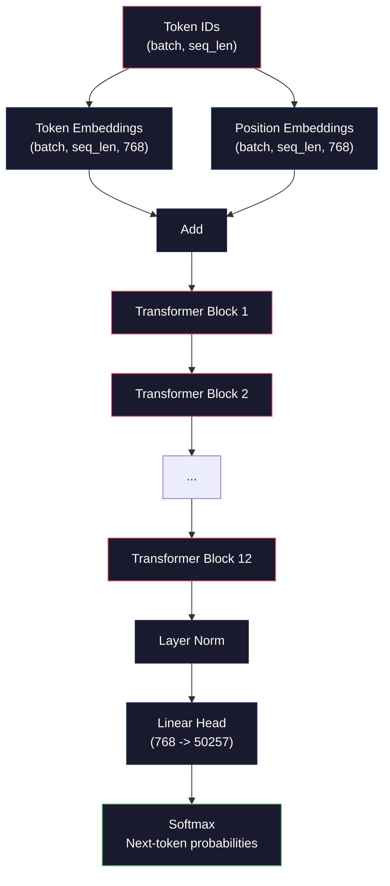
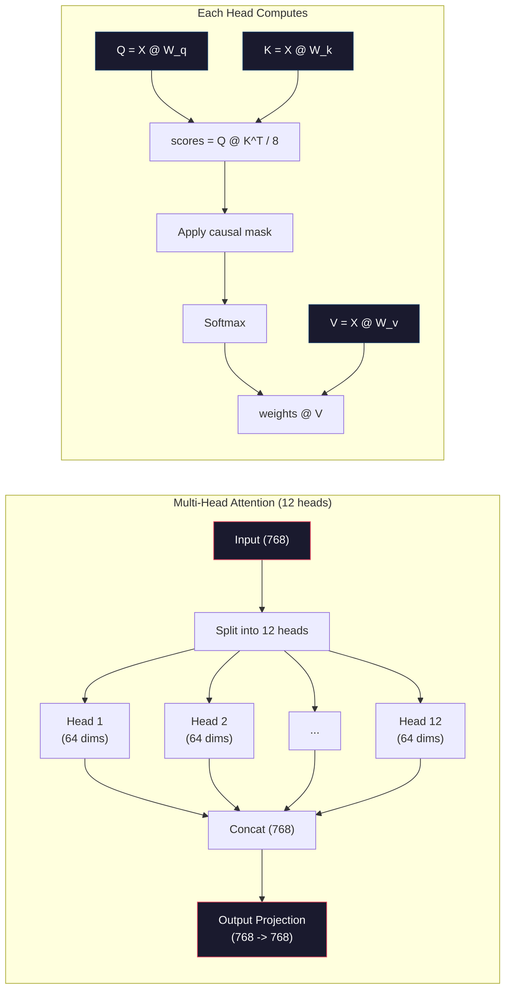
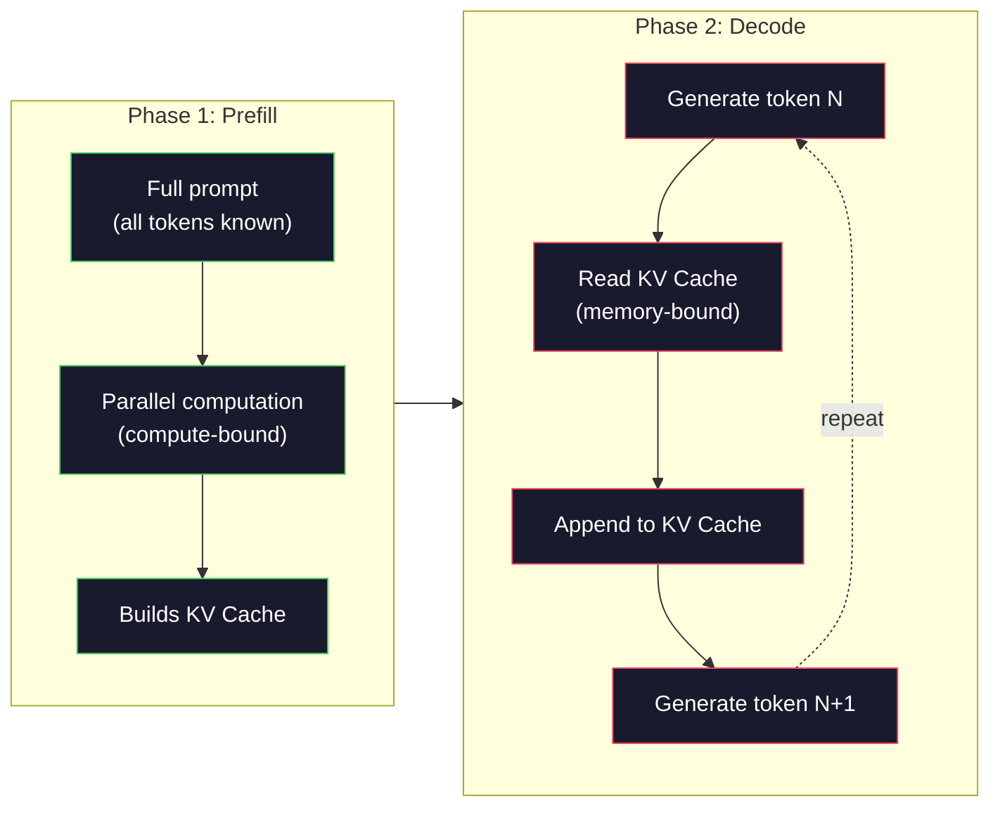

# 预训练一个 Mini GPT（124M 参数）

> GPT-2 Small 有 124 million（一亿二千四百万）个参数，对应 12 层 Transformer、12 个注意力头（attention head）和 768 维嵌入（embedding）。用单张 GPU，几个小时就能从零开始训练它。大多数人从未这样做过，而是使用预训练（pre-training）模型的检查点（checkpoint）。但如果你没有亲手训练过一个，就无法真正理解你用来构建产品的模型内部在发生什么。

**Type:** Build
**Languages:** Python (with numpy)
**Prerequisites:** 阶段 10，第 01-03 课（分词器、构建分词器、数据处理流水线）
**Time:** ~120 分钟

## 学习目标

- 从零实现完整的 GPT-2 架构（124M 参数）：token（词元）嵌入、位置嵌入（positional embedding）、Transformer 块和语言模型输出头（language model head）
- 利用交叉熵损失（cross-entropy loss）进行下一 token 预测，在文本语料库上训练 GPT 模型
- 实现自回归（autoregressive）文本生成，支持温度采样（temperature sampling）与 top-k/top-p 过滤
- 监测训练损失曲线，验证模型是否学会了连贯的语言模式

## 要解决的问题

你知道 Transformer 是什么，也看过相关示意图。你能背出“attention is all you need”，也能在白板上画出标着“Multi-Head Attention”的方框。

这些都不代表你理解模型生成文本时究竟发生了什么。

GPT-2 Small 有 124,438,272 个参数（采用权重绑定，weight tying）。每个参数都是通过训练循环确定的：前向传播（forward pass）、计算损失、反向传播（backward pass）、更新权重。十二个 Transformer 块，每个块十二个注意力头，768 维的嵌入空间，以及包含 50,257 个 token 的词表。模型每生成一个 token，全部 124 million（一亿二千四百万）个参数都会参与同一条矩阵乘法运算链：输入一串 token ID，输出下一 token 的概率分布。

如果你从未亲手实现过，就等于在使用一个黑箱。你可以调用 API（应用程序编程接口），也可以进行微调（fine-tuning）。但当模型出问题时，比如产生幻觉、重复内容或不遵循指令，你却没有一套思维框架来理解*为什么*会这样。

本课将从零实现 GPT-2 Small。使用的是 numpy，而非 PyTorch。每次矩阵乘法都清晰可见，每个梯度都由你的代码计算。你将亲眼看到 124 million（一亿二千四百万）个数字如何协同预测下一个词。

## 核心概念

### GPT 架构

GPT 是一种自回归语言模型。“自回归”意味着每次生成一个 token，并以之前的所有 token 为条件。其架构由一系列 Transformer 解码器块（decoder block）堆叠而成。

从 token ID 到下一 token 概率的完整计算图如下：

1. 输入 token ID。形状：(batch_size, seq_len)。
2. 查找 token 嵌入。每个 ID 映射为一个 768 维向量。形状：(batch_size, seq_len, 768)。
3. 查找位置嵌入。每个位置 (0, 1, 2, ...) 映射为一个 768 维向量。形状与上一步相同。
4. 将 token 嵌入 + 位置嵌入相加。
5. 依次通过 12 个 Transformer 块。
6. 进行最后的层归一化（layer normalization）。
7. 线性投影到词表大小。形状：(batch_size, seq_len, vocab_size)。
8. 用 softmax 得到概率。

这就是整个模型。没有卷积，没有循环结构，只有嵌入、注意力（attention）、前馈网络（feedforward network）和层归一化，堆叠 12 次。



### Transformer 块

12 个块都遵循相同的结构，采用前置归一化（pre-norm）架构（GPT-2 使用前置归一化，而原始 Transformer 使用后置归一化，post-norm）：

1. LayerNorm（层归一化）
2. 多头自注意力（Multi-Head Self-Attention）
3. 残差连接（residual connection，将输入加回来）
4. LayerNorm
5. 前馈网络（Feed-Forward Network，MLP）
6. 残差连接（将输入加回来）

残差连接至关重要。没有它们，反向传播中的梯度到达第 1 个块时就会消失。有了它们，梯度便可以通过“跳跃”路径从损失直接流向任意一层。因此，你才能堆叠 12、32 甚至 96 个块（有传言称 GPT-4 使用了 120 个）。

### 注意力：核心机制

自注意力（self-attention）让每个 token 查看它之前的每个 token，并决定对各个 token 投入多少注意力。其数学过程如下。

对每个 token 位置，根据输入计算三个向量：
- **查询（Query，Q）**：“我在寻找什么？”
- **键（Key，K）**：“我包含什么？”
- **值（Value，V）**：“我携带什么信息？”

```text
Q = input @ W_q    (768 -> 768)
K = input @ W_k    (768 -> 768)
V = input @ W_v    (768 -> 768)

attention_scores = Q @ K^T / sqrt(d_k)
attention_scores = mask(attention_scores)   # causal mask: -inf for future positions
attention_weights = softmax(attention_scores)
output = attention_weights @ V
```

因果掩码（causal mask）使 GPT 能够进行自回归建模。位置 5 可以关注位置 0-5，但不能关注 6、7、8 等之后的位置。这可以防止模型在训练时偷看未来的 token 来“作弊”。

**多头注意力（multi-head attention）**将 768 维空间拆分为 12 个头，每个头 64 维。每个头学习不同的注意力模式：一个头可能追踪句法关系（主谓一致），另一个可能追踪语义相似性（同义词），还有一个可能追踪位置上的接近程度（相邻词）。将全部 12 个头的输出拼接起来，再投影回 768 维。



除以 sqrt(d_k)，也就是 sqrt(64) = 8，是在进行缩放。否则，高维向量的点积会变得很大，使 softmax 进入梯度几乎为零的区域。这是原始论文“Attention Is All You Need”的关键见解之一。

### KV cache：推理为什么快

训练时，一次处理整个序列；推理时，每次生成一个 token。如果不做优化，生成 token N 就需要为之前全部 N-1 个 token 重新计算注意力。因此，每生成一个 token 的复杂度为 O(N^2)，生成长度为 N 的完整序列的总复杂度则为 O(N^3)。

KV cache（键值缓存）解决了这个问题。计算出每个 token 的 K 和 V 后，将它们存下来。生成 token N+1 时，只需计算新 token 的 Q，并查找之前所有 token 已缓存的 K 和 V。这样，每个 token 的 K、V 计算成本就从 O(N) 降到了 O(1)。注意力分数的计算仍是 O(N)，因为还要关注之前的所有位置，但已经避免了对输入重复执行矩阵乘法。

对于有 12 层、12 个头的 GPT-2，KV cache 为每个 token 存储 2 (K + V) x 12 层 x 12 个头 x 64 维 = 18,432 个值。对于包含 1024 个 token 的序列，以 FP32 存储时大约需要 75MB。对于有 128 层的 Llama 3 405B，单个序列的 KV cache 可能超过 10GB。这就是长上下文推理受内存带宽限制（memory-bound）的原因。

### 预填充与解码：推理的两个阶段

向大语言模型（LLM）发送提示词（prompt）后，推理会分为两个不同的阶段。

**预填充（Prefill）**并行处理整段提示词。所有 token 都已知，因此模型可以同时计算所有位置的注意力。这个阶段受算力限制（compute-bound），GPU 会以最大吞吐量执行矩阵乘法。在 A100 上，处理含 1000 个 token 的提示词，预填充大约需要 20-50ms。

**解码（Decode）**每次生成一个 token。每个新 token 都依赖之前的所有 token。这个阶段受内存带宽限制：瓶颈在于从 GPU 内存读取模型权重和 KV cache，而不是矩阵运算本身。GPU 的计算核心大部分时间都在空等内存读取。对于 GPT-2，无论矩阵乘法需要多少 FLOPs，每个解码步骤的耗时都差不多，因为限制因素是内存带宽。

这一区别对生产系统很重要。预填充吞吐量随 GPU 算力增长（FLOPS 越高，预填充越快）；解码吞吐量随内存带宽增长（内存越快，解码越快）。因此，NVIDIA 的 H100 相比 A100 着重提升了内存带宽，这能直接加快 token 生成。



### 训练循环

训练 LLM 就是在做下一 token 预测。给定 token [0, 1, 2, ..., N-1]，预测 token [1, 2, 3, ..., N]。损失函数是模型预测的概率分布与实际下一 token 之间的交叉熵。

一个训练步骤包括：

1. **前向传播**：让整个批次通过全部 12 个块，得到每个位置的 logits（softmax 之前的未归一化分数）。
2. **计算损失**：计算 logits 与目标 token（将输入错开一个位置）之间的交叉熵。
3. **反向传播**：通过反向传播计算全部 124M 个参数的梯度。
4. **优化器步骤**：更新权重。GPT-2 使用 Adam，配合学习率预热（warmup）和余弦衰减（cosine decay）。

学习率调度的重要性可能超出你的预期。GPT-2 在前 2,000 步中将学习率从 0 预热到峰值，然后沿余弦曲线衰减。一开始就使用较高的学习率会使模型发散；始终保持较高的学习率则会在训练后期引起振荡。各大 LLM 都采用先预热、再衰减的模式。

### GPT-2 Small：参数数量

| 组件 | 形状 | 参数量 |
|-----------|-------|------------|
| token 嵌入 | (50257, 768) | 38,597,376 |
| 位置嵌入 | (1024, 768) | 786,432 |
| 每个块的注意力（W_q, W_k, W_v, W_out） | 4 x (768, 768) | 2,359,296 |
| 每个块的 FFN（升维 + 降维） | (768, 3072) + (3072, 768) | 4,718,592 |
| 每个块的 LayerNorm（2x） | 2 x 768 x 2 | 3,072 |
| 最后的 LayerNorm | 768 x 2 | 1,536 |
| **每个块合计** | | **7,080,960** |
| **合计（12 个块）** | | **85,054,464 + 39,383,808 = 124,438,272** |

输出投影（logits 输出头）与 token 嵌入矩阵共享权重，这称为权重绑定。它将参数量减少了 38M，并通过让模型的输入和输出使用同一个表示空间来提升性能。

## 动手实现

### 第 1 步：嵌入层

token 嵌入将 50,257 个可能的 token 分别映射为 768 维向量。位置嵌入补充每个 token 在序列中所处位置的信息，二者相加。

```python
import numpy as np

class Embedding:
    def __init__(self, vocab_size, embed_dim, max_seq_len):
        self.token_embed = np.random.randn(vocab_size, embed_dim) * 0.02
        self.pos_embed = np.random.randn(max_seq_len, embed_dim) * 0.02

    def forward(self, token_ids):
        seq_len = token_ids.shape[-1]
        tok_emb = self.token_embed[token_ids]
        pos_emb = self.pos_embed[:seq_len]
        return tok_emb + pos_emb
```

初始化时使用的标准差 0.02 来自 GPT-2 论文。标准差太大，初始前向传播就会产生极端值，使训练不稳定；太小，则不同输入的初始输出几乎一样，导致早期的梯度信号无法发挥作用。

### 第 2 步：带因果掩码的自注意力

先实现单头注意力。因果掩码会在 softmax 之前将未来位置设为负无穷，确保每个位置只能关注自身及之前的位置。

```python
def attention(Q, K, V, mask=None):
    d_k = Q.shape[-1]
    scores = Q @ K.transpose(0, -1, -2 if Q.ndim == 4 else 1) / np.sqrt(d_k)
    if mask is not None:
        scores = scores + mask
    weights = np.exp(scores - scores.max(axis=-1, keepdims=True))
    weights = weights / weights.sum(axis=-1, keepdims=True)
    return weights @ V
```

这个 softmax 实现在求指数前先减去最大值。否则，exp(large_number) 会上溢为无穷大。这是一种保持数值稳定性的技巧，不会改变输出，因为对任意常数 c，都有 softmax(x - c) = softmax(x)。

### 第 3 步：多头注意力

将 768 维输入拆分为 12 个头，每个头 64 维。各个头独立计算注意力，然后将结果拼接起来，再投影回 768 维。

```python
class MultiHeadAttention:
    def __init__(self, embed_dim, num_heads):
        self.num_heads = num_heads
        self.head_dim = embed_dim // num_heads
        self.W_q = np.random.randn(embed_dim, embed_dim) * 0.02
        self.W_k = np.random.randn(embed_dim, embed_dim) * 0.02
        self.W_v = np.random.randn(embed_dim, embed_dim) * 0.02
        self.W_out = np.random.randn(embed_dim, embed_dim) * 0.02

    def forward(self, x, mask=None):
        batch, seq_len, d = x.shape
        Q = (x @ self.W_q).reshape(batch, seq_len, self.num_heads, self.head_dim).transpose(0, 2, 1, 3)
        K = (x @ self.W_k).reshape(batch, seq_len, self.num_heads, self.head_dim).transpose(0, 2, 1, 3)
        V = (x @ self.W_v).reshape(batch, seq_len, self.num_heads, self.head_dim).transpose(0, 2, 1, 3)

        scores = Q @ K.transpose(0, 1, 3, 2) / np.sqrt(self.head_dim)
        if mask is not None:
            scores = scores + mask
        weights = np.exp(scores - scores.max(axis=-1, keepdims=True))
        weights = weights / weights.sum(axis=-1, keepdims=True)
        attn_out = weights @ V

        attn_out = attn_out.transpose(0, 2, 1, 3).reshape(batch, seq_len, d)
        return attn_out @ self.W_out
```

反复重塑形状、转置、再重塑形状，是多头注意力中最容易让人困惑的部分。具体过程是：(batch, seq_len, 768) 张量先变为 (batch, seq_len, 12, 64)，再变为 (batch, 12, seq_len, 64)。此时，12 个头各自拥有一个 (seq_len, 64) 矩阵，用来计算注意力。注意力计算之后，将过程反过来：(batch, 12, seq_len, 64) 变为 (batch, seq_len, 12, 64)，再变为 (batch, seq_len, 768)。

### 第 4 步：Transformer 块

一个完整的 Transformer 块依次包含：LayerNorm、带残差连接的多头注意力、LayerNorm，以及带残差连接的前馈网络。

```python
class LayerNorm:
    def __init__(self, dim, eps=1e-5):
        self.gamma = np.ones(dim)
        self.beta = np.zeros(dim)
        self.eps = eps

    def forward(self, x):
        mean = x.mean(axis=-1, keepdims=True)
        var = x.var(axis=-1, keepdims=True)
        return self.gamma * (x - mean) / np.sqrt(var + self.eps) + self.beta


class FeedForward:
    def __init__(self, embed_dim, ff_dim):
        self.W1 = np.random.randn(embed_dim, ff_dim) * 0.02
        self.b1 = np.zeros(ff_dim)
        self.W2 = np.random.randn(ff_dim, embed_dim) * 0.02
        self.b2 = np.zeros(embed_dim)

    def forward(self, x):
        h = x @ self.W1 + self.b1
        h = np.maximum(0, h)  # GELU approximation: ReLU for simplicity
        return h @ self.W2 + self.b2


class TransformerBlock:
    def __init__(self, embed_dim, num_heads, ff_dim):
        self.ln1 = LayerNorm(embed_dim)
        self.attn = MultiHeadAttention(embed_dim, num_heads)
        self.ln2 = LayerNorm(embed_dim)
        self.ffn = FeedForward(embed_dim, ff_dim)

    def forward(self, x, mask=None):
        x = x + self.attn.forward(self.ln1.forward(x), mask)
        x = x + self.ffn.forward(self.ln2.forward(x))
        return x
```

前馈网络将 768 维输入扩展到 3,072 维（4x），施加非线性变换，再投影回 768 维。这种先扩展、再收缩的模式，让模型在每个位置都能使用更“宽”的内部表示。GPT-2 使用 GELU 激活函数，这里为简便起见使用 ReLU；对理解架构而言，两者的差异不大。

### 第 5 步：完整的 GPT 模型

堆叠 12 个 Transformer 块，在前面加上嵌入层，在后面加上输出投影。

```python
class MiniGPT:
    def __init__(self, vocab_size=50257, embed_dim=768, num_heads=12,
                 num_layers=12, max_seq_len=1024, ff_dim=3072):
        self.embedding = Embedding(vocab_size, embed_dim, max_seq_len)
        self.blocks = [
            TransformerBlock(embed_dim, num_heads, ff_dim)
            for _ in range(num_layers)
        ]
        self.ln_f = LayerNorm(embed_dim)
        self.vocab_size = vocab_size
        self.embed_dim = embed_dim

    def forward(self, token_ids):
        seq_len = token_ids.shape[-1]
        mask = np.triu(np.full((seq_len, seq_len), -1e9), k=1)

        x = self.embedding.forward(token_ids)
        for block in self.blocks:
            x = block.forward(x, mask)
        x = self.ln_f.forward(x)

        logits = x @ self.embedding.token_embed.T
        return logits

    def count_parameters(self):
        total = 0
        total += self.embedding.token_embed.size
        total += self.embedding.pos_embed.size
        for block in self.blocks:
            total += block.attn.W_q.size + block.attn.W_k.size
            total += block.attn.W_v.size + block.attn.W_out.size
            total += block.ffn.W1.size + block.ffn.b1.size
            total += block.ffn.W2.size + block.ffn.b2.size
            total += block.ln1.gamma.size + block.ln1.beta.size
            total += block.ln2.gamma.size + block.ln2.beta.size
        total += self.ln_f.gamma.size + self.ln_f.beta.size
        return total
```

注意权重绑定这一行：`logits = x @ self.embedding.token_embed.T`。输出投影复用了转置后的 token 嵌入矩阵。这不只是节省参数的技巧，还意味着模型在理解 token（嵌入）和预测 token（输出）时使用同一个向量空间。

### 第 6 步：训练循环

要真正训练一个有 124M 个参数的模型，需要 GPU 和 PyTorch。下面的训练循环用一个完全在 numpy 中运行的小模型演示基本过程。我们采用一个很小的模型（4 层、4 个头、128 维），让计算规模保持在可承受的范围内。

```python
def cross_entropy_loss(logits, targets):
    batch, seq_len, vocab_size = logits.shape
    logits_flat = logits.reshape(-1, vocab_size)
    targets_flat = targets.reshape(-1)

    max_logits = logits_flat.max(axis=-1, keepdims=True)
    log_softmax = logits_flat - max_logits - np.log(
        np.exp(logits_flat - max_logits).sum(axis=-1, keepdims=True)
    )

    loss = -log_softmax[np.arange(len(targets_flat)), targets_flat].mean()
    return loss


def train_mini_gpt(text, vocab_size=256, embed_dim=128, num_heads=4,
                   num_layers=4, seq_len=64, num_steps=200, lr=3e-4):
    tokens = np.array(list(text.encode("utf-8")[:2048]))
    model = MiniGPT(
        vocab_size=vocab_size, embed_dim=embed_dim, num_heads=num_heads,
        num_layers=num_layers, max_seq_len=seq_len, ff_dim=embed_dim * 4
    )

    print(f"Model parameters: {model.count_parameters():,}")
    print(f"Training tokens: {len(tokens):,}")
    print(f"Config: {num_layers} layers, {num_heads} heads, {embed_dim} dims")
    print()

    for step in range(num_steps):
        start_idx = np.random.randint(0, max(1, len(tokens) - seq_len - 1))
        batch_tokens = tokens[start_idx:start_idx + seq_len + 1]

        input_ids = batch_tokens[:-1].reshape(1, -1)
        target_ids = batch_tokens[1:].reshape(1, -1)

        logits = model.forward(input_ids)
        loss = cross_entropy_loss(logits, target_ids)

        if step % 20 == 0:
            print(f"Step {step:4d} | Loss: {loss:.4f}")

    return model
```

损失一开始接近 ln(vocab_size)。对于包含 256 个 token 的字节级词表，就是 ln(256) = 5.55。随机模型为每个 token 分配相同的概率。随着训练推进，损失会下降，因为模型学会了预测常见模式，例如“t”后面出现“th”、句点后面出现空格等。

在生产环境中，你会使用 Adam 优化器，配合梯度累积（gradient accumulation）、学习率预热和梯度裁剪（gradient clipping）。前向传播、计算损失、反向传播、更新参数的循环是一样的，只是优化器更复杂。

### 第 7 步：文本生成

生成时，利用训练好的模型每次预测一个 token。每次预测都从输出分布中采样，或贪心地取 argmax（最大值对应的索引）。

```python
def generate(model, prompt_tokens, max_new_tokens=100, temperature=0.8):
    tokens = list(prompt_tokens)
    seq_len = model.embedding.pos_embed.shape[0]

    for _ in range(max_new_tokens):
        context = np.array(tokens[-seq_len:]).reshape(1, -1)
        logits = model.forward(context)
        next_logits = logits[0, -1, :]

        next_logits = next_logits / temperature
        probs = np.exp(next_logits - next_logits.max())
        probs = probs / probs.sum()

        next_token = np.random.choice(len(probs), p=probs)
        tokens.append(next_token)

    return tokens
```

温度控制随机性。温度为 1.0 时使用原始分布；为 0.5 时分布变得更尖锐，结果更确定，模型会更频繁地选择概率最高的那些 token；为 1.5 时分布更平坦，随机性更强，低概率 token 被选中的机会更大。温度为 0.0 时就是贪心解码（greedy decoding），始终选择概率最高的 token。

必须使用 `tokens[-seq_len:]` 这个窗口，因为模型有最大上下文长度限制（GPT-2 为 1024）。一旦超出，就必须丢弃最早的 token。这就是大家常说的“上下文窗口”（context window）。

```figure
sampling-decoder
```

## 实际使用

### 完整的训练与生成演示

```python
corpus = """The transformer architecture has revolutionized natural language processing.
Attention mechanisms allow the model to focus on relevant parts of the input.
Self-attention computes relationships between all pairs of positions in a sequence.
Multi-head attention splits the representation into multiple subspaces.
Each attention head can learn different types of relationships.
The feedforward network provides nonlinear transformations at each position.
Residual connections enable gradient flow through deep networks.
Layer normalization stabilizes training by normalizing activations.
Position embeddings give the model information about token ordering.
The causal mask ensures autoregressive generation during training.
Pre-training on large text corpora teaches the model general language understanding.
Fine-tuning adapts the pre-trained model to specific downstream tasks."""

model = train_mini_gpt(corpus, num_steps=200)

prompt = list("The transformer".encode("utf-8"))
output_tokens = generate(model, prompt, max_new_tokens=100, temperature=0.8)
generated_text = bytes(output_tokens).decode("utf-8", errors="replace")
print(f"\nGenerated: {generated_text}")
```

用小模型在小语料库上训练，生成的文本最多只能算大致连贯。它会从训练文本中学到一些字节级模式，但无法像使用 40GB 训练数据和完整 124M 参数架构的 GPT-2 那样泛化。重点不在输出质量，而在于你能追踪每一步：嵌入查找、注意力计算、前馈变换、logit 投影、softmax 和采样。每个操作都清晰可见。

## 交付成果

本课产出 `outputs/prompt-gpt-architecture-analyzer.md`，这份提示词用于分析任意 GPT 风格模型的架构选择。向它提供模型卡（model card）或技术报告，它就会拆解参数分配、注意力设计和模型规模扩展方面的决策。

## 练习

1. 修改模型，将 12/12 的层数与头数配置改为 24 层和 16 个头。统计参数量。将深度加倍与将宽度（嵌入维度）加倍相比，有什么区别？

2. 实现 GELU 激活函数（GELU(x) = x * 0.5 * (1 + erf(x / sqrt(2))))，并替换前馈网络中的 ReLU。分别使用两种激活函数训练 500 步，比较最终损失。

3. 为生成函数添加 KV cache。在第一次前向传播后，存储每一层的 K 和 V 张量，并在生成后续 token 时复用。测量加速效果：分别在使用和不使用缓存的情况下生成 200 个 token，比较实际耗时。

4. 实现 top-k 采样（只考虑概率最高的 k 个 token）和 top-p 采样（核采样，nucleus sampling：考虑累计概率超过 p 的最小 token 集合）。在温度为 0.8 时，比较 top-k=50 与 top-p=0.95 的输出质量。

5. 编写训练损失曲线绘制工具。训练模型 1000 步，绘制损失随步数变化的曲线。识别三个阶段：初期快速下降（学习常见字节）、中期下降放缓（学习字节模式），以及平台期（在小语料库上过拟合）。无论训练的是 128 维模型还是 GPT-4，这条曲线的形状都是一样的。

## 关键术语

| 术语 | 常见说法 | 实际含义 |
|------|----------------|----------------------|
| 自回归 | “一次生成一个词” | 每个输出 token 都以之前的所有 token 为条件，模型预测 P(token_n \| token_0, ..., token_{n-1}) |
| 因果掩码 | “看不到未来” | 由 -infinity 值构成的上三角矩阵，防止训练时关注未来位置 |
| 多头注意力 | “多种注意力模式” | 将 Q、K、V 拆分到并行的头中（例如 GPT-2 的 12 个头，每个头 64 维），使各个头能够学习不同类型的关系 |
| KV cache | “用缓存加速” | 存储之前 token 已计算出的键和值张量，避免自回归生成时的重复计算 |
| 预填充 | “处理提示词” | 推理的第一阶段，并行处理提示词中的全部 token，受 GPU 的 FLOPS 算力限制 |
| 解码 | “生成 token” | 推理的第二阶段，每次生成一个 token，受 GPU 内存带宽限制 |
| 权重绑定 | “共享嵌入” | 输入 token 嵌入与输出投影头使用同一个矩阵，在 GPT-2 中可节省 38M 个参数 |
| 残差连接 | “跳跃连接” | 将输入直接加到子层输出上 (x + sublayer(x))，使梯度能够在深层网络中流动 |
| 层归一化 | “对激活值归一化” | 沿特征维度归一化，使均值为 0、方差为 1，并带有可学习的缩放和偏置参数 |
| 交叉熵损失 | “预测错得有多离谱” | -log(赋予实际下一 token 的概率)，对所有位置取平均，是标准的 LLM 训练目标 |

## 延伸阅读

- [Radford et al., 2019 -- "Language Models are Unsupervised Multitask Learners" (GPT-2)](https://cdn.openai.com/better-language-models/language_models_are_unsupervised_multitask_learners.pdf) -- GPT-2 论文，介绍了参数量从 124M 到 1.5B 的模型家族
- [Vaswani et al., 2017 -- "Attention Is All You Need"](https://arxiv.org/abs/1706.03762) -- 原始 Transformer 论文，提出了缩放点积注意力和多头注意力
- [Llama 3 Technical Report](https://arxiv.org/abs/2407.21783) -- Meta 如何用 16K 张 GPU 将 GPT 架构扩展到 405B 个参数
- [Pope et al., 2022 -- "Efficiently Scaling Transformer Inference"](https://arxiv.org/abs/2211.05102) -- 对预填充、解码的区别及 KV cache 分析进行形式化阐述的论文
