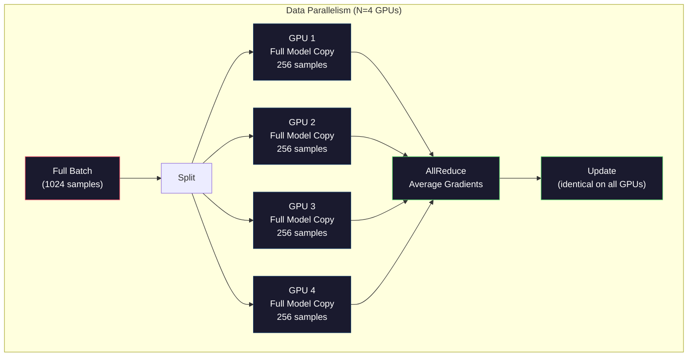
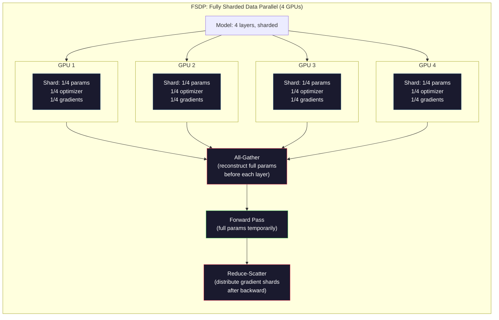
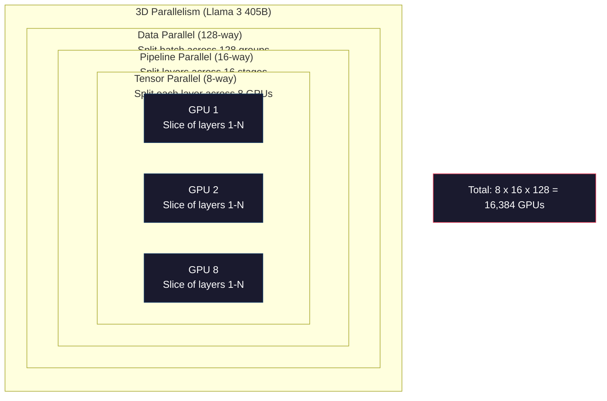

# 扩展训练规模：分布式训练、FSDP、DeepSpeed

> 你的 124M 模型用一块 GPU 就训练好了。现在试试 7 billion（十亿）个参数。显存放不下模型；单机处理数据要花数周。达到这样的规模，分布式训练（distributed training）就不再是可选项，而是唯一的前进道路。

**Type:** Build
**Languages:** Python
**Prerequisites:** 第 10 阶段，第 04 课（预训练 Mini GPT）
**Time:** ~120 分钟

## 学习目标

- 解释三种并行方式（数据、张量、流水线），并根据模型和集群规模判断何时需要各自的方式
- 使用 PyTorch 分布式数据并行（DDP）实现数据并行训练，在多个 GPU 间同步梯度
- 为给定规模的模型计算显存预算（权重 + 优化器状态 + 梯度 + 激活），确定最低硬件要求
- 配置 FSDP 或 DeepSpeed ZeRO 的阶段，将模型状态分片存放到多个 GPU 上，容纳超过单卡显存容量的模型

## 要解决的问题

一个 7B 参数的模型采用 FP16 时，仅权重就需要 14GB。Adam 优化器为每个参数额外存储两份副本（一阶矩和二阶矩估计），又占 28GB。反向传播期间的梯度再增加 14GB。在尚未存储任何激活值时，就已经占用了 56GB。

一块 NVIDIA A100 有 80GB 显存。

80GB 中已经用掉 56GB，只剩 24GB 留给激活值，也就是前向传播中计算出的、必须保留供反向传播使用的中间值。对于长度为 2048 个 token（词元）的序列和维度为 4096 的模型，单层激活约占 64MB。若有 32 层，每个样本就需要 2GB。批大小为 8 时需要 16GB，而你有 24GB。批大小达到 12 就会爆显存。

现在试试 70B 参数。仅 FP16 权重就有 140GB，一块 GPU 放不下。光是存放权重，至少就需要 2 块 A100（2 x 80GB = 160GB）。加上优化器状态和梯度，需要的 GPU 还要多得多：最少 3+ 块，实际通常要 8-16 块，取决于分片策略。

Llama 3 405B 在 16,384 块 NVIDIA H100 GPU 上训练。这次训练的计算成本估计为 $100 million（百万）。DeepSeek V3 则通过巧妙的架构设计（混合专家，Mixture of Experts，意味着每个 token 只激活部分参数）和训练效率优化，以大约 $5.6 million（百万）训练出了相当的模型。

本课介绍让大规模训练成为可能的四种策略：数据并行（data parallelism）、张量并行（tensor parallelism）、流水线并行（pipeline parallelism）以及完全分片数据并行（fully sharded data parallelism）。在接触分布式训练框架之前，你将用纯 Python 逐一模拟它们，理解其中的机制。

## 核心概念

### 为什么必须分布式运行

下面是实际模型的显存计算。每个数字都是算出来的，而不是估计出来的。

| 模型 | 参数量 | 权重（FP16） | Adam 状态 | 梯度（FP16） | 总计（不含激活） |
|-------|--------|----------------|-------------|------------------|----------------------|
| GPT-2 Small | 124M | 248 MB | 992 MB | 248 MB | 1.5 GB |
| Llama 3 8B | 8B | 16 GB | 64 GB | 16 GB | 96 GB |
| Llama 3 70B | 70B | 140 GB | 560 GB | 140 GB | 840 GB |
| Llama 3 405B | 405B | 810 GB | 3,240 GB | 810 GB | 4,860 GB |

“Adam 状态”这一列才是显存大户。Adam 为每个参数存储滚动均值（m）和滚动方差（v），两者都是 FP32。对于 70B 模型，这就是 70B x 4 bytes x 2 = 560GB。仅优化器就需要七块 A100。

一块 H100 有 80GB 显存。Llama 3 405B 至少需要 61 块 H100 才能放下权重、优化器和梯度。加上激活，数量还会进一步增加。Meta 使用 16,384 块 GPU，不是因为想这么做，而是因为不得不这么做。

### 数据并行

这是最简单的分布式策略。把整个模型复制到 N 块 GPU 上，将每个训练批次等分成 N 份。每块 GPU 在自己的数据分片上执行前向和反向传播。反向传播后，对所有 GPU 的梯度求平均。每块 GPU 用同样的平均梯度更新自己的权重副本，让所有副本保持同步。

**优点：** 吞吐量线性扩展。N 块 GPU 每步处理的数据量是原来的 N 倍。通信仅限于梯度平均，并可与计算重叠。

**缺点：** 每块 GPU 都保存模型、优化器状态和梯度的完整副本。对于 70B 模型，每块 GPU 都需要 840GB。数据并行完全不能降低单卡显存需求，只能缩短训练时间。

**计算方式：** 有效批大小 = per_gpu_batch_size x N。当 N=64 块 GPU、每块 GPU 的批大小为 16 时，有效批大小为 1,024。Llama 3 使用的有效批大小是每步 16 million（百万）个 token。



### 张量并行

将单个层拆分到多块 GPU 上。一次矩阵乘法分给多块 GPU，每块计算一部分结果。

考虑前馈层中形状为 (8192, 8192) 的权重矩阵。采用 4 路张量并行时，每块 GPU 持有一个 (8192, 2048) 的分片。每块 GPU 将输入与自己的分片相乘，得到部分结果。随后通过全归约（all-reduce）或全收集（all-gather）合并这些部分结果，得到完整输出。

**优点：** 降低每块 GPU 存放模型权重的显存需求。将 70B 模型拆分到 8 块 GPU 上，意味着每块 GPU 持有约 ~8.75B 个参数的权重。

**缺点：** 每层之后都需要快速的 GPU 间通信。每次矩阵乘法后的全归约会增加延迟。在 NVLink 上效果很好（同一节点内 GPU 之间为 900 GB/s），但在通过 InfiniBand 相连的跨节点场景下效果较差（400 Gb/s，约 50 GB/s）。张量并行几乎总是局限在单个节点内（8 块 GPU）。

**实际应用：** Megatron-LM 开创了张量并行。Llama 3 405B 在每个节点内使用 8 路张量并行。

### 流水线并行

按层拆分模型。GPU 1 运行第 1-8 层，GPU 2 运行第 9-16 层，GPU 3 运行第 17-24 层，GPU 4 运行第 25-32 层。数据沿流水线流动：GPU 1 计算自己的层，并将激活发送给 GPU 2；后者计算自己的层，再发送给 GPU 3，以此类推。

**优点：** GPU 间通信量很小，只传输层边界处的激活，与梯度或权重相比，它们的数据量很小。由于带宽要求低，也适合跨节点运行。

**缺点：** 存在流水线气泡。当 GPU 4 对微批次 1 做前向传播时，GPU 1、2 和 3 处于空闲状态，因为它们已经完成了各自部分的前向传播。反向传播时则反过来。对于包含 N 个流水线阶段的朴素流水线，GPU 利用率只有 1/N。

**GPipe 和 PipeDream** 通过将批次划分为微批次来解决气泡问题。GPU 1 一完成微批次 1 的前向传播，就开始处理微批次 2，让各流水线阶段的计算相互重叠。有 M 个微批次和 N 个阶段时，气泡比例降至 (N-1)/M。使用 M=16 个微批次和 N=4 个阶段，气泡对应的空闲时间比例为 3/16 = 18.75%。

### FSDP：完全分片数据并行

FSDP 将数据并行的可扩展性与分片的显存效率结合起来。每块 GPU 不再持有模型的完整副本，而只持有参数、梯度和优化器状态的 1/N。

在某层前向传播之前，FSDP 执行一次 **全收集（all-gather）** 操作，将所有 GPU 上的参数收集到每块 GPU 的显存中，得到完整参数。前向传播后，每块 GPU 丢弃不属于本地的参数。反向传播时，再次执行全收集，重建用于梯度计算的参数。反向传播后，通过 **归约散发（reduce-scatter）** 分发梯度分片，使每块 GPU 只存储梯度的 1/N。

**70B 模型在 8 块 GPU 上的计算：**

| 组成部分 | 不使用 FSDP | 使用 FSDP |
|-----------|-------------|-----------|
| 权重（FP16） | 每块 GPU 140 GB | 每块 GPU 17.5 GB |
| Adam 状态（FP32） | 每块 GPU 560 GB | 每块 GPU 70 GB |
| 梯度（FP16） | 每块 GPU 140 GB | 每块 GPU 17.5 GB |
| **总计** | **每块 GPU 840 GB** | **每块 GPU 105 GB** |

不用 FSDP，无法将 70B 模型放进一块 80GB GPU。用 8 块 GPU 运行 FSDP，每块 GPU 占用 105GB。等等，仍然放不下。你至少需要 16 块 GPU，才能让每块 GPU 的占用低于 80GB；或者将 FSDP 与激活检查点（activation checkpointing）结合，在反向传播时重新计算激活，而不是存储它们。

由于每层之前都需要全收集，通信成本比普通数据并行更高。但省下的显存让此前无法进行的训练成为可能。



### DeepSpeed ZeRO

DeepSpeed 的 ZeRO（Zero Redundancy Optimizer，零冗余优化器）在概念上与 FSDP 相同，但由 Microsoft 独立开发。它定义了三个阶段，分片范围逐步扩大：

| 阶段 | 分片对象 | 显存节省 | 通信 |
|-------|--------|---------------|---------------|
| ZeRO-1 | 仅优化器状态 | 约缩减 4x | 与数据并行相同 |
| ZeRO-2 | + 梯度 | 约缩减 8x | 略多 |
| ZeRO-3 | + 参数 | 约缩减 Nx（N 块 GPU） | 每层执行全收集 |

ZeRO-3 等价于 FSDP。名字不同，机制相同。在 DeepSpeed 证明这一概念后，PyTorch 加入了原生 FSDP 实现。

DeepSpeed 还推出了 ZeRO-Offload（将优化器状态卸载到更便宜、容量更大的 CPU RAM）和 ZeRO-Infinity（卸载到 NVMe SSD）。它们用计算速度换取内存容量：卸载后的操作更慢，但能释放 GPU 显存。

### 混合精度训练

现代训练会同时使用多种浮点格式：

- **前向传播**: FP16 或 BF16（16-bit）。显存占用是 FP32 的一半。矩阵乘法在张量核心上运行速度为 2x。
- **主权重**: FP32（32-bit）。由优化器维护，保证权重更新时的数值精度。
- **损失缩放**: 反向传播前将损失乘以一个较大的常数，防止 FP16 梯度下溢为零。在优化器执行更新步骤前，再除以相同的常数。

BF16（Brain Float 16）的指数范围与 FP32 相同（8 个指数位），但精度较低（7 个尾数位，而 FP32 为 23 个）。由于能表示相同范围的值，它很少需要损失缩放。FP16 有 5 个指数位和 10 个尾数位，可以表示更细粒度的数值，但在极端数量级下会溢出或下溢。

Google 的 TPU 原生使用 BF16。NVIDIA 的 A100 和 H100 同时支持 FP16 与 BF16。业界已大体转向 BF16，因为它消除了损失缩放带来的麻烦。

**7B 模型的显存比较：**

| 精度 | 权重 | 优化器 | 梯度 | 总计 |
|-----------|---------|-----------|-----------|-------|
| 全部使用 FP32 | 28 GB | 56 GB | 28 GB | 112 GB |
| 混合（BF16 + FP32 主权重） | 14 GB | 56 GB | 14 GB | 84 GB |

混合精度为这个模型节省了 28GB。不论如何，优化器状态仍然保持 FP32，这正是显存占用的大头。

### Megatron-LM 与 3D 并行

实际的大规模训练会将三种并行方式结合起来：

- 在节点组之间进行 **数据并行** （扩大批大小）
- 在节点内部进行 **张量并行** （将层拆分到 8 块 GPU 上）
- 在节点之间进行 **流水线并行** （将层组拆分到不同机器上）

Llama 3 405B 在 16,384 块 H100 上运行：
- 每个节点内部采用 8 路张量并行（每个节点 8 块 GPU）
- 跨节点采用 16 路流水线并行（16 个流水线阶段）
- 在剩余维度采用 128 路数据并行（16,384 / 8 / 16 = 128）

这种 3D 分解（8 x 16 x 128 = 16,384）就是扩展到数千块 GPU 的方法。每块 GPU 看到不同的数据分片（数据并行），持有每层的一个切片（张量并行），并计算不同的一组层（流水线并行）。

DeepSeek V3 走了另一条路。其混合专家架构对每个 token 只激活 671B 参数中的 37B。这意味着每块 GPU 只需计算活跃参数，并为其存储激活。他们使用 2,048 块 H800 GPU 训练，不到 Meta GPU 数量的 1/8，花费 $5.6M，而 Meta 的估计花费是 $100M。



```figure
paged-kv-cache
```

## 动手实现

### 步骤 1：模拟数据并行

将一个批次拆分到模拟 GPU 上。每块 GPU 在自己的分片上计算前向传播。对“梯度”求平均，我们用损失值来模拟它们。

```python
import numpy as np

def simulate_data_parallelism(data, num_gpus, model_fn):
    batch_size = len(data)
    shard_size = batch_size // num_gpus
    remainder = batch_size % num_gpus

    gpu_losses = []
    gpu_gradients = []

    offset = 0
    for gpu_id in range(num_gpus):
        extra = 1 if gpu_id < remainder else 0
        shard = data[offset:offset + shard_size + extra]
        offset += shard_size + extra

        loss, grad = model_fn(shard)
        gpu_losses.append(loss)
        gpu_gradients.append(grad)

    avg_loss = np.mean(gpu_losses)
    avg_gradient = np.mean(gpu_gradients, axis=0)

    return avg_loss, avg_gradient
```

全归约操作（梯度求平均）是数据并行中唯一的通信。实践中，NVIDIA GPU 上使用 NCCL 库来实现环形全归约：每块 GPU 将自己梯度的 1/N 发送给一个相邻 GPU，从另一个相邻 GPU 接收 1/N，经过 N-1 步之后，每块 GPU 都得到完整的平均值。总通信量为 2 x gradient_size x (N-1)/N，N 很大时接近梯度大小的 2x。

### 步骤 2：模拟张量并行

将权重矩阵拆分到多块 GPU 上。每块 GPU 计算部分矩阵乘法，再合并结果。

```python
def simulate_tensor_parallelism(input_data, weight_matrix, num_gpus):
    d_in, d_out = weight_matrix.shape
    assert d_out % num_gpus == 0, f"d_out {d_out} not divisible by num_gpus {num_gpus}"
    shard_size = d_out // num_gpus

    partial_results = []
    for gpu_id in range(num_gpus):
        start = gpu_id * shard_size
        end = start + shard_size
        weight_shard = weight_matrix[:, start:end]

        partial = input_data @ weight_shard
        partial_results.append(partial)

    full_output = np.concatenate(partial_results, axis=-1)

    direct_output = input_data @ weight_matrix
    error = np.abs(full_output - direct_output).max()

    return full_output, error
```

误差应当恰好为零，或处于机器精度量级。张量并行在数学上是精确的，结果与在一块 GPU 上计算完整矩阵乘法相同。拆分沿输出维度进行，因此每块 GPU 生成不同的一组列，拼接后便可重建完整结果。

对于列并行线性层（拆分输出维度），要做拼接。对于行并行（拆分输入维度），则要求和。在 Transformer 的 FFN 中，第一个线性层（扩张）采用列并行，第二个线性层（收缩）采用行并行，从而避免在两层之间进行全归约。

### 步骤 3：模拟流水线并行

将模型的层拆分到虚拟 GPU 上，展示后续阶段进行计算时、前面阶段处于空闲状态的气泡问题。

```python
def simulate_pipeline_parallelism(num_layers, num_stages, num_microbatches):
    layers_per_stage = num_layers // num_stages

    timeline = {}
    clock = 0

    for mb in range(num_microbatches):
        for stage in range(num_stages):
            start_time = max(
                timeline.get((stage, mb - 1, "fwd"), (0, 0))[1] if mb > 0 else 0,
                timeline.get((stage - 1, mb, "fwd"), (0, 0))[1] if stage > 0 else 0,
            )
            end_time = start_time + layers_per_stage
            timeline[(stage, mb, "fwd")] = (start_time, end_time)

    last_fwd_end = max(v[1] for v in timeline.values())

    for mb in range(num_microbatches - 1, -1, -1):
        for stage in range(num_stages - 1, -1, -1):
            deps = [last_fwd_end]
            if mb < num_microbatches - 1 and (stage, mb + 1, "bwd") in timeline:
                deps.append(timeline[(stage, mb + 1, "bwd")][1])
            if stage < num_stages - 1 and (stage + 1, mb, "bwd") in timeline:
                deps.append(timeline[(stage + 1, mb, "bwd")][1])
            start_time = max(deps)
            end_time = start_time + layers_per_stage
            timeline[(stage, mb, "bwd")] = (start_time, end_time)

    total_time = max(v[1] for v in timeline.values())
    compute_time = num_microbatches * num_stages * layers_per_stage * 2
    bubble_fraction = 1.0 - compute_time / (total_time * num_stages)

    return timeline, total_time, bubble_fraction
```

当有 4 个阶段、1 个微批次时，气泡比例为 75%，即任意时刻四块 GPU 中有三块空闲。当有 16 个微批次时，气泡比例下降到约 19%。消除气泡的代价是显存：必须同时存储所有正在处理的微批次的激活。

### 步骤 4：显存计算器

计算训练任意规模模型所需的精确显存。

```python
def memory_calculator(
    params_billions,
    precision_bytes=2,
    optimizer="adam",
    num_gpus=1,
    sharding="none",
    sequence_length=2048,
    batch_size_per_gpu=1,
    hidden_dim=None,
    num_layers=None,
):
    params = params_billions * 1e9

    weight_memory = params * precision_bytes

    if optimizer == "adam":
        optimizer_memory = params * 4 * 2
    elif optimizer == "sgd":
        optimizer_memory = params * 4
    else:
        optimizer_memory = 0

    gradient_memory = params * precision_bytes

    total_no_activation = weight_memory + optimizer_memory + gradient_memory

    if hidden_dim and num_layers:
        activation_per_layer = (
            sequence_length * batch_size_per_gpu * hidden_dim * precision_bytes * 4
        )
        activation_memory = activation_per_layer * num_layers
    else:
        activation_memory = params * precision_bytes * 0.5

    if sharding == "fsdp" or sharding == "zero3":
        weight_memory /= num_gpus
        optimizer_memory /= num_gpus
        gradient_memory /= num_gpus
    elif sharding == "zero2":
        optimizer_memory /= num_gpus
        gradient_memory /= num_gpus
    elif sharding == "zero1":
        optimizer_memory /= num_gpus

    per_gpu_total = weight_memory + optimizer_memory + gradient_memory + activation_memory

    return {
        "params_billions": params_billions,
        "weights_gb": weight_memory / 1e9,
        "optimizer_gb": optimizer_memory / 1e9,
        "gradients_gb": gradient_memory / 1e9,
        "activations_gb": activation_memory / 1e9,
        "per_gpu_total_gb": per_gpu_total / 1e9,
        "total_across_gpus_gb": per_gpu_total * num_gpus / 1e9,
        "fits_on_80gb": per_gpu_total / 1e9 <= 80,
        "num_gpus": num_gpus,
        "sharding": sharding,
    }
```

这个计算器回答了每位 ML 工程师都会问的问题：“我需要多少块 GPU？”输入模型规模，看看是否放得下。调整分片策略，直到单卡总占用降到 80GB 以下。

### 步骤 5：混合精度模拟

比较 FP32、FP16 和混合精度训练的显存用量。

```python
def mixed_precision_comparison(params_billions):
    params = params_billions * 1e9

    fp32_weights = params * 4
    fp32_optimizer = params * 4 * 2
    fp32_gradients = params * 4
    fp32_total = fp32_weights + fp32_optimizer + fp32_gradients

    fp16_weights = params * 2
    fp16_master = params * 4
    fp16_optimizer = params * 4 * 2
    fp16_gradients = params * 2
    fp16_total = fp16_weights + fp16_master + fp16_optimizer + fp16_gradients

    mixed_weights = params * 2
    mixed_optimizer = params * 4 * 2
    mixed_gradients = params * 2
    mixed_total = mixed_weights + mixed_optimizer + mixed_gradients

    return {
        "fp32_total_gb": fp32_total / 1e9,
        "fp16_with_master_gb": fp16_total / 1e9,
        "mixed_bf16_gb": mixed_total / 1e9,
        "savings_vs_fp32": 1 - mixed_total / fp32_total,
    }
```

最让许多人意外的是：混合精度不会让显存减半。无论采用什么精度，优化器状态（Adam 的 m 和 v）始终保持 FP32。对于 7B 模型，FP32 训练占用 112GB，混合精度占用 84GB。这是减少 25%，而不是 50%。优化器才是主要占用来源。

## 实际使用

### 运行所有模拟

```python
def run_all_demos():
    print("=" * 70)
    print("DATA PARALLELISM SIMULATION")
    print("=" * 70)

    np.random.seed(42)
    data = np.random.randn(64, 32)
    weight = np.random.randn(32, 16)

    def model_fn(batch):
        output = batch @ weight
        loss = np.mean(output ** 2)
        grad = 2 * batch.T @ (batch @ weight) / len(batch)
        return loss, grad

    for n_gpus in [1, 2, 4, 8]:
        loss, grad = simulate_data_parallelism(data, n_gpus, model_fn)
        print(f"  {n_gpus} GPUs: loss={loss:.4f}, grad_norm={np.linalg.norm(grad):.4f}")

    print()
    print("=" * 70)
    print("TENSOR PARALLELISM SIMULATION")
    print("=" * 70)

    x = np.random.randn(4, 8192)
    W = np.random.randn(8192, 8192)

    for n_gpus in [1, 2, 4, 8]:
        output, error = simulate_tensor_parallelism(x, W, n_gpus)
        print(f"  {n_gpus} GPUs: output_shape={output.shape}, max_error={error:.2e}")

    print()
    print("=" * 70)
    print("PIPELINE PARALLELISM SIMULATION")
    print("=" * 70)

    for n_mb in [1, 4, 8, 16, 32]:
        _, total_t, bubble = simulate_pipeline_parallelism(32, 4, n_mb)
        print(f"  {n_mb:2d} micro-batches: total_time={total_t:4d}, bubble={bubble:.1%}")

    print()
    print("=" * 70)
    print("MEMORY CALCULATOR")
    print("=" * 70)

    configs = [
        (7, "none", 1),
        (7, "fsdp", 8),
        (70, "none", 1),
        (70, "fsdp", 8),
        (70, "fsdp", 16),
        (405, "fsdp", 64),
        (405, "fsdp", 128),
    ]

    print(f"  {'Model':>8} {'Sharding':>8} {'GPUs':>5} {'Per-GPU':>10} {'Fits 80GB':>10}")
    print("  " + "-" * 50)
    for params, shard, gpus in configs:
        result = memory_calculator(params, num_gpus=gpus, sharding=shard)
        fits = "Yes" if result["fits_on_80gb"] else "No"
        print(f"  {params:>6}B {shard:>8} {gpus:>5} {result['per_gpu_total_gb']:>8.1f}GB {fits:>10}")

    print()
    print("=" * 70)
    print("MIXED PRECISION COMPARISON")
    print("=" * 70)

    for params_b in [7, 13, 70, 405]:
        result = mixed_precision_comparison(params_b)
        print(f"  {params_b}B: FP32={result['fp32_total_gb']:.0f}GB, "
              f"Mixed BF16={result['mixed_bf16_gb']:.0f}GB, "
              f"Savings={result['savings_vs_fp32']:.0%}")
```

## 交付成果

本课产出 `outputs/prompt-distributed-training-planner.md`，这是一个提示词（prompt）：输入模型规模和可用硬件后，它会生成完整的分布式训练计划，包括并行策略、显存预算、通信开销和预期吞吐量。

## 练习

1. 修改显存计算器，使其包含激活检查点。使用检查点时，只存储每隔 K 层的激活（典型值 K=1，表示全部重新计算）。展示显存与计算量的权衡：检查点节省多少显存，又会让训练慢多少（完全启用检查点大约增加 33% 的计算量）？

2. 扩展流水线并行模拟，实现 PipeDream 使用的 1F1B（一次前向、一次反向）调度。对于 4 个阶段和 8 个微批次，将其气泡比例与朴素调度比较。由于更早开始反向传播，1F1B 调度的峰值显存应当更小。

3. 实现梯度累积模拟器。不在每个微批次之后执行全归约，而是先在本地累积 K 步的梯度，再全归约。展示这种做法如何将通信量降至原来的 K 分之一，同时得到完全相同的最终梯度，从而实现完全相同的训练。

4. 构建成本估算器。给定模型规模、目标 token 数、GPU 类型（A100 为 $2/hr，H100 为 $3.50/hr）以及并行策略，估计以美元计的总训练成本。对照已知成本验证：据报道，Llama 3 405B 约花费 ~$100M，DeepSeek V3 约花费 ~$5.6M。

5. 为显存计算器加入 ZeRO-Offload。假设每个节点有 512GB CPU RAM 和 2TB NVMe。展示如何通过将优化器状态卸载到 CPU，使 70B 模型只需 4 块 GPU 而非 16 块就能训练，代价是优化器更新步骤慢 30-50%。

## 关键术语

| 术语 | 常见说法 | 实际含义 |
|------|----------------|----------------------|
| 数据并行 | “把模型复制到每块 GPU” | 每块 GPU 处理不同的数据分片，每步之后通过全归约对梯度求平均 |
| 张量并行 | “把一个层拆分到多块 GPU” | 划分权重矩阵，让每块 GPU 计算部分矩阵乘法，需要快速的 NVLink 互连 |
| 流水线并行 | “把各层拆分到多块 GPU” | 每块 GPU 运行不同的层组，数据以微批次形式沿流水线流动，以减少气泡 |
| FSDP | “把一切都分片” | 完全分片数据并行，每块 GPU 持有权重、梯度和优化器状态的 1/N，计算前执行全收集 |
| ZeRO | “DeepSpeed 版 FSDP” | 零冗余优化器，分为 3 个阶段：优化器分片（阶段 1），+ 梯度（阶段 2），+ 参数（阶段 3） |
| All-reduce | “在 GPU 间求平均” | 集合通信操作，每块 GPU 最终都得到所有 GPU 输入的总和或平均值，通常通过环形全归约实现 |
| All-gather | “从所有 GPU 收集” | 集合通信操作，每块 GPU 最终都得到所有 GPU 数据的拼接结果，FSDP 用它重建完整参数 |
| Reduce-scatter | “求和并分发” | 将数据归约（求和），并将不同块散发给不同 GPU 的集合通信操作，FSDP 用它对梯度分片 |
| 混合精度 | “用半精度训练” | 前向和反向传播使用 FP16/BF16，优化器状态使用 FP32；由于优化器占用为主，显存节省约 ~25%，而非 50% |
| 流水线气泡 | “流水线中的空闲时间” | GPU 等待前一阶段数据时处于空闲的时间比例，使用更多微批次可以降低这一比例 |

## 延伸阅读

- [Rajbhandari et al., 2020 -- "ZeRO: Memory Optimizations Toward Training Trillion Parameter Models"](https://arxiv.org/abs/1910.02054) -- 定义了三个分片阶段的 DeepSpeed ZeRO 论文
- [Shoeybi et al., 2020 -- "Megatron-LM: Training Multi-Billion Parameter Language Models Using Model Parallelism"](https://arxiv.org/abs/1909.08053) -- NVIDIA 面向 Transformer 的张量并行
- [Narayanan et al., 2021 -- "Efficient Large-Scale Language Model Training on GPU Clusters Using Megatron-LM"](https://arxiv.org/abs/2104.04473) -- 将数据、张量和流水线并行结合起来的 3D 并行
- [Zhao et al., 2023 -- "PyTorch FSDP: Experiences on Scaling Fully Sharded Data Parallel"](https://arxiv.org/abs/2304.11277) -- PyTorch 原生 FSDP 实现
- [Llama 3 Technical Report](https://arxiv.org/abs/2407.21783) -- 使用 16,384 块 GPU 训练时的 3D 并行细节
- [DeepSeek-V3 Technical Report](https://arxiv.org/abs/2412.19437) -- MoE 架构如何将训练成本降低一个数量级
