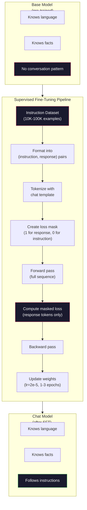

# 指令微调（SFT）

> 基座模型只会预测下一个 token（词元），仅此而已。它不会遵循指令、回答问题，也不会拒绝有害请求。监督微调（SFT）是连接 token 预测器与实用助手的桥梁。你交谈过的每一个模型，包括 Claude、GPT 和 Llama Chat，都经历了这一步。

**Type:** Build
**Languages:** Python (with numpy)
**Prerequisites:** 第 10 阶段，第 04 课（预训练一个 Mini GPT）
**Time:** ~90 分钟

## 学习目标

- 实现监督微调（SFT），将基座语言模型转变为遵循指令的助手
- 使用包含 system、user 和 assistant 角色的聊天模板来组织训练数据，并屏蔽非 assistant token 的损失
- 解释为什么需要 SFT：基座模型会续写文本，而不是回答问题
- 在留出的指令集上比较基座模型与微调模型的响应，评估 SFT 的质量

## 要解决的问题

你在第 04 课训练了一个模型。给定一个序列，它能预测下一个 token。输入“Transformer 架构”，它可能续写“彻底改变了自然语言处理”。对于下一 token 预测器来说，这已经很出色。

现在试试这个：输入“法国的首都是什么？”基座模型不会回答“巴黎”。它会延续这个模式。它可能输出“德国的首都是什么？西班牙的首都是什么？”，因为它从包含问题列表的文档中学到了这种模式。它也可能输出“是许多人都会问的问题”，因为这也是一种合理的下一 token 续写。模型没有 *回答* 的概念。它只知道 *续写*。

这就是 GPT-3（2020 年六月发布的基座模型）与 ChatGPT（2022 年十一月发布的指令微调模型）之间的差距。架构相同，预训练相同。区别在于 20,000 到 100,000 个精心编写的（指令，响应）对，它们教会模型遵循对话模式。

Stanford Alpaca 证明，你不需要数百万个样本。2023 年三月，他们仅用 GPT-3.5 生成的 52,000 个指令—响应对就对 Llama 7B 进行了微调。总成本为 $600。得到的聊天机器人能够遵循指令、回答问题并进行对话。虽然不如 ChatGPT，但只花 $600 并训练几个小时就能如此接近，实在令人惊讶。

Meta 的 Llama 2 Chat 在初始 SFT 阶段只用了 ~27,000 个高质量样本。关键认识是：质量比数量更重要。熟练标注员编写的 27,000 个样本，胜过从互联网上抓取的 1 million（百万）个含噪样本。

## 核心概念

### SFT 究竟做了什么

监督微调沿用预训练的训练循环：前向传播、计算损失、反向传播、更新权重，但使用不同类型的数据。你不再用原始文本训练，而是使用结构化对话：

```json
{
  "system": "You are a helpful assistant.",
  "user": "What is the capital of France?",
  "assistant": "The capital of France is Paris."
}
```

模型已经知道巴黎是法国的首都。它在使用 Wikipedia、教科书和网页进行预训练时就学到了这一点。SFT 不会教模型新的事实，而是教它一种新的 *行为*：看到问题就给出答案，看到指令就生成补全内容，看到有害请求就予以拒绝。

可以这样理解：预训练赋予模型知识，SFT 教会模型礼貌。

### 数据格式

行业中主要使用三种格式。它们用不同的分隔符编码同样的信息：谁说了什么。

**Alpaca 格式** （Stanford，2023 年三月）：

```json
{
  "instruction": "Summarize the following article in 3 sentences.",
  "input": "The European Central Bank raised interest rates...",
  "output": "The ECB increased rates by 25 basis points..."
}
```

这种格式简单且应用广泛。`input` 字段是可选的，许多指令不需要额外上下文。Stanford 发布了 52,000 个这种格式的样本，由 GPT-3.5 生成，花费 $600。这开启了开源指令微调的热潮。

**ShareGPT 格式** （社区，2023）：

```json
{
  "conversations": [
    {"from": "system", "value": "You are a helpful assistant."},
    {"from": "human", "value": "What causes tides?"},
    {"from": "gpt", "value": "Tides are caused by the gravitational pull of the Moon..."},
    {"from": "human", "value": "How often do they occur?"},
    {"from": "gpt", "value": "Most coastal areas experience two high tides and two low tides per day..."}
  ]
}
```

这种格式支持多轮对话。无论实际使用什么模型，“from”字段按惯例都使用“human”和“gpt”。Vicuna 使用了 70,000 段 ShareGPT 对话进行训练，这些对话抓取自用户分享的 ChatGPT 对话记录。

**ChatML 格式** （OpenAI，许多开源模型都在使用）：

```text
<|im_start|>system
You are a helpful assistant.<|im_end|>
<|im_start|>user
What is the capital of France?<|im_end|>
<|im_start|>assistant
The capital of France is Paris.<|im_end|>
```

这种格式使用特殊 token（`<|im_start|>`、`<|im_end|>`）来分隔角色。这些 token 会在微调期间加入分词器（tokenizer）的词表。Qwen、Yi 和许多其他模型都使用 ChatML。

这三种格式实现的是同一件事：告诉模型“这是指令，这是响应，请学习这种模式”。

### 为什么有效

模型通过预训练已经掌握了语言。它见过 billions（数十亿）个问题后接答案、指令后接补全内容以及人与人对话的例子。这些模式已经编码在权重中。

SFT 将这种潜在能力集中起来。模型不必再从上下文中判断自己应该回答问题还是续写文档，因为 SFT 明确针对对话模式进行训练。经过几千个样本后，模型就会学到：看到 assistant 角色标记时，生成有帮助的响应。

这就是为什么 27,000 个样本就够了。你不是在教模型英语，也不是在教它关于世界的事实，而是在教它一种简单的行为：响应指令。知识本来就已经存在。

### 带掩码的损失

这是 SFT 中最重要的技术细节，但大多数教程都会跳过它。

预训练时，你会对每个 token 计算损失。模型学习预测序列中每个位置的下一个 token。SFT 期间，你只对 *响应* token 计算损失。指令 token 用来提供上下文，即使模型对它们的“预测”有误，也不会受到惩罚。

为什么？因为你不希望模型学会 *生成* 指令，而是希望它学会 *响应* 指令。如果对指令 token 计算损失，你就是在训练模型预测“法国的首都是什么？”，仿佛它才是提问者。这会浪费梯度信号，也可能让模型混淆自己的角色。

实际操作中，你会创建一个损失掩码：响应 token 对应 1，指令 token 对应 0。先将每个 token 的损失乘以这个掩码，再求平均。

```text
Tokens:    [SYS] You are helpful [USER] What is the capital? [ASST] Paris is the capital [EOS]
Loss mask:   0    0    0     0      0     0   0  0     0       1     1    1   1     1      1
```

只有 `[ASST]` 后面的 token 对损失有贡献。模型在前向传播时会看到完整对话（它需要指令才能生成正确响应），但只根据响应预测得有多好来更新权重。

### 训练超参数

SFT 使用的超参数与预训练大不相同。你不是从零开始训练，而是在调整一个已经能工作的模型。

| 参数 | 预训练（Llama 2 7B） | SFT（Llama 2 Chat） |
|-----------|---------------------------|---------------------|
| 学习率 | 3e-4（峰值） | 2e-5 |
| 训练轮次 | 1（遍历数据一次） | 2 |
| 批量大小 | 4M tokens | 64 个样本 |
| 预热步数 | 2,000 | 0-100 |
| 权重衰减 | 0.1 | 0.0-0.1 |
| 数据规模 | 2T tokens | 27,000 个样本 |

SFT 的学习率比预训练低 15x。这一点至关重要。微调时使用高学习率会破坏预训练知识。模型会“忘记”学过的内容，并对小规模微调数据集过拟合。这就是灾难性遗忘（catastrophic forgetting）。

两个训练轮次意味着模型会看到每个训练样本两次。在小数据集上训练超过 3 个轮次会导致死记硬背：模型开始逐字复现训练样本，而不是泛化。

### 灾难性遗忘

微调可能破坏通用能力。如果在指令遵循数据上训练过久，模型就会失去编写代码、进行数学运算或创作文本的能力。它会变得非常擅长训练数据中的特定格式，却在其他方面表现糟糕。

三种缓解方法：

1. **低学习率。** 1e-5 到 5e-5。更新幅度越小，对预训练特征的破坏就越少。

2. **缩短训练。** 1-3 个训练轮次。在模型过拟合之前停止。

3. **混入预训练数据。** Llama 2 Chat 在 SFT 数据集中混入了少量（2-5%）原始预训练数据。这会在模型学习新的指令遵循行为时，“提醒”它保持通用能力。

### 实际数值

在单张 NVIDIA A100 80GB GPU 上，用 10,000 个高质量指令对微调一个 7B 模型大约需要 1 小时。计算如下：

- 10,000 个样本 x 平均 512 tokens = 5.12M tokens
- 2 个训练轮次 = 总计 10.24M tokens
- A100 微调 7B 模型时的吞吐量：~3,000 tokens/second（每秒 token 数）
- 10.24M / 3,000 = ~3,400 秒 = ~57 分钟

对于我们的 mini GPT（4 层、128 维）而言，训练几乎瞬间就能完成。重点在于理解机制，而不是追求规模。



```figure
loss-masking
```

## 动手实现

### 步骤 1：指令数据集

创建一个合成指令数据集。在生产环境中，Scale AI 和 Anthropic 等公司会雇用人工标注员编写这些数据。我们将以编程方式创建它们，演示数据格式。

```python
import numpy as np

INSTRUCTION_DATA = [
    {
        "instruction": "What is the capital of France?",
        "response": "The capital of France is Paris."
    },
    {
        "instruction": "Explain gravity in one sentence.",
        "response": "Gravity is the force that attracts objects with mass toward each other."
    },
    {
        "instruction": "Write a haiku about the ocean.",
        "response": "Waves crash on the shore, salt and foam beneath the sun, endless blue expanse."
    },
    {
        "instruction": "What is 15 multiplied by 7?",
        "response": "15 multiplied by 7 is 105."
    },
    {
        "instruction": "Name three programming languages.",
        "response": "Three programming languages are Python, Rust, and TypeScript."
    },
    {
        "instruction": "Summarize photosynthesis.",
        "response": "Photosynthesis converts sunlight, water, and carbon dioxide into glucose and oxygen."
    },
    {
        "instruction": "What year did World War II end?",
        "response": "World War II ended in 1945."
    },
    {
        "instruction": "Define machine learning.",
        "response": "Machine learning is a field where algorithms learn patterns from data to make predictions."
    },
]
```

八个样本非常少。Stanford Alpaca 用了 52,000 个。但无论是 8 个还是 52,000 个，机制都相同：分词、应用掩码、只对响应计算损失。

### 步骤 2：使用聊天模板分词

将指令—响应对转换为带有特殊角色标记的 token 序列。这些标记告诉模型指令在哪里结束、响应从哪里开始。

```python
SPECIAL_TOKENS = {
    "INST_START": 253,
    "INST_END": 254,
    "RESP_START": 255,
}


def tokenize_instruction_pair(instruction, response, vocab_size=256):
    inst_tokens = list(instruction.encode("utf-8"))
    resp_tokens = list(response.encode("utf-8"))

    inst_tokens = [min(t, vocab_size - 4) for t in inst_tokens]
    resp_tokens = [min(t, vocab_size - 4) for t in resp_tokens]

    tokens = (
        [SPECIAL_TOKENS["INST_START"]]
        + inst_tokens
        + [SPECIAL_TOKENS["INST_END"]]
        + [SPECIAL_TOKENS["RESP_START"]]
        + resp_tokens
    )

    return tokens


def create_loss_mask(tokens):
    mask = np.zeros(len(tokens), dtype=np.float32)
    in_response = False

    for i, token in enumerate(tokens):
        if token == SPECIAL_TOKENS["RESP_START"]:
            in_response = True
            continue
        if in_response:
            mask[i] = 1.0

    return mask
```

指令 token 的损失掩码全部为零，响应 token 的损失掩码全部为一。`RESP_START` token 本身的掩码为 0，因为它是分隔符，不属于响应内容。

### 步骤 3：带掩码的交叉熵损失

使用标准交叉熵，但将其乘以损失掩码。只有响应 token 对梯度有贡献。

```python
def masked_cross_entropy_loss(logits, targets, loss_mask):
    batch, seq_len, vocab_size = logits.shape
    logits_flat = logits.reshape(-1, vocab_size)
    targets_flat = targets.reshape(-1)
    mask_flat = loss_mask.reshape(-1)

    max_logits = logits_flat.max(axis=-1, keepdims=True)
    log_softmax = logits_flat - max_logits - np.log(
        np.exp(logits_flat - max_logits).sum(axis=-1, keepdims=True)
    )

    per_token_loss = -log_softmax[np.arange(len(targets_flat)), targets_flat]

    masked_loss = per_token_loss * mask_flat
    num_response_tokens = mask_flat.sum()
    if num_response_tokens == 0:
        return 0.0
    loss = masked_loss.sum() / num_response_tokens

    return loss
```

分母是 `num_response_tokens`，不是 `seq_len`。如果除以序列总长度，较长的指令就会稀释梯度信号。除以响应 token 数，可以确保无论指令多长，每个响应 token 都具有相同的权重。

### 步骤 4：SFT 训练循环

复用第 04 课的 MiniGPT。训练循环看起来与预训练几乎相同，只是加入了指令格式化和带掩码的损失。

```python
import sys
import os
sys.path.insert(0, os.path.join(os.path.dirname(__file__), "..", "..", "04-pre-training-mini-gpt", "code"))
from main import MiniGPT, LayerNorm, FeedForward, MultiHeadAttention, TransformerBlock, Embedding


def sft_train(model, dataset, num_epochs=2, lr=2e-5, seq_len=64):
    formatted_data = []
    for example in dataset:
        tokens = tokenize_instruction_pair(example["instruction"], example["response"])
        mask = create_loss_mask(tokens)
        formatted_data.append((tokens, mask))

    print(f"SFT Training: {len(formatted_data)} examples, {num_epochs} epochs, lr={lr}")
    print(f"Total tokens: {sum(len(t) for t, _ in formatted_data):,}")
    print()

    losses = []

    for epoch in range(num_epochs):
        epoch_loss = 0.0
        num_batches = 0

        indices = np.random.permutation(len(formatted_data))

        for idx in indices:
            tokens, mask = formatted_data[idx]

            if len(tokens) < 3:
                continue
            if len(tokens) > seq_len:
                tokens = tokens[:seq_len]
                mask = mask[:seq_len]

            input_ids = np.array(tokens[:-1]).reshape(1, -1)
            target_ids = np.array(tokens[1:]).reshape(1, -1)
            loss_mask = np.array(mask[1:]).reshape(1, -1)

            logits = model.forward(input_ids)
            loss = masked_cross_entropy_loss(logits, target_ids, loss_mask)

            batch_size, s_len, v_size = logits.shape
            probs = np.exp(logits - logits.max(axis=-1, keepdims=True))
            probs = probs / probs.sum(axis=-1, keepdims=True)
            dlogits = probs.copy()
            dlogits[np.arange(batch_size)[:, None], np.arange(s_len), target_ids] -= 1.0

            mask_expanded = loss_mask[:, :, np.newaxis]
            num_resp = loss_mask.sum()
            if num_resp > 0:
                dlogits = dlogits * mask_expanded / num_resp

            for block in model.blocks:
                block.ffn.W1 -= lr * np.random.randn(*block.ffn.W1.shape) * 0.01
                block.ffn.W2 -= lr * np.random.randn(*block.ffn.W2.shape) * 0.01
                block.ffn.b1 -= lr * np.random.randn(*block.ffn.b1.shape) * 0.01
                block.ffn.b2 -= lr * np.random.randn(*block.ffn.b2.shape) * 0.01

            epoch_loss += loss
            num_batches += 1
            losses.append(loss)

        avg_loss = epoch_loss / max(num_batches, 1)
        print(f"Epoch {epoch + 1}/{num_epochs} | Avg Loss: {avg_loss:.4f}")

    return model, losses
```

学习率为 2e-5，与 Llama 2 Chat 一致。与预训练使用的 3e-4 相比，它低了 15x。梯度经过掩码处理：指令 token 产生的梯度为零。只有响应 token 推动权重更新。

### 步骤 5：比较基座模型与 SFT 模型

SFT 的目的就是改变行为。让我们检查模型如何响应按指令格式组织的输入，并与原始文本续写进行比较，衡量这种变化。

```python
def generate_response(model, prompt_tokens, max_new_tokens=50, temperature=0.8):
    tokens = list(prompt_tokens)
    seq_len = model.embedding.pos_embed.shape[0]

    for _ in range(max_new_tokens):
        context = np.array(tokens[-seq_len:]).reshape(1, -1)
        logits = model.forward(context)
        next_logits = logits[0, -1, :]

        next_logits = next_logits / max(temperature, 1e-8)
        probs = np.exp(next_logits - next_logits.max())
        probs = probs / probs.sum()
        probs = np.clip(probs, 1e-10, 1.0)
        probs = probs / probs.sum()

        next_token = np.random.choice(len(probs), p=probs)
        tokens.append(int(next_token))

    return tokens


def evaluate_instruction_following(model, instructions):
    print("Evaluating instruction following:")
    print("-" * 50)

    for instruction in instructions:
        tokens = (
            [SPECIAL_TOKENS["INST_START"]]
            + [min(t, 252) for t in list(instruction.encode("utf-8"))]
            + [SPECIAL_TOKENS["INST_END"]]
            + [SPECIAL_TOKENS["RESP_START"]]
        )

        output = generate_response(model, tokens, max_new_tokens=30, temperature=0.6)
        response_start = len(tokens)
        response_tokens = output[response_start:]
        response_bytes = bytes([t for t in response_tokens if t < 128])
        response_text = response_bytes.decode("utf-8", errors="replace")

        print(f"  Q: {instruction}")
        print(f"  A: {response_text[:80]}")
        print()
```

对于只使用 8 个样本的微型模型，响应不会有实际意义，这是预料之中的。重要的是 *结构*：模型学会在响应标记之后生成输出，而不是继续生成更多指令。

### 步骤 6：测量灾难性遗忘

比较模型在 SFT 前后预测下一 token 的能力。如果 SFT 损害了通用能力，原始文本上的损失就会上升。

```python
def measure_forgetting(model, test_text, seq_len=64):
    tokens = np.array(list(test_text.encode("utf-8")[:512]))

    total_loss = 0.0
    num_windows = 0

    for start in range(0, len(tokens) - seq_len - 1, seq_len):
        input_ids = tokens[start:start + seq_len].reshape(1, -1)
        target_ids = tokens[start + 1:start + seq_len + 1].reshape(1, -1)

        logits = model.forward(input_ids)

        batch, s_len, vocab_size = logits.shape
        logits_flat = logits.reshape(-1, vocab_size)
        targets_flat = target_ids.reshape(-1)

        max_logits = logits_flat.max(axis=-1, keepdims=True)
        log_softmax = logits_flat - max_logits - np.log(
            np.exp(logits_flat - max_logits).sum(axis=-1, keepdims=True)
        )

        loss = -log_softmax[np.arange(len(targets_flat)), targets_flat].mean()
        total_loss += loss
        num_windows += 1

    return total_loss / max(num_windows, 1)
```

在实际微调中，你会在整个训练过程中跟踪这一指标。如果原始文本损失的增幅超过 10-15%，就说明 SFT 过于激进。应降低学习率，或减少训练轮次。

## 实际使用

### 完整 SFT 流程演示

```python
if __name__ == "__main__":
    np.random.seed(42)

    test_text = """The transformer architecture processes sequences through self-attention.
Each layer applies multi-head attention followed by a feedforward network.
Residual connections and layer normalization stabilize deep networks.
The model learns to predict the next token given all previous tokens."""

    print("=" * 70)
    print("INSTRUCTION TUNING (SFT) DEMO")
    print("=" * 70)
    print()

    model = MiniGPT(
        vocab_size=256, embed_dim=128, num_heads=4,
        num_layers=4, max_seq_len=128, ff_dim=512
    )
    print(f"Model: {model.count_parameters():,} parameters")
    print(f"Config: 4 layers, 4 heads, 128 dims (mini GPT from Lesson 04)")
    print()

    print("PRE-SFT: Measuring base model loss on raw text")
    base_loss = measure_forgetting(model, test_text)
    print(f"  Base model loss: {base_loss:.4f}")
    print()

    print("=" * 70)
    print("SFT TRAINING")
    print("=" * 70)

    model, losses = sft_train(
        model, INSTRUCTION_DATA, num_epochs=3, lr=2e-5, seq_len=128
    )

    print()
    print("POST-SFT: Measuring fine-tuned model loss on raw text")
    sft_loss = measure_forgetting(model, test_text)
    print(f"  SFT model loss: {sft_loss:.4f}")
    print(f"  Change: {((sft_loss - base_loss) / base_loss * 100):+.1f}%")
    if abs(sft_loss - base_loss) / base_loss < 0.15:
        print("  Minimal forgetting (< 15% change)")
    else:
        print("  Significant forgetting detected")
    print()

    print("=" * 70)
    print("INSTRUCTION FOLLOWING EVALUATION")
    print("=" * 70)
    print()

    test_instructions = [
        "What is the capital of France?",
        "Name a programming language.",
        "Define gravity.",
    ]
    evaluate_instruction_following(model, test_instructions)

    print("=" * 70)
    print("DATA FORMAT EXAMPLES")
    print("=" * 70)
    print()

    for i, example in enumerate(INSTRUCTION_DATA[:3]):
        tokens = tokenize_instruction_pair(example["instruction"], example["response"])
        mask = create_loss_mask(tokens)
        resp_count = int(mask.sum())
        total_count = len(tokens)
        print(f"  Example {i + 1}: {total_count} tokens, {resp_count} response tokens ({resp_count/total_count:.0%} of sequence)")
        print(f"    Instruction: {example['instruction']}")
        print(f"    Response: {example['response']}")
        print()

    print("=" * 70)
    print("TRAINING LOSS CURVE")
    print("=" * 70)
    print()

    if losses:
        window = max(1, len(losses) // 5)
        for i in range(0, len(losses), window):
            chunk = losses[i:i + window]
            avg = sum(chunk) / len(chunk)
            print(f"  Steps {i:3d}-{i + len(chunk) - 1:3d}: avg loss = {avg:.4f}")
```

## 交付成果

本课产出 `outputs/prompt-sft-data-curator.md`，这是一份帮助你设计和筛选 SFT 指令数据集的提示词（prompt）。给定目标能力（代码生成、数学、对话），它会生成一份数据收集计划，其中包含格式规范、质量标准和多样性要求。

## 练习

1. 添加对系统提示词的支持。修改 `tokenize_instruction_pair`，使其接受一条系统消息，并将其放在指令之前。创建 5 个使用不同系统提示词的样本（“你是一位诗人”“你是一位数学辅导老师”），并验证模型在训练期间看到了不同的系统提示词。

2. 实现数据混合。创建一个函数，接收 SFT 数据集和原始文本语料库，然后生成训练批次，其中 5% 的样本为原始文本（不使用掩码），95% 为指令对（使用掩码）。训练 3 个轮次，并将遗忘指标与纯 SFT 训练进行比较。

3. 构建数据质量评分器。对每个指令—响应对计算：(a) 响应长度，单位为 token；(b) 指令与响应的长度比；(c) 词汇多样性（不同 token 数 / 总 token 数）。过滤掉响应长度 < 10 tokens 或多样性 < 0.3 的样本。展示过滤如何影响最终损失。

4. 实现多轮对话训练。扩展分词过程，使其能够处理 3 轮对话（user-assistant-user-assistant-user-assistant）。损失掩码应覆盖全部三轮 assistant 响应。打印一个样本的 token 与掩码对齐结果，验证掩码是否正确。

5. 比较学习率。分别使用 lr=1e-4、lr=2e-5 和 lr=1e-6，将同一模型训练三次。绘制损失曲线。1e-4 的训练应表现为初期快速下降，但最终损失更高（过拟合）。1e-6 的训练应几乎没有变化。2e-5 的训练应达到最佳平衡。

## 关键术语

| 术语 | 常见说法 | 实际含义 |
|------|----------------|----------------------|
| SFT | “在对话上微调” | 监督微调：在（指令，响应）对上继续训练，只对响应 token 计算损失 |
| 指令微调 | “教模型遵循指令” | 使用明确的指令—响应对训练，让基座模型学习对话模式，而非新知识 |
| 损失掩码处理 | “忽略提示词” | 将指令 token 的损失设为零，使梯度仅来自响应 token 的预测 |
| ChatML | “聊天标记语言” | 使用 `<\|im_start\|>` 和 `<\|im_end\|>` 分隔符来标记对话数据中说话者角色的 token 格式 |
| Alpaca 格式 | “Stanford 的格式” | 包含 instruction/input/output 字段的 JSON 格式，用于由 GPT-3.5 生成、花费 $600 的 52K 个样本 |
| 灾难性遗忘 | “模型变笨了” | 微调破坏预训练能力，因为梯度更新用任务特定模式覆盖了通用知识 |
| 权重绑定（weight tying） | “共享嵌入” | 输入 token 嵌入和输出预测头使用同一矩阵，以节省参数并提高连贯性 |
| 聊天模板 | “如何组织提示词格式” | 为模型组织对话结构的特定 token 序列（角色标记、分隔符） |

## 延伸阅读

- [Ouyang et al., 2022 -- "Training language models to follow instructions with human feedback" (InstructGPT)](https://arxiv.org/abs/2203.02155) -- 介绍 OpenAI 指令微调 + RLHF 的论文
- [Taori et al., 2023 -- "Stanford Alpaca: An Instruction-following LLaMA Model"](https://github.com/tatsu-lab/stanford_alpaca) -- 以 $600 获得 52K 个指令样本，证明 SFT 在小数据集上也有效
- [Touvron et al., 2023 -- "Llama 2: Open Foundation and Fine-Tuned Chat Models"](https://arxiv.org/abs/2307.09288) -- Meta 使用 27K 个高质量样本的 SFT + RLHF 流程
- [Chiang et al., 2023 -- "Vicuna: An Open-Source Chatbot Impressing GPT-4"](https://lmsys.org/blog/2023-03-30-vicuna/) -- 使用 70K 段 ShareGPT 对话进行训练
- [Zhou et al., 2023 -- "LIMA: Less Is More for Alignment"](https://arxiv.org/abs/2305.11206) -- 证明 1,000 个精心筛选的样本能够达到在大得多的数据集上进行 SFT 的效果
