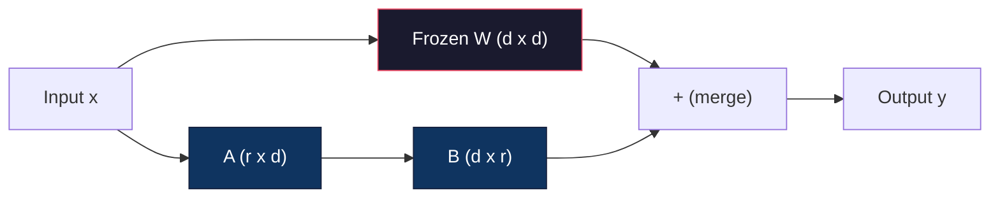
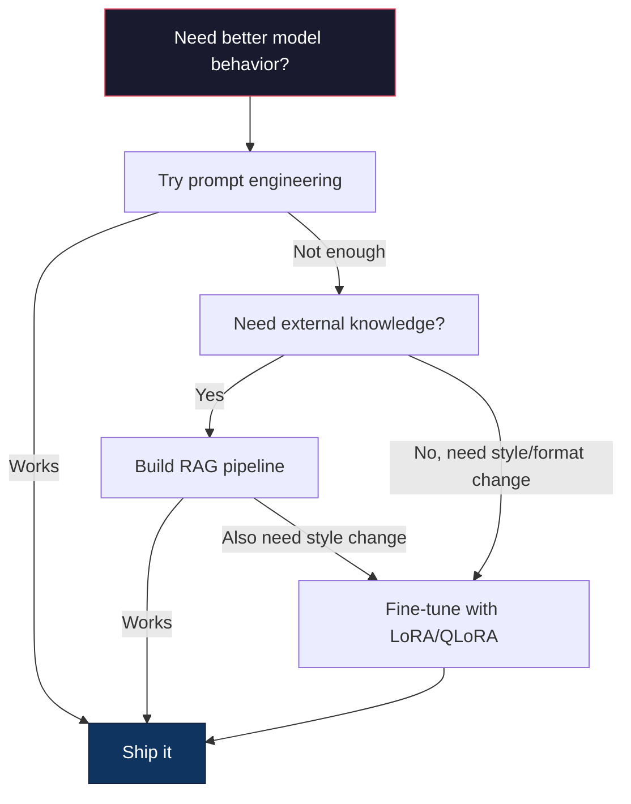

# 使用 LoRA 与 QLoRA 进行微调

> 对一个 7B 模型进行全参数微调（fine-tuning）需要 56GB 显存。你没有这么多显存，大多数公司也没有。LoRA（低秩适配）只训练不到 1% 的参数，就能让你在 6GB 显存中微调同一个模型。这并非妥协：在大多数任务上，它的质量可与全参数微调相当。整个开源微调生态都建立在这一技巧之上。

**Type:** Build
**Languages:** Python
**Prerequisites:** 阶段 10，第 06 课（指令微调 / SFT）
**Time:** ~75 分钟
**相关内容:** 阶段 10 从零实现 SFT/DPO 循环。本课将这些流程接入 2026 年的参数高效微调（PEFT）工具包（PEFT、TRL、Unsloth、Axolotl、LLaMA-Factory）。

## 学习目标

- 将低秩适配器矩阵（A 和 B）注入预训练模型的注意力层，实现 LoRA
- 计算 LoRA 相比全参数微调节省的参数量：当秩为 r、维度为 d_model 时，训练的参数量为 2\*r\*d，而不是 d^2
- 使用 QLoRA（将量化与低秩适配结合，即 4-bit 量化基座模型 + LoRA 适配器）微调模型，使其适配消费级 GPU 的显存容量；量化（quantization）用于降低数值表示精度
- 将 LoRA 权重合并回基座模型以进行部署，并比较使用与不使用适配器时的推理速度

## 要解决的问题

你有一个基座模型 Llama 3 8B，希望它用公司的语气回复客户支持工单。监督微调（SFT）可以解决这个问题，但 SFT 存在成本问题。

全参数微调会更新模型中的每一个参数。Llama 3 8B 有 8 billion（十亿）个参数。在 fp16 下，每个参数占用 2 bytes，仅加载权重就需要 16GB。训练时还需要梯度（16GB）、Adam 优化器状态（动量 + 方差需要 32GB），以及激活值。总计：一个 8B 模型大约需要 56GB 显存。

一张 A100 80GB 也只能勉强容纳。在云服务商处，两张 A100 的费用为 $3-4/hour。在 50,000 个样本上训练 3 epochs，需要 6-10 hours，也就是每次实验 $30-40。为了调好超参数做 10 次实验，还没部署任何东西，就已经花了 $400。

如果扩展到 Llama 3 70B，数字就会高得惊人。仅权重就需要 140GB。你需要一个集群，每次实验的费用为 $100+。

还有一个更深层的问题：全参数微调会修改模型的每个权重。如果在客户支持数据上微调，可能会削弱模型的通用能力。这称为灾难性遗忘。模型会更擅长你的任务，却更不擅长其他事情。

你需要一种方法，训练更少的参数、使用更少的内存，同时不破坏模型已有的知识。

## 核心概念

### LoRA：低秩适配

Microsoft 的 Edward Hu 及其同事于 2021 年六月发表了 LoRA 论文。论文的核心洞见是：微调过程中的权重更新具有较低的内在秩。你无需更新一个 4096x4096 权重矩阵中的全部 16.7 million（百万）个参数。更新中的有效信息，可以由一个秩为 16 或 32 的矩阵表示。

来看数学表达式。标准线性层的计算为：

```text
y = Wx
```

其中 W 是一个 d_out x d_in 矩阵。对于 4096x4096 的注意力投影，共有 16,777,216 个参数。

LoRA 冻结 W，并加入一个低秩分解：

```text
y = Wx + BAx
```

其中 B 的形状为 (d_out x r)，A 的形状为 (r x d_in)。秩 r 远小于 d，通常取 8、16 或 32。

对于一个 4096x4096 的层，当 r=16 时：
- 原始参数量：4096 x 4096 = 16,777,216
- LoRA 参数量：(4096 x 16) + (16 x 4096) = 65,536 + 65,536 = 131,072
- 缩减后的占比：131,072 / 16,777,216 = 0.78%

你只训练 0.78% 的参数，却能获得 95-100% 的质量。



A 使用高斯随机值初始化，B 初始化为零。这意味着 LoRA 分支的初始贡献为零：模型从原有行为开始训练，再逐步学会适配。

### 缩放因子：Alpha

LoRA 引入缩放因子 alpha，用来控制低秩更新对输出的影响程度：

```text
y = Wx + (alpha / r) * BAx
```

当 alpha = r 时，缩放为 1x。当 alpha = 2r（常见默认值）时，缩放为 2x。这个超参数可以独立于基础学习率，控制 LoRA 分支的学习率。

实践建议：
- alpha = 2 \* rank 是社区常见的约定（原论文在大多数实验中使用 alpha = rank）
- alpha = rank 对应 1x 缩放，较保守但稳定
- 更高的 alpha 意味着每步更新更大，可能加快收敛，也可能导致不稳定

### 在哪些位置应用 LoRA

Transformer 中有很多线性层，但你不必给每一层都添加 LoRA。原论文测试了不同组合：

| 目标层 | 可训练参数量（7B） | 质量 |
|--------------|----------------------|---------|
| 仅 q_proj | 4.7M | 良好 |
| q_proj + v_proj | 9.4M | 更好 |
| q_proj + k_proj + v_proj + o_proj | 18.9M | 注意力层中的最佳选择 |
| 所有线性层（注意力 + MLP） | 37.7M | 提升有限，参数量为 2x |

对大多数任务，较好的折中是 q_proj + v_proj。它们分别对应自注意力中的查询投影和值投影，控制模型关注什么，以及提取什么信息。对于代码生成等复杂任务，加入 MLP 层有帮助；但对于较简单的任务，它会让参数量翻倍，而收益递减。

### 秩的选择

秩 r 决定适配的表达能力：

| 秩 | 可训练参数量（每层） | 最适合的场景 |
|------|---------------------------|----------|
| 4 | 32,768 | 简单分类、情感分析 |
| 8 | 65,536 | 单领域问答、摘要 |
| 16 | 131,072 | 多领域任务、指令遵循 |
| 32 | 262,144 | 复杂推理、代码生成 |
| 64 | 524,288 | 大多数任务上的收益开始递减 |
| 128 | 1,048,576 | 很少有充分理由采用 |

Hu 等人表明，对于简单任务，r=4 就已能捕捉大部分适配信息。实践中最常见的选择是 r=8 和 r=16。超过 r=64 后，质量很少进一步改善，还会开始削弱 LoRA 的内存优势。

### QLoRA：4-Bit 量化 + LoRA

University of Washington 的 Tim Dettmers 及其同事于 2023 年五月发表了 QLoRA 论文。思路是：将冻结的基座模型量化为 4-bit 精度，再在其上添加 fp16 的 LoRA 适配器。

这会大幅改变内存需求：

| 方法 | 权重内存（7B） | 训练内存（7B） | 所需 GPU |
|--------|-------------------|---------------------|-------------|
| 全参数微调（fp16） | 14GB | ~56GB | 1x A100 80GB |
| LoRA（fp16 基座） | 14GB | ~18GB | 1x A100 40GB |
| QLoRA（4-bit 基座） | 3.5GB | ~6GB | 1x RTX 3090 24GB |

QLoRA 有三项技术贡献：

**NF4（Normal Float 4-bit，正态浮点格式）**：一种专为神经网络权重设计的新数据类型。神经网络权重大致服从正态分布。NF4 将其 16 个量化级别设置在标准正态分布的分位点上。对于正态分布的数据，这在信息论意义上是最优的。它造成的信息损失小于均匀 4-bit 量化（INT4）或标准 Float4。

**双重量化**：量化常数本身也会占用内存。每个包含 64 个权重的块都需要一个 fp32 缩放因子（4 bytes）。对于 7B 模型，这会额外占用 0.4GB。双重量化将这些常数量化为 fp8，把额外开销降到 0.1GB。单看很小，累积起来也很可观。

**分页优化器**：在长序列训练中，优化器状态（Adam 的动量和方差）可能超出 GPU 显存容量。分页优化器利用 NVIDIA 的统一内存，在 GPU 显存耗尽时自动将优化器状态换页到 CPU RAM，需要时再换回。这样可避免内存不足（OOM）导致崩溃，但会牺牲一些吞吐量。

### 质量是否受影响

减少参数或量化基座模型，会损害质量吗？多篇论文的结果如下：

| 方法 | MMLU（5-shot） | MT-Bench | HumanEval |
|--------|--------------|----------|-----------|
| 全参数微调（Llama 2 7B） | 48.3 | 6.72 | 14.6 |
| LoRA r=16 | 47.9 | 6.68 | 14.0 |
| QLoRA r=16（NF4） | 47.5 | 6.61 | 13.4 |
| QLoRA r=64（NF4） | 48.1 | 6.70 | 14.2 |

在大多数基准上，r=16 的 LoRA 与全参数微调相差不到 1%。r=16 的 QLoRA 还会有不到百分之一的额外损失。r=64 的 QLoRA 基本可以匹配全参数微调，同时减少 90% 的内存使用量。

### 实际成本

在 50,000 个样本上微调 Llama 3 8B（3 epochs）：

| 方法 | GPU | 时间 | 成本 |
|--------|-----|------|------|
| 全参数微调 | 2x A100 80GB | 8 hours | ~$32 |
| LoRA r=16 | 1x A100 40GB | 4 hours | ~$8 |
| QLoRA r=16 | 1x RTX 4090 24GB | 6 hours | ~$5 |
| QLoRA r=16（Unsloth） | 1x RTX 4090 24GB | 2.5 hours | ~$2 |
| QLoRA r=16 | 1x T4 16GB | 12 hours | ~$4 |

在单张消费级 GPU 上使用 QLoRA，成本还不到一顿午饭。这就是开放权重微调社区在 2023 年迅速壮大的原因，也解释了为何下面列出的所有训练框架在 2026 年都默认提供 QLoRA。

### 2026 年的 PEFT 技术栈

| 框架 | 是什么 | 适用情况 |
|-----------|-----------|-----------|
| **Hugging Face PEFT** | LoRA/QLoRA/DoRA/IA3 的标准库 | 你希望直接掌控细节，且训练循环已使用 `transformers.Trainer` |
| **TRL** | HF 的反馈驱动强化学习训练器（SFT、DPO、GRPO、PPO、ORPO） | 你需要在 SFT 之后进行 DPO/GRPO；它构建在 PEFT 之上 |
| **Unsloth** | 用 Triton 内核重写前向与反向传播 | 你希望在不损失精度的情况下获得 2-5x 加速，并将显存占用减半；适用于 Llama/Mistral/Qwen 系列 |
| **Axolotl** | 通过 YAML 配置封装 PEFT + TRL + DeepSpeed + Unsloth | 你希望训练运行可复现，并纳入版本控制 |
| **LLaMA-Factory** | 基于 PEFT + TRL 的 GUI/CLI/API（图形界面/命令行界面/应用程序编程接口） | 你希望零代码微调；支持 100+ 个模型系列 |
| **torchtune** | 原生 PyTorch 方案，不依赖 `transformers` | 你希望尽量减少依赖，且组织已统一使用 PyTorch |

经验法则：研究或一次性实验 → PEFT。可重复的生产流程 → 启用 Unsloth 内核的 Axolotl。一次性原型验证 → LLaMA-Factory。

### 合并适配器

训练后，你会得到两样东西：冻结的基座模型，以及一个小型 LoRA 适配器（通常为 10-100MB）。你可以选择：

1. **保持分离**：加载基座模型，再加载适配器。面对不同任务时切换适配器。这样就能用一个基座模型提供多个微调变体。

2. **永久合并**：计算 W' = W + (alpha/r) \* BA，并将结果保存为一个新的完整模型。合并后的模型与原模型大小相同，没有额外的推理开销，也无需再管理适配器。

如果要服务多个任务，例如客户支持、代码和翻译各使用一个适配器，就保持分离。如果要部署单个专用模型，就进行合并。

组合多个适配器的高级合并技术：

- **TIES-Merging**（Yadav 等，2023）：裁去幅值较小的参数，解决符号冲突，然后合并，从而减少适配器之间的干扰。
- **DARE**（Yu 等，2023）：合并前随机丢弃适配器参数，并重新缩放剩余参数。在组合不同能力时，效果出奇地好。
- **任务算术**：直接对适配器权重做加减。将一个“代码”适配器与一个“数学”适配器相加，往往可以得到两者兼擅的模型。

### 什么时候不该微调

微调应该是第三个选项，而不是第一个。

**第一步：提示词工程。** 编写更好的系统提示词（prompt，即给模型的指令或输入），加入少样本示例，使用思维链。这不需要花钱，只需几分钟。如果提示词已经能满足 80% 的需求，你大概就不需要微调。

**第二步：RAG（检索增强生成）。** 如果模型需要了解你的特定数据，例如文档、知识库或产品目录，检索比将这些内容固化进权重更便宜，也更容易维护。参见第 06 课。

**第三步：微调。** 当你需要模型采用特定风格、格式或推理模式，而提示词无法实现时，就可以使用微调。其他适用情况包括：需要稳定一致的结构化输出；需要将较大模型蒸馏成较小模型；延迟很重要，无法承担少样本提示带来的额外 token（词元）开销。



```figure
lora-params
```

## 动手实现

我们将仅使用 PyTorch，从零实现 LoRA。不借助其他库，也没有黑箱技巧。你会构建 LoRA 层，将它注入模型、完成训练，再把权重合并回去。

### 第 1 步：LoRA 层

```python
import torch
import torch.nn as nn
import math

class LoRALayer(nn.Module):
    def __init__(self, in_features, out_features, rank=8, alpha=16):
        super().__init__()
        self.rank = rank
        self.alpha = alpha
        self.scaling = alpha / rank

        self.A = nn.Parameter(torch.randn(in_features, rank) * (1 / math.sqrt(rank)))
        self.B = nn.Parameter(torch.zeros(rank, out_features))

    def forward(self, x):
        return (x @ self.A @ self.B) * self.scaling
```

A 使用缩放后的随机值初始化，B 初始化为零。乘积 BA 的初始值为零，因此模型从原有行为开始训练。

### 第 2 步：用 LoRA 包装线性层

```python
class LinearWithLoRA(nn.Module):
    def __init__(self, linear, rank=8, alpha=16):
        super().__init__()
        self.linear = linear
        self.lora = LoRALayer(
            linear.in_features, linear.out_features, rank, alpha
        )

        for param in self.linear.parameters():
            param.requires_grad = False

    def forward(self, x):
        return self.linear(x) + self.lora(x)
```

原始线性层被冻结。只有 LoRA 参数（A 和 B）可以训练。

### 第 3 步：将 LoRA 注入模型

```python
def inject_lora(model, target_modules, rank=8, alpha=16):
    for param in model.parameters():
        param.requires_grad = False

    lora_layers = {}
    for name, module in model.named_modules():
        if isinstance(module, nn.Linear):
            if any(t in name for t in target_modules):
                parent_name = ".".join(name.split(".")[:-1])
                child_name = name.split(".")[-1]
                parent = dict(model.named_modules())[parent_name]
                lora_linear = LinearWithLoRA(module, rank, alpha)
                setattr(parent, child_name, lora_linear)
                lora_layers[name] = lora_linear
    return lora_layers
```

首先冻结模型中的每个参数，然后遍历模型树，找到与目标名称匹配的线性层，并替换为经 LoRA 包装的版本。整个模型中，只有 LoRA 的 A 和 B 矩阵可以训练。

### 第 4 步：统计参数量

```python
def count_parameters(model):
    total = sum(p.numel() for p in model.parameters())
    trainable = sum(p.numel() for p in model.parameters() if p.requires_grad)
    frozen = total - trainable
    return {
        "total": total,
        "trainable": trainable,
        "frozen": frozen,
        "trainable_pct": 100 * trainable / total if total > 0 else 0
    }
```

### 第 5 步：将权重合并回去

```python
def merge_lora_weights(model):
    for name, module in model.named_modules():
        if isinstance(module, LinearWithLoRA):
            with torch.no_grad():
                merged = (
                    module.lora.A @ module.lora.B
                ) * module.lora.scaling
                module.linear.weight.data += merged.T
            parent_name = ".".join(name.split(".")[:-1])
            child_name = name.split(".")[-1]
            if parent_name:
                parent = dict(model.named_modules())[parent_name]
            else:
                parent = model
            setattr(parent, child_name, module.linear)
```

合并后，LoRA 层就不再存在。模型与原模型大小相同，适配结果已经融入权重，不会带来额外的推理开销。

### 第 6 步：模拟 QLoRA 量化

```python
def quantize_to_nf4(tensor, block_size=64):
    blocks = tensor.reshape(-1, block_size)
    scales = blocks.abs().max(dim=1, keepdim=True).values / 7.0
    scales = torch.clamp(scales, min=1e-8)
    quantized = torch.round(blocks / scales).clamp(-8, 7).to(torch.int8)
    return quantized, scales

def dequantize_from_nf4(quantized, scales, original_shape):
    dequantized = quantized.float() * scales
    return dequantized.reshape(original_shape)
```

这里将权重按每块 64 个分组，并在每个块内映射到 16 个离散级别，以模拟 4-bit 量化。生产环境中的 QLoRA 使用 bitsandbytes 库，在 GPU 上实现真正的 NF4。

### 第 7 步：训练循环

```python
def train_lora(model, data, epochs=5, lr=1e-3, batch_size=4):
    optimizer = torch.optim.AdamW(
        [p for p in model.parameters() if p.requires_grad], lr=lr
    )
    criterion = nn.MSELoss()

    losses = []
    for epoch in range(epochs):
        epoch_loss = 0.0
        n_batches = 0
        indices = torch.randperm(len(data["inputs"]))

        for i in range(0, len(indices), batch_size):
            batch_idx = indices[i:i + batch_size]
            x = data["inputs"][batch_idx]
            y = data["targets"][batch_idx]

            output = model(x)
            loss = criterion(output, y)

            optimizer.zero_grad()
            loss.backward()
            optimizer.step()

            epoch_loss += loss.item()
            n_batches += 1

        avg_loss = epoch_loss / n_batches
        losses.append(avg_loss)

    return losses
```

### 第 8 步：完整演示

```python
def demo():
    torch.manual_seed(42)
    d_model = 256
    n_classes = 10

    model = nn.Sequential(
        nn.Linear(d_model, 512),
        nn.ReLU(),
        nn.Linear(512, 512),
        nn.ReLU(),
        nn.Linear(512, n_classes),
    )

    n_samples = 500
    x = torch.randn(n_samples, d_model)
    y = torch.randint(0, n_classes, (n_samples,))
    y_onehot = torch.zeros(n_samples, n_classes).scatter_(1, y.unsqueeze(1), 1.0)

    data = {"inputs": x, "targets": y_onehot}

    params_before = count_parameters(model)

    lora_layers = inject_lora(
        model, target_modules=["0", "2"], rank=8, alpha=16
    )

    params_after = count_parameters(model)

    losses = train_lora(model, data, epochs=20, lr=1e-3)

    merge_lora_weights(model)
    params_merged = count_parameters(model)

    return {
        "params_before": params_before,
        "params_after": params_after,
        "params_merged": params_merged,
        "losses": losses,
    }
```

演示会创建一个小模型，向其中两个层注入 LoRA，完成训练，再将权重合并回去。在 LoRA 训练期间，可训练参数量从全部参数降到 ~1%，合并后则恢复原始架构。

## 实际使用

借助 Hugging Face 生态，在真实模型上应用 LoRA 只需大约 20 行代码：

```python
from transformers import AutoModelForCausalLM, AutoTokenizer
from peft import LoraConfig, get_peft_model, TaskType

model = AutoModelForCausalLM.from_pretrained("meta-llama/Llama-3.1-8B")
tokenizer = AutoTokenizer.from_pretrained("meta-llama/Llama-3.1-8B")

lora_config = LoraConfig(
    task_type=TaskType.CAUSAL_LM,
    r=16,
    lora_alpha=32,
    lora_dropout=0.05,
    target_modules=["q_proj", "v_proj"],
)

model = get_peft_model(model, lora_config)
model.print_trainable_parameters()
```

对于 QLoRA，再加入 bitsandbytes 量化：

```python
from transformers import BitsAndBytesConfig

bnb_config = BitsAndBytesConfig(
    load_in_4bit=True,
    bnb_4bit_quant_type="nf4",
    bnb_4bit_compute_dtype=torch.bfloat16,
    bnb_4bit_use_double_quant=True,
)

model = AutoModelForCausalLM.from_pretrained(
    "meta-llama/Llama-3.1-8B",
    quantization_config=bnb_config,
    device_map="auto",
)

model = get_peft_model(model, lora_config)
```

这样就完成了。训练循环相同，数据流程也相同。基座模型现在以 4-bit 存储，LoRA 适配器以 fp16 训练，整套流程可容纳在 6GB 显存中。

使用 Hugging Face Trainer 训练：

```python
from transformers import TrainingArguments, Trainer
from datasets import load_dataset

dataset = load_dataset("tatsu-lab/alpaca", split="train[:5000]")

training_args = TrainingArguments(
    output_dir="./lora-llama",
    num_train_epochs=3,
    per_device_train_batch_size=4,
    gradient_accumulation_steps=4,
    learning_rate=2e-4,
    fp16=True,
    logging_steps=10,
    save_strategy="epoch",
    optim="paged_adamw_8bit",
)

trainer = Trainer(
    model=model,
    args=training_args,
    train_dataset=dataset,
)

trainer.train()

model.save_pretrained("./lora-adapter")
```

保存下来的适配器大小为 10-100MB，基座模型保持不变。你可以在 Hugging Face Hub 上分享适配器，无需重新分发完整模型。

## 交付成果

本课将产出：
- `outputs/prompt-lora-advisor.md` -- 一份提示词，帮助你根据具体任务决定 LoRA 的秩、目标模块和超参数
- `outputs/skill-fine-tuning-guide.md` -- 一项技能，教智能体（agent）用决策树判断何时微调以及如何微调

## 练习

1. **秩的消融研究。** 分别使用 2、4、8、16、32、64 的秩运行演示，绘制最终损失随秩变化的曲线。找出收益递减的转折点，即秩翻倍已无法让损失减半的位置。对于基于 256 维特征的简单分类任务，这个点应在 r=8-16 左右。

2. **目标模块比较。** 修改 inject_lora，分别只选择层 "0"、只选择层 "2"、只选择层 "4"，以及同时选择这三层。每个变体训练 20 epochs，比较收敛速度和最终损失。这对应于实际中选择 q_proj、v_proj 或所有线性层的决策。

3. **量化误差分析。** 取训练后模型的权重矩阵，比较经过 quantize_to_nf4 / dequantize_from_nf4 前后的结果。计算均方误差、最大绝对误差，以及原始权重与重建权重之间的相关性。尝试将 block_size 分别设为 32、64、128 和 256。

4. **多适配器服务。** 在数据的不同子集上，分别训练两个 LoRA 适配器，例如一个使用偶数索引样本，另一个使用奇数索引样本。保存两个适配器。只加载一次基座模型，再切换适配器，验证它们对相同输入会产生不同输出。生产系统正是这样用一个基座模型提供多个微调模型的。

5. **合并与未合并状态下的推理。** 对相同的 100 个输入，比较 LoRA 模型在 merge_lora_weights 前后的输出。验证输出一致，允许 1e-5 的浮点误差。然后测试两者的推理速度：合并后应该略快，因为它只需一次矩阵乘法，而不是两次。

## 关键术语

| 术语 | 常见说法 | 实际含义 |
|------|----------------|----------------------|
| LoRA | “高效微调” | 低秩适配：冻结基座权重，训练两个小矩阵 A 和 B，用它们的乘积近似完整的权重更新 |
| QLoRA | “在笔记本上微调” | 量化 LoRA：以 4-bit NF4 加载基座模型，在其上训练 fp16 的 LoRA 适配器，从而能在 6GB 显存中微调 7B 模型 |
| 秩（r） | “模型能学到多少” | A 和 B 矩阵的内部维度；控制表达能力与参数量之间的权衡 |
| Alpha | “LoRA 学习率” | 作用于 LoRA 输出的缩放因子；alpha/r 决定适配分支对最终输出的贡献大小 |
| NF4 | “4-bit 量化” | Normal Float 4：一种 4-bit 数据类型，量化级别位于正态分布分位点上，对神经网络权重最优 |
| 适配器 | “训练过的那一小部分” | 单独保存为文件的 LoRA A、B 矩阵（10-100MB），可加载到基座模型的任意副本之上 |
| 目标模块 | “给哪些层加 LoRA” | 注入 LoRA 适配器的特定线性层，例如 q_proj、v_proj 等 |
| 合并 | “融入模型” | 计算 W + (alpha/r) \* BA 并替换原始权重，消除推理时的适配器开销 |
| 分页优化器 | “训练时别发生 OOM” | GPU 显存耗尽时，将优化器状态（Adam 动量、方差）卸载到 CPU |
| 灾难性遗忘 | “微调把其他能力都搞坏了” | 更新全部权重导致模型丧失先前学到的能力 |

## 延伸阅读

- Hu 等，《LoRA：大语言模型的低秩适配》（2021）-- 首次提出低秩分解方法的论文，在 GPT-3 175B 上测试时，秩最低仅为 4
- Dettmers 等，《QLoRA：量化语言模型的高效微调》（2023）-- 引入 NF4、双重量化和分页优化器，使单张 48GB GPU 可以微调 65B 模型
- PEFT 库文档（huggingface.co/docs/peft）-- Hugging Face 生态中用于 LoRA、QLoRA 及其他参数高效方法的标准库
- Yadav 等，《TIES-Merging：解决模型合并时的干扰》（2023）-- 在不降低质量的情况下组合多个 LoRA 适配器的技术
- [Rafailov 等，《直接偏好优化：你的语言模型其实就是奖励模型》（NeurIPS 2023）](https://arxiv.org/abs/2305.18290) -- DPO 的推导；这是 SFT 之后的偏好微调阶段，不需要奖励模型。
- [TRL 文档](https://huggingface.co/docs/trl/) -- `SFTTrainer`、`DPOTrainer`、`KTOTrainer`，以及与 PEFT/bitsandbytes/Unsloth 集成接口的官方参考资料。
- [Unsloth 文档](https://docs.unsloth.ai/) -- 融合内核，使微调吞吐量翻倍、内存减半；它是 TRL 底层的性能优化层。
- [Axolotl 文档](https://axolotl-ai-cloud.github.io/axolotl/) -- 通过 YAML 配置的多 GPU SFT/DPO/QLoRA 训练器；以“配置即代码”的方式替代手写脚本。
