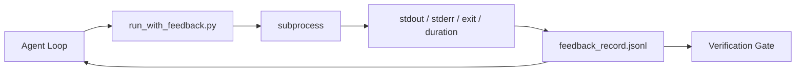

# 运行时反馈循环

> 看不到真实命令输出的智能体（agent），只能靠猜。反馈运行器（feedback runner）会把标准输出 stdout、标准错误 stderr、退出码和耗时捕获为结构化记录，供下一轮读取。这样，智能体就能根据事实采取行动，而不是根据自己对事实的预测行动。

**Type:** Build
**Languages:** Python (stdlib)
**Prerequisites:** 阶段 14 · 32（最小工作台），阶段 14 · 35（初始化脚本）
**Time:** ~50 分钟

## 学习目标

- 区分运行时反馈（runtime feedback）与可观测性遥测（telemetry）。
- 构建反馈运行器，封装 Shell（命令解释器）命令，并将结构化记录持久保存。
- 以确定性的方式截断大段输出，使循环保持在 token（词元）预算以内。
- 在缺少反馈时拒绝推进循环。

## 要解决的问题

智能体说：“现在运行测试。”下一条消息就说：“所有测试都通过了。”事实却是，根本没有运行任何测试。智能体可能臆想了输出，也可能运行了命令却没有读取结果，或者读了结果，却悄悄截掉了包含失败信息的那一行。

反馈运行器会弥合这个缺口。每条命令都经过运行器。每条记录都包含命令、捕获到的 stdout 和 stderr、退出码、墙钟耗时（wall-clock duration，即实际经过的时间），以及智能体写的一行备注。智能体在下一轮读取这条记录。验证门禁（verification gate）则在任务结束时读取这些记录。

## 核心概念



### 反馈记录包含什么

| 字段 | 为什么重要 |
|-------|----------------|
| `command` | 精确的 argv 参数列表，不会因 Shell 展开而产生意外 |
| `stdout_tail` | 最后 N 行，以确定性的方式截断 |
| `stderr_tail` | 最后 N 行，与 stdout 分开保存 |
| `exit_code` | 明确无歧义的成功信号 |
| `duration_ms` | 暴露缓慢的探测和失控的进程 |
| `started_at` | 用于回放的时间戳 |
| `agent_note` | 智能体写的一行备注，说明它原本预期会发生什么 |

### 截断是确定性的

一份 50 MB 的日志足以拖垮循环。运行器截断输出时会保留头部和尾部，并插入 `...truncated N lines...` 标记；这种截断是确定性的，因此相同输出总会生成相同记录。这里不做采样；智能体需要看到的部分，如最后的错误和最终摘要，都位于尾部。

### 反馈与遥测

遥测（阶段 14 · 23，OTel GenAI 约定）供运维人员回顾不同时段的运行。反馈则服务于本次运行的下一轮。二者有一些共同字段，但保存在不同文件中，采用不同的保留策略。

### 没有反馈就拒绝推进

如果运行器在捕获退出码之前出错，记录中会包含 `exit_code: null` 和 `error: <reason>`。退出码为 `null` 时，智能体循环必须拒绝声称成功。没有退出码，就不能继续推进。

```figure
wb-feedback-loop
```

## 动手实现

`code/main.py` 实现了：

- `run_with_feedback(command, agent_note)`：封装 `subprocess.run`，捕获 stdout/stderr/退出码/耗时，以确定性的方式截断输出，并追加到 `feedback_record.jsonl`。
- 一个小型加载器，以流式方式将 JSONL（每行一个 JSON 对象的格式）读入 Python 列表。
- 一个运行三条命令（成功、失败、缓慢）的演示，并打印每条命令的最后一条记录。

运行方式：

```text
python3 code/main.py
```

输出：向 `feedback_record.jsonl` 追加三条反馈记录，并直接打印每条命令的最后一条记录。多次重新运行时查看文件尾部，就能看到循环中的记录不断累积。

## 真实生产环境中的模式

以下三种模式能加固运行器，使其达到可交付的程度。

**在写入时脱敏，而不是在读取时脱敏。** 任何涉及 stdout 或 stderr 的记录都可能泄露秘密信息。运行器在追加 JSONL 之前会执行脱敏（redaction）：删除匹配 `^Bearer `、`password=`、`api[_-]?key=`、`AKIA[0-9A-Z]{16}`（AWS）、`xox[baprs]-`（Slack）的行。只在读取时脱敏很容易埋下隐患，因为攻击者能接触到的是磁盘上的文件。每季度都应根据生产运行时实际观察到的秘密信息格式，审查脱敏模式。

**制定轮转策略，而不是一直写同一个文件。** 将 `feedback_record.jsonl` 的每文件大小上限设为 1 MB；超出时轮转为 `.1`、`.2`，丢弃 `.5`。智能体循环只读取当前文件，因此运行时开销有上限。CI 产物存储保留完整的轮转文件集。如果不做轮转，每次调用加载器时，这个文件都会成为瓶颈。

**用父命令 ID 串起重试链。** 每条记录都有 `command_id`；重试记录携带 `parent_command_id`，指向上一次尝试。审查者的“失败尝试”列表（阶段 14 · 40）和验证门禁的审计都会沿这条链追溯。如果没有这种关联，重试就会看起来像一次独立的成功，审计也就掩盖了失败历史。

## 实际使用

生产环境中的用法：

- **Claude Code Bash 工具。** 该工具已经会捕获 stdout、stderr、退出码和耗时。本课的运行器提供了等价能力，不依赖具体框架，可用于任何智能体产品。
- **LangGraph 节点。** 用运行器封装任何执行 Shell 命令的节点，使记录持久保存在图状态之外。
- **CI 日志。** 将 JSONL 通过管道送入 CI 产物存储；审查者无需重新运行整个会话，就能回放任何命令。

运行器只是一层薄封装。因为记录结构由它自己掌控，所以无论迁移到哪个框架，它都能继续使用。

## 交付成果

`outputs/skill-feedback-runner.md` 会生成适配具体项目的 `run_with_feedback.py`，其中包含合适的截断预算、接入工作台（workbench）的 JSONL 写入器，以及供智能体每轮读取记录的加载器。

## 练习

1. 为每条记录添加 `cwd` 字段，以区分从不同目录运行的同一条命令。
2. 添加 `redaction` 步骤，删除匹配 `^Bearer ` 或 `password=` 的行。使用一条测试样例（fixture）记录进行测试。
3. 通过轮转为 `.1`、`.2` 文件，将 `feedback_record.jsonl` 的总大小限制在 1 MB。说明你选择该轮转策略的理由。
4. 添加 `parent_command_id`，让重试链可见：哪条命令产生了下一条命令所使用的输入。
5. 将 JSONL 通过管道送入一个小型 TUI（终端用户界面），突出显示最近一次非零退出。列出该 TUI 必须展示的八项关键功能，使其能在审查中发挥作用。

## 关键术语

| 术语 | 常见说法 | 实际含义 |
|------|----------------|------------------------|
| 反馈记录（Feedback record） | “运行日志” | 包含命令、输出、退出码和耗时的结构化 JSONL 条目 |
| 尾部截断（Tail truncation） | “裁剪日志” | 以确定性的方式保留头部与尾部，使记录符合 token 预算 |
| 空值即拒绝（Refuse-on-null） | “数据缺失时阻止推进” | `exit_code` 为空值时，循环不得推进 |
| 智能体备注（Agent note） | “预期标签” | 智能体在读取结果之前写下的一行预测 |
| 遥测分离（Telemetry split） | “两个日志文件” | 反馈供下一轮使用，遥测供运维人员使用 |

## 延伸阅读

- [OpenTelemetry GenAI 语义约定](https://opentelemetry.io/docs/specs/semconv/gen-ai/)
- [Anthropic：为长时间运行的智能体构建有效运行框架](https://www.anthropic.com/engineering/effective-harnesses-for-long-running-agents)
- [Guardrails AI x MLflow：确定性安全、PII（个人身份信息）与质量验证器](https://guardrailsai.com/blog/guardrails-mlflow) —— 将脱敏模式用作回归测试
- [Aport.io：2026 年最佳 AI 智能体安全护栏：行动前授权比较](https://aport.io/blog/best-ai-agent-guardrails-2026-pre-action-authorization-compared/) —— 在工具执行前后捕获信息
- [Andrii Furmanets：2026 年的 AI 智能体：工具、记忆、评估与安全护栏的实用架构](https://andriifurmanets.com/blogs/ai-agents-2026-practical-architecture-tools-memory-evals-guardrails) —— 可观测性相关组成要素
- 阶段 14 · 23 —— 遥测侧的 OTel GenAI 约定
- 阶段 14 · 24 —— 智能体可观测性平台（Langfuse、Phoenix、Opik）
- 阶段 14 · 33 —— 要求在宣告完成之前获得反馈的规则
- 阶段 14 · 38 —— 读取 JSONL 的验证门禁
