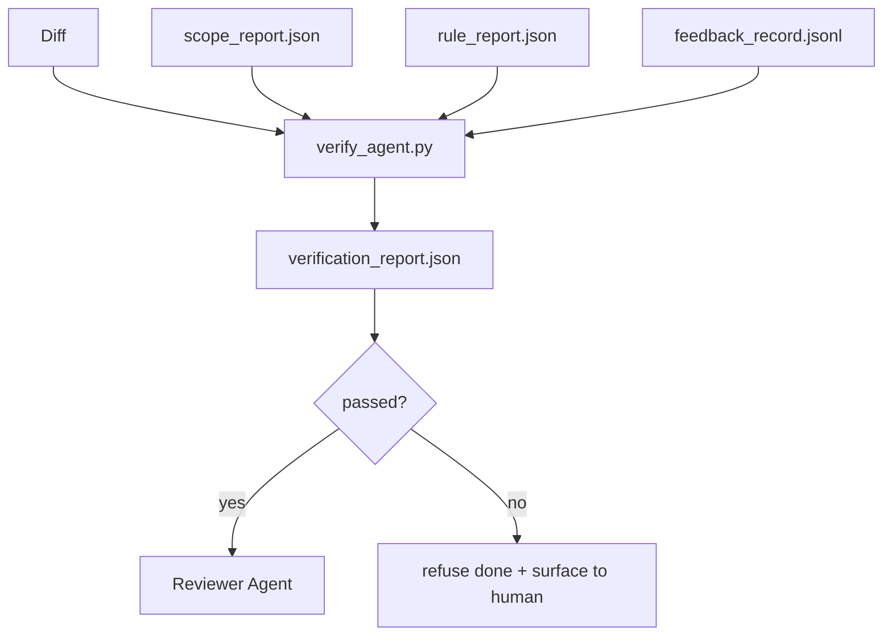

# 验证关卡

> 智能体（agent）不能自行把自己的工作标记为已完成。验证关卡（verification gate）读取范围契约、反馈日志、规则报告和差异，只回答一个问题：这项任务真的完成了吗？只要关卡判定未完成，任务就没有完成，无论聊天里怎么说。

**Type:** Build
**Languages:** Python (stdlib)
**Prerequisites:** 阶段 14 · 33（规则）、阶段 14 · 36（范围）、阶段 14 · 37（反馈）
**Time:** ~55 分钟

## 学习目标

- 将验证关卡定义为一个以工作台（workbench）产物（artifact）为输入的确定性函数。
- 将规则报告、范围报告、反馈记录和差异合成为一个判定结果。
- 输出一份审查智能体和 CI（持续集成）都能读取的 `verification_report.json`。
- 只要出现任何阻断级失败，就拒绝推进任务，无一例外。

## 要解决的问题

智能体太容易宣布成功。最常见的失败有三种：

- “看起来没问题。”模型读了自己生成的差异，就认定它是正确的。
- “测试通过了。”说得很有把握，却没有任何记录证明测试实际运行过。
- “满足验收要求。”对验收标准的解释宽松到“只要看上去像是完成了”就算满足。

工作台的解决办法是设置一个统一的验证关卡，由它读取智能体已经生成的产物并作出判断。关卡是确定性的，纳入版本控制，并接入 CI。智能体无法收买它。

## 核心概念



### 关卡检查什么

| 检查项 | 来源产物 | 严重级别 |
|-------|-----------------|----------|
| 所有验收命令都已运行 | `feedback_record.jsonl` | block（阻断） |
| 所有验收命令都以零退出码结束 | `feedback_record.jsonl` | block |
| 范围检查中没有禁止的写入 | `scope_report.json` | block |
| 范围检查中没有超出范围的写入 | `scope_report.json` | block 或 warn（警告） |
| 所有阻断级规则都通过 | `rule_report.json` | block |
| 反馈中没有 `null` 退出码 | `feedback_record.jsonl` | block |
| 修改过的文件符合 `scope.allowed_files` | 两者 | warn |

`warn` 级发现会作为注记写入判定结果；`block` 级发现则会阻止结果成为 `passed: true`。

### 确定性，而非概率性

对于同一组产物，关卡每次都必须给出相同的判定结果。不使用大语言模型（LLM）裁判。LLM 裁判应放在审查侧（阶段 14 · 39），那里的目标是定性评价，而不是判定状态。

### 一份报告，一个路径

每次任务收尾时，关卡输出一份 `verification_report.json`，写入 `outputs/verification/<task_id>.json`。CI 也从同一路径读取。如果多个关卡使用不同路径，权威来源就会出现分叉。

### 拒绝放行，没有例外

智能体不能对阻断级发现作出豁免。只有人类可以豁免，而且必须记录 `override_reason` 和 `overridden_by` 用户 ID。豁免是一项经过签名的变更，不是智能体的决定。

```figure
wb-gate-sequence
```

## 动手实现

`code/main.py` 实现了：

- 每种输入产物各有一个加载器，全部在本地用桩实现，使本课无需外部配套即可运行。
- 一个 `verify(task_id, artifacts) -> VerdictReport` 纯函数。
- 一个打印器，显示各检查项的结果以及最终是否通过。
- 一个包含三种任务情景的演示：全部通过、范围蔓延、缺少验收。

运行：

```text
python3 code/main.py
```

输出：三份判定报告，每份都保存在脚本旁。

## 生产实践中的模式

以下四种模式让关卡从“又一个代码检查任务”升级为“决定能否继续的关口”。

**纵深防御（defense-in-depth），而非单一关卡。** 提交前钩子（pre-commit hook）→ CI 状态检查 → 工具调用前授权钩子 → 合并前关卡。每一层都是确定性的，因此某一层未能拦下的问题会被下一层捕获。microservices.io 在 2026 年三月的实践指南中明确指出：提交前钩子无法绕过，因为它不像模型侧的技能那样依赖智能体遵循指令。验证关卡位于 CI / 合并前这一层。

**用确定性检查防御，模型裁判只处理需要细致判断的部分。** Anthropic 在 2026 年提出的 Hybrid Norm 组合方式是：可验证奖励（单元测试、schema（结构定义）检查、退出码）回答“代码解决了问题吗？”，LLM 评分准则回答“代码是否可读、安全、符合风格？”。关卡执行前一类检查，审查者（阶段 14 · 39）执行后一类。将两者混在一起会破坏信号。

**使用签名豁免日志，而不是 Slack 讨论串。** 每次豁免都会向 `outputs/verification/overrides.jsonl` 写入一行，包含：时间戳、发现项代码、理由、签名用户、当前 HEAD 提交。运行时拒绝任何缺少签名的豁免；审计轨迹纳入 git 跟踪。这是实质性的豁免策略与徒具形式的豁免之间的分界线。

**将覆盖率下限作为一项正式检查。** `coverage_report.json` 为 `coverage_floor`（默认 80%）检查提供输入。如果测得的覆盖率低于下限，或者比上一次合并时的下限低超过 1 个百分点，关卡就会判定失败。没有这项检查，智能体就会悄悄删除失败的测试，而验证报告仍然显示通过。

**`--strict` 模式将警告提升为阻断。** 对于发布分支、决定能否交付的 PR，或事故后的排查，`--strict` 会让每个警告都导致硬性失败。该标志按分支选择启用，不作为全局默认，因为对一切都采取严格模式会妨碍日常工作。

## 实际使用

生产模式：

- **CI 步骤。** 一个 `verify_agent` 作业针对智能体的最终产物运行关卡。没有 `passed: true`，合并保护就拒绝放行。
- **交接前钩子。** 智能体运行时在生成交接（handoff）文档之前调用关卡。没有通过的判定结果，就不能交接。
- **人工排查。** 当智能体声称成功、而人类对此存疑时，操作人员会读取报告。

关卡是工作台流程中决定能否继续的关口。其他每个组成要素都位于它的上游。

## 交付成果

`outputs/skill-verification-gate.md` 将关卡接入具体项目：哪些验收命令向它提供输入、哪些规则属于阻断级、哪些超出范围的写入可以容忍，以及如何存储豁免审计日志。

## 练习

1. 添加 `coverage_floor` 检查：测试命令必须生成一份覆盖率至少达到 80% 的报告。决定由哪种产物承载这个下限。
2. 支持 `--strict` 模式，将每个 `warn` 提升为 `block`。说明哪些情况下应默认使用严格模式。
3. 让关卡在 JSON 之外再生成一份 Markdown 摘要。论证哪些字段应放进摘要。
4. 添加 `time_since_last_human_touch` 检查：任何在人类敲击键盘后 60 秒内被编辑的文件，都免于被标记为超出范围。
5. 在你们产品中智能体产生的一份真实差异上运行关卡。有多少发现确实有问题，又有多少是噪声？关卡还需要在哪些方面扩展？

## 关键术语

| 术语 | 常见说法 | 实际含义 |
|------|----------------|------------------------|
| 验证关卡 | “拦住操作的检查” | 以工作台产物为输入、生成通过/失败判定结果的确定性函数 |
| 阻断级 | “硬性失败” | 会阻止 `passed: true`、需要签名豁免才能放行的发现 |
| 豁免日志 | “我们为什么放行” | 包含理由和用户 ID 的签名记录，由审查环节审计 |
| 验收命令 | “证据” | 一条 shell 命令，其零退出码就是 `done` 的含义 |
| 单一报告路径 | “权威来源” | `outputs/verification/<task_id>.json`，供 CI 和人类共同读取 |

## 延伸阅读

- [Anthropic：面向长时应用开发的运行框架设计](https://www.anthropic.com/engineering/harness-design-long-running-apps)
- [OpenAI Agents SDK 安全护栏](https://openai.github.io/openai-agents-python/guardrails/)
- [microservices.io：GenAI 开发平台的安全护栏](https://microservices.io/post/architecture/2026/03/09/genai-development-platform-part-1-development-guardrails.html)——提交前与 CI 之间的纵深防御
- [ICMD：2026 年智能体 AI 运维实践指南](https://icmd.app/article/the-2026-playbook-for-agentic-ai-ops-guardrails-costs-and-reliability-at-scale-1776661990431)——审批关卡阶梯（草稿 → 审批 → 在阈值内自动执行）
- [类型检查式合规：确定性安全护栏（arXiv 2604.01483）](https://arxiv.org/pdf/2604.01483)——Lean 4 作为确定性关卡的上限
- [logi-cmd/agent-guardrails：合并关卡规范](https://github.com/logi-cmd/agent-guardrails)——范围与变异测试关卡
- [Guardrails AI x MLflow](https://guardrailsai.com/blog/guardrails-mlflow)——以确定性验证器充当 CI 评分器
- 阶段 14 · 27——提示词注入防御（与关卡配套的对抗性防御）
- 阶段 14 · 36——本关卡强制执行的范围契约
- 阶段 14 · 37——本关卡评分的反馈日志
- 阶段 14 · 39——关卡向其交接的审查智能体
