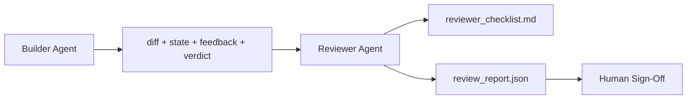

# 审查智能体：将构建者与评分者分开

> 编写代码的智能体（agent）不能给这份代码打分。审查者（reviewer）构成第二个循环：它使用不同的系统提示词（system prompt），有不同的目标，并且只能以只读方式访问构建者（builder）产出的全部内容。可靠性很大程度上来自构建者与审查者之间的隔离。

**Type:** Build
**Languages:** Python (stdlib)
**Prerequisites:** 阶段 14 · 38（验证关卡）
**Time:** ~55 分钟

## 学习目标

- 说明为什么同一个智能体无法可靠地审查自己的工作。
- 构建一个审查智能体循环，读取构建者的产物（artifact），输出结构化审查报告。
- 编写审查者评分细则（rubric），按具体维度评分，而不是凭感觉判断。
- 将审查者接入工作台（workbench），让人工审查以一份实际产物为起点。

## 要解决的问题

你让智能体修复一个缺陷。它修改了四个文件，运行测试，然后报告任务完成。验证关卡（verification gate，阶段 14 · 38）确认已执行验收，并且遵守了范围约束。关卡给出 `passed: true`。你合并了改动。两天后，你发现这次修复解决了缺陷中的一半，却不是该解决的那一半。

通过验收是必要条件，但并不充分。审查者会提出验收无法回答的问题：这是否解决了正确的问题？是否扩大了范围却未加说明？是否记录了本应受到质疑的假设？留下的工作台状态是否能让下一次会话接着工作？

## 核心概念



### 审查者评分细则

五个维度，每个维度评分为 0 到 2。

| 维度 | 问题 |
|-----------|----------|
| 问题契合度 | 改动是否解决了任务所述的问题，而不是一个相近的任务？ |
| 范围约束遵守情况 | 修改是否限制在契约范围内，或者是否经过有意识的决策才扩大了契约范围？ |
| 假设 | 所有隐含假设是否都写在了可供审查的地方？ |
| 验证质量 | 验收命令是否真正证明了目标已达成，还是只证明了一个较弱的版本？ |
| 交接就绪程度 | 下一次会话能否从当前状态顺利接手？ |

总分为 10 分。一次运行的总分低于 7，属于软性失败（soft fail）；低于 5，属于硬性失败（hard fail）。

### 审查者是独立的角色，不一定是不同的模型

审查者可以使用与构建者相同的模型。关键在于严格区分角色：不同的系统提示词、不同的输入，以及对差异内容（diff）没有写入权限。审查立场变了，得到的信号也会改变。

### 审查者不能编辑差异内容

审查者读取差异内容、状态、反馈和判定结果，然后撰写报告。它不会给差异内容打补丁。如果报告说“修复这里”，就由构建者在下一轮修复；审查者则继续负责审查。角色混用会破坏这种隔离。

### 审查者评分细则与验证关卡

关卡（阶段 14 · 38）检查确定性事实：是否执行验收、规则是否通过、范围是否受控。审查者作出定性判断：是否做了正确的工作、是否有文档记录、交接（handoff）是否可用。两者缺一不可。

```figure
wb-builder-marker
```

## 动手实现

`code/main.py` 实现了以下内容：

- 一个 `ReviewerInputs` 数据类，将审查者要读取的产物打包在一起。
- 一个按评分细则打分的评分器，每个维度各有一个函数。本课中的每个函数都是确定性的，只是教学用的桩实现（stub）；实际实现会调用大语言模型（LLM）。
- 一个 `review_report.json` 写入器，写入五个分数、总分和判定结果（`pass`、`soft_fail`、`hard_fail`）。
- 两个演示案例：一项没有问题的改动，以及一项“测试正确，问题弄错”的改动。

运行：

```text
python3 code/main.py
```

输出：写入磁盘的两份审查报告，以及控制台中按维度列出的评分表。

## 生产实践中的模式

实际记录如下：Cloudflare 2026 年四月的 AI Code Review 系统在 30 天内，对 5,169 个仓库中的 48,095 个合并请求执行了 131,246 次审查。审查完成时间的中位数为 3 分 39 秒。最多七位专业审查者（安全、性能、代码质量、文档、发布管理、合规、Engineering Codex）在审查协调者（Review Coordinator）的统筹下并行工作；协调者负责对发现项去重并判断严重程度。顶级模型专供协调者使用，专业审查者则使用更便宜的模型档位。

四种模式使这一做法能够规模化运作。

**采用专业审查者池，而不是一个包揽一切的审查者。** 对个人维护的仓库，一位使用 5 维评分细则的审查者就能胜任。一旦代码库包含安全关键部分、性能关键部分和文档部分，就应拆分为使用更短提示词的专业审查者。协调者负责去重；专业审查者从不执行完整评分细则。模型档位的分工也就顺理成章：专业审查者用便宜模型，协调者用昂贵模型。

**将偏差缓解视为设计要求，而不只是优化。** LLM 评判者会稳定地表现出四种偏差（Adnan Masood，2026 年四月）：位置偏差（GPT-4 对 (A,B) 与 (B,A) 的排序有 ~40% 的判断不一致）、冗长偏差（较长输出的评分虚高 ~15%）、自我偏好（评判者更偏好同一模型家族的输出）、权威偏差（评判者会给引用知名作者的内容过高评分）。缓解方法是：评估两种排列顺序，只计入结果一致的胜出；采用明确奖励简洁性的 1-4 分量表；轮换使用不同模型家族的评判者；在评分前移除作者姓名。

**采用校准集，而不是凭感觉。** 校准集（calibration set）由 10-20 项已有正确判定结果的历史任务组成。每次更改提示词，都要让审查者在这组任务上运行。如果与历史记录的一致率低于 80%，就必须在交付审查者之前修订评分细则。这是每个团队最终都会重新发现的做法，不如从一开始就采用。

**与关卡配合，形成混合规范。** 验证关卡（阶段 14 · 38）负责确定性检查（是否执行验收、测试是否通过、范围是否受控）。审查者负责语义检查（是否做了正确的工作、是否记录了假设、交接是否可用）。Anthropic 在 2026 年的指南中明确强调了这种分工：不要让审查者重做关卡已经证明的事情。

## 实际使用

生产实践中的模式：

- **Claude Code 子智能体。** 构建者结束一项任务后，审查子智能体开始运行。它在 PR 上发表评论，给出评分细则中各维度的得分。
- **OpenAI Agents SDK 的交接。** 在 OpenAI Agents SDK（软件开发工具包）中，构建者完成任务后将工作交给审查者。审查者可以附上发现项列表交回，也可以上交给人工处理。
- **双模型配对。** 构建者使用速度更快、成本更低的模型。审查者使用能力更强的模型，携带更小的上下文，专注于判断。

当人无法亲自完成每一次审查时，审查者就是工作台增设的第二双眼睛。

## 交付成果

`outputs/skill-reviewer-agent.md` 会生成项目专用的审查者评分细则、接入构建者产物的审查智能体桩实现，以及与验证关卡的集成，让人工审查从书面报告开始，而不是面对一张白纸。

## 练习

1. 添加一个与你的产品领域相关的第六维度。说明为什么现有五个维度无法涵盖它。
2. 使用两种不同的系统提示词（简短版、冗长版）运行审查者。哪一种生成的报告更能让人愿意阅读？
3. 为每个维度添加一个 `confidence` 字段，用来表示置信度。当最低分维度的置信度低于 0.6 时，拒绝交付报告。
4. 构建一个校准集：收集 10 项已有正确判定结果的历史任务结项记录。让审查者评判这些记录。它在哪些地方与历史记录不一致？
5. 增加“请求更多证据”的操作入口：审查者可以在评分前，要求构建者运行某个具体测试。应采用怎样的退避策略，才能避免这个流程陷入循环？

## 关键术语

| 术语 | 常见说法 | 实际含义 |
|------|----------------|------------------------|
| 审查者评分细则 | “检查清单” | 按五个维度以 0-2 分评分，每个维度都有书面问题 |
| 软性失败 | “需要修订” | 总分低于 7；构建者收到需要处理的发现项 |
| 硬性失败 | “拒绝” | 总分低于 5，或任一维度为 0；停止并交由人工处理 |
| 角色分离 | “不同的提示词” | 同一个模型可以承担两种角色；关键在于输入和审查立场 |
| 置信度下限 | “不要交付信号不足的报告” | 当评分细则无法给出确定判断时，拒绝输出判定结果 |

## 延伸阅读

- [OpenAI Agents SDK handoffs](https://openai.github.io/openai-agents-python/handoffs/)
- [Anthropic Claude Code subagents](https://code.claude.com/docs/en/sub-agents)
- [Cloudflare, Orchestrating AI Code Review at Scale](https://blog.cloudflare.com/ai-code-review/) — 7 位专业审查者加协调者的架构，30 天内运行 131k 次
- [Agent-as-a-Judge: Evaluating Agents with Agents (OpenReview / ICLR)](https://openreview.net/forum?id=DeVm3YUnpj) — DevAI 基准，366 项分层解决方案要求
- [Adnan Masood, Rubric-Based Evaluations and LLM-as-a-Judge: Methodologies, Biases, Empirical Validation](https://medium.com/@adnanmasood/rubric-based-evals-llm-as-a-judge-methodologies-and-empirical-validation-in-domain-context-71936b989e80) — 4 种偏差及其缓解方法
- [MLflow, LLM-as-a-Judge Evaluation](https://mlflow.org/llm-as-a-judge) — 用于分离构建者与评估者的生产工具
- [LangChain, How to Calibrate LLM-as-a-Judge with Human Corrections](https://www.langchain.com/articles/llm-as-a-judge) — 校准集工作流
- [Evidently AI, LLM-as-a-judge: a complete guide](https://www.evidentlyai.com/llm-guide/llm-as-a-judge)
- [Arize, LLM as a Judge — Primer and Pre-Built Evaluators](https://arize.com/llm-as-a-judge/)
- 阶段 14 · 05 — Self-Refine 和 CRITIC（单智能体自审基线）
- 阶段 14 · 30 — 评测驱动的智能体开发（校准集生成器）
- 阶段 14 · 38 — 审查者读取的验证关卡
- 阶段 14 · 40 — 接收审查报告的交接包
