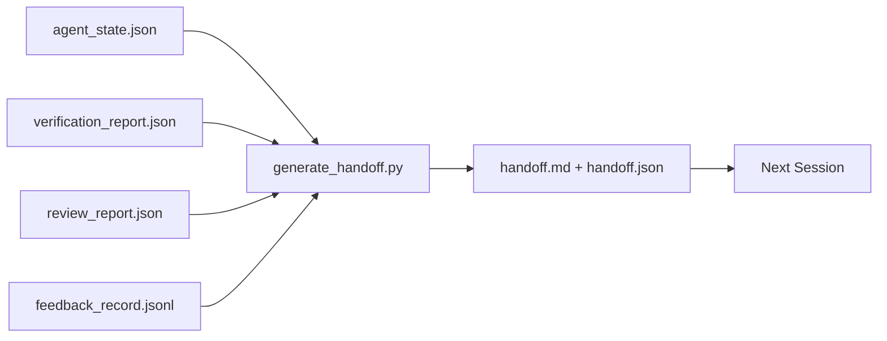

# 跨会话交接

> 会话总会结束，工作却未必做完。交接包（handoff packet）这一产物，能把“智能体（agent）忙了一小时”转化为“下一次会话从第一分钟起就能有效推进工作”。要有意识地构建它，而不是临到结束才想起来。

**Type:** Build
**Languages:** Python (stdlib)
**Prerequisites:** 阶段 14 · 34（仓库记忆）、阶段 14 · 38（验证）、阶段 14 · 39（审查者）
**Time:** 约 50 分钟

## 学习目标

- 说出每个交接包必备的七个字段。
- 从工作台（workbench）产物生成交接包，无需手写说明文字。
- 将庞大的反馈日志裁剪成适合放入交接包的摘要。
- 让下一次会话的首个行动明确且可确定。

## 要解决的问题

会话结束了。智能体说：“很好，我们取得了进展。”下一次会话开始，下一个智能体却问：“上次做到哪里了？”先前智能体的回答已经不在了。下一个智能体只能重新摸索、重复执行相同的命令、再次向人提出相同的问题，花上三十分钟，才找回上一次会话最后三十秒的工作状态。

只要任务还在继续，每次会话都要为糟糕的交接付出代价。解决办法是在会话结束时自动生成一个交接包，说明改了什么、为什么改、尝试了什么、什么失败了、还剩什么，以及下次首先做什么。

## 核心概念



### 每个交接包都包含的七个字段

| 字段 | 它回答的问题 |
|-------|---------------------|
| `summary` | 用一段话概述做了什么 |
| `changed_files` | 一眼看清差异（diff） |
| `commands_run` | 实际执行了什么 |
| `failed_attempts` | 尝试了什么，以及为什么没奏效 |
| `open_risks` | 哪些问题可能影响下一次会话，以及各自的严重程度 |
| `next_action` | 下一次会话首先采取的具体步骤 |
| `verdict_pointer` | 验证报告和审查报告的路径 |

`next_action` 是支撑整个交接包的关键字段。一个交接包即使其他内容齐全，只要缺少 `next_action`，就只是状态报告，而不是交接包。

### 交接包靠生成，不靠手写

需要手写的交接包，往往会在忙乱的一天被省略。生成器读取工作台产物，输出交接包。智能体的职责是让工作台保持在生成器能够概述的状态，而不是亲自撰写摘要。

### 两种形式：人可读和机器可读

`handoff.md` 供人阅读，`handoff.json` 供下一个智能体加载。两者都来自同一组源产物。如果内容不一致，以 JSON 为准。

### 裁剪反馈日志

完整的 `feedback_record.jsonl` 可能有数百条记录。交接包只保留最后 K 条，以及所有退出码非零的记录。下一次会话可以在需要时加载完整日志，而交接包则保持精简。

### 留下干净的状态

交接包描述工作，干净的状态则让工作可以继续。两者不是一回事。如果下一次会话面对的是只应用了一半的差异、智能体忘记清理的临时文件、多余的分支（branch），以及尚未真正运行就报错的测试，那么再完美的 `handoff.md` 也没有价值。下一个智能体只能把头十分钟花在收拾上一次留下的残局上，而不是继续构建；在任务的整个生命周期中，这种代价会随每次会话不断累积。

因此，功能能用了，并不意味着会话就可以结束。只有工作台处于生成器能够概述、下一次会话能够信赖的状态时，会话才算结束。清理本身就是一个独立阶段，要在交接之前执行；它必须是一项检查，而不能只靠习惯，因为忙乱的时候，习惯恰恰最容易被省略。

| 检查项 | 怎样才算干净 | 未清理为何会造成阻碍 |
|-------|-------------|----------------------|
| 工作树 | 每项改动都已提交，或已明确暂存到 stash 并留下说明 | 只应用了一半的差异，在下一个智能体看来可能是有意为之 |
| 临时产物 | 不留下 `*.tmp`、草稿目录、调试打印语句或被注释掉的代码块 | 多余文件会干扰差异审查，也会干扰下一个智能体对工作状态的理解 |
| 测试 | 全部通过；若有失败，须在 `open_risks` 中点明 | 未被说明的失败测试，是下一次会话会踩中的陷阱 |
| 功能看板 | `feature_list.json` 中的状态反映实际情况（阶段 14 · 36） | 过时的看板会让下一次会话去做已经完成的工作 |
| 分支 | 位于预期分支，没有分离的 HEAD，也没有孤儿分支 | 分支不对，下一次会话的首个提交就会落到错误的位置 |

清理阶段会输出 `clean_state.json`，列出阻断问题；该列表为空，是交接生成器在写入交接包前要用断言检查的前置条件。在未清理的工作树上生成的交接包，算不上交接，只是在把烂摊子转交出去。这两个产物相互配合：清理证明工作台可以放心交出去，交接包则证明下一次会话知道从何开始。

```figure
wb-handoff-packet
```

## 动手实现

`code/main.py` 实现了：

- 一个加载器，将状态、判定结果、审查报告和反馈汇集为一个 `WorkbenchSnapshot`。
- 一个 `generate_handoff(snapshot) -> (markdown, payload)` 函数。
- 一个过滤器，选出最后 K 条反馈记录，以及所有退出码非零的记录。
- 一次演示运行，在脚本旁写出 `handoff.md` 和 `handoff.json`。

运行方式：

```text
python3 code/main.py
```

输出：打印出的交接正文，以及磁盘上的两个文件。

## 生产实践中的模式

Codex CLI、Claude Code 和 OpenCode 各有不同的上下文压缩（compaction）方案；结构化交接包则建立在这三种方案之上。

**压缩策略各不相同，交接包的 schema（结构定义）却不变。** Codex CLI 的 POST /v1/responses/compact 对应一个服务端不透明的 AES 数据块（OpenAI 模型的快速路径）；回退方案是在本地生成一份“交接摘要”，以 `_summary` 用户角色消息的形式追加。Claude Code 在上下文用量达到 95% 时执行五阶段渐进式压缩。OpenCode 则按时间戳隐藏消息，再加上一份含 5 个标题的大语言模型（LLM）摘要。三种机制各不相同，却有同一个需求：把压缩后保留下来的内容序列化成可移植的产物。交接包就是这一产物。

**切换到新会话的交接，不等同于压缩。** 压缩延长当前会话；交接则妥善结束当前会话，再开启下一次会话。Hermes Issue #20372（2026 年四月）提出的思路是对的：当原地压缩开始损害质量时，智能体应写出一份精简的交接包、结束会话，再在全新上下文中继续。交接包让这种切换的成本降了下来。错误做法是不断压缩，直到质量崩溃；正确做法是预留预算，及早完成一次干净利落的交接。

**每个分支、每个主题只保留一份生效中的交接包。** 多智能体协作因过时交接而失效的情况，比因糟糕模型输出而失效的情况更常见。始终包含 `branch`、`last_known_good_commit`，以及取值为 `active | superseded | archived` 的 `status`。过时的交接包应归档，只有生效中的那一份用于指导下一次会话。这正是“把交接当笔记”和“把交接当状态”的区别。

**在上下文用量达到 50-75% 之前收尾，不要等到上限。** 手写交接模式的实践指南（CLAUDE.md + HANDOVER.md）报告称，当会话在上下文预算用到 50-75% 时结束，而非等到 95% 时，效果最好。在压缩引入的失真污染源状态之前，交接包生成器能够顺利运行。上下文完整时，写交接包成本很低；等到模型已经开始搞不清进度时，成本就高了。

## 实际使用

生产模式：

- **会话结束钩子（hook）。** 用户关闭聊天时，运行时（runtime）触发生成器。交接包保存到 `outputs/handoff/<session_id>/`。
- **PR 模板。** 生成器输出的 Markdown 也可以作为 PR 正文。审查者无需再打开另外五个文件就能阅读它。
- **跨智能体交接。** 用一个产品（Claude Code）构建，再用另一个产品（Codex）继续。交接包就是双方的通用语言。

交接包体积小、格式规整，生成成本也低。每多一次会话，它带来的成本节省就多积累一分。

## 交付成果

`outputs/skill-handoff-generator.md` 会生成一个按项目产物路径配置的生成器、一个在会话结束时运行该生成器的钩子，以及一个供下一个智能体在启动时读取的 `handoff.json` schema。

## 练习

1. 添加一个 `assumptions_to_validate` 字段，列出构建者记录过、但审查者未给出高于 1 分评价的所有假设。
2. 对失败运行和通过运行，采用不同的反馈摘要裁剪方式。说明这种不对称处理的理由。
3. 加入一份“向人提问”的问题清单。一个问题在什么条件下应放入交接包，而不是发成聊天消息？
4. 让生成器具有幂等性（idempotent）：运行两次得到相同的交接包。要做到这一点，哪些内容必须保持稳定？
5. 添加“下一次会话的前置要求”一节，准确列出下一次会话行动前必须加载的产物。

## 关键术语

| 术语 | 常见说法 | 实际含义 |
|------|----------------|------------------------|
| 交接包 | “会话摘要” | 包含七个字段的生成产物，同时提供 Markdown 和 JSON 两种形式 |
| 下一步行动 | “首先做什么” | 启动下一次会话的一个具体步骤 |
| 反馈裁剪 | “日志摘要” | 最后 K 条记录，加上所有退出码非零的记录 |
| 状态报告 | “我们做了什么” | 缺少 `next_action` 的文档；有用，但不算交接包 |
| 判定结果指针 | “凭证” | 指向验证报告和审查报告的路径，用于追溯 |

## 延伸阅读

- [Anthropic：面向长时间运行智能体的高效运行框架](https://www.anthropic.com/engineering/effective-harnesses-for-long-running-agents)
- [OpenAI Agents SDK（软件开发工具包）的交接机制](https://openai.github.io/openai-agents-python/handoffs/)
- [Codex Blog：Codex CLI 上下文压缩：架构、配置与长会话管理](https://codex.danielvaughan.com/2026/03/31/codex-cli-context-compaction-architecture/) —— POST /v1/responses/compact 与本地回退方案
- [Justin3go：卸下沉重记忆：Codex、Claude Code 与 OpenCode 中的上下文压缩](https://justin3go.com/en/posts/2026/04/09-context-compaction-in-codex-claude-code-and-opencode) —— 三家厂商的压缩机制对比
- [JD Hodges：Claude 交接提示词（prompt）：如何跨会话保留上下文（2026）](https://www.jdhodges.com/blog/ai-session-handoffs-keep-context-across-conversations/) —— CLAUDE.md + HANDOVER.md，50-75% 上下文预算
- [Mervin Praison：管理多智能体编码会话中的交接：全新上下文与连续性兼得](https://mer.vin/2026/04/managing-handoffs-in-multi-agent-coding-sessions-fresh-context-without-losing-continuity/) —— 从分布式系统角度看交接
- [Hermes Issue #20372 —— 当压缩变得有风险时，自动交接到新会话](https://github.com/NousResearch/hermes-agent/issues/20372)
- [Hermes Issue #499 —— 上下文压缩质量改进](https://github.com/NousResearch/hermes-agent/issues/499) —— Codex CLI 中面向交接的提示词
- [Microsoft Agent Framework：压缩](https://learn.microsoft.com/en-us/agent-framework/agents/conversations/compaction)
- [OpenCode：上下文管理与压缩](https://deepwiki.com/sst/opencode/2.4-context-management-and-compaction)
- [LangChain：智能体的上下文工程](https://www.langchain.com/blog/context-engineering-for-agents)
- 阶段 14 · 34 —— 生成器读取的状态文件
- 阶段 14 · 38 —— 交接包指向的验证判定结果
- 阶段 14 · 39 —— 纳入交接包的审查报告
