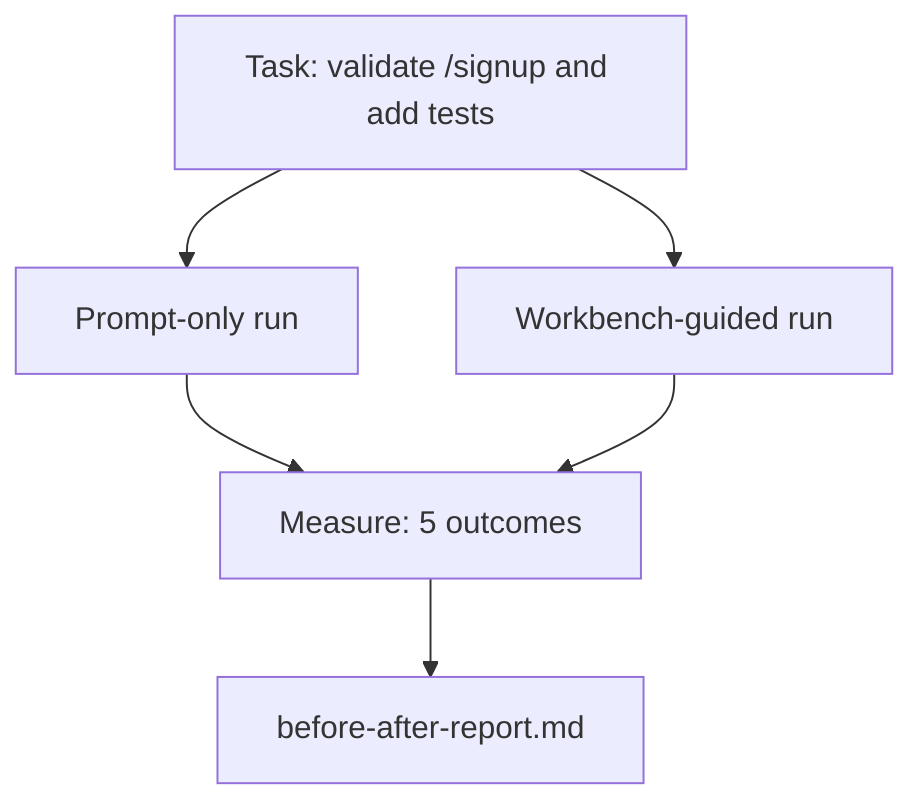

# 在真实代码仓库中使用工作台

> 这十一课所讲的组成要素（surface），如果经不起真实代码库的检验，就毫无价值。本课在一个小型示例应用上把同一任务运行两遍：一遍仅用提示词（prompt），一遍由工作台（workbench）引导。让数字来说明问题。

**Type:** Build
**Languages:** Python (stdlib)
**Prerequisites:** 阶段 14 · 32 至 14 · 40
**Time:** ~60 分钟

## 学习目标

- 在一个小型应用中整合工作台的七种组成要素。
- 将同一任务运行两遍（仅用提示词和工作台引导），并测量五项结果。
- 阅读前后对比报告，判断哪些组成要素发挥了最大的作用。
- 面对“可我的模型已经够好了”的质疑，为使用工作台提供论据。

## 要解决的问题

在玩具任务上做演示，说服不了任何人。只有在一个贴近真实情况的代码仓库中，完成一项贴近真实情况的任务并投入生产，出错更少、回滚更少，还留下下一次会话能使用的交接包（handoff packet），工作台的价值才有说服力。

本课提供这样一个贴近真实情况的代码仓库，并通过两条管线（pipeline）运行同一任务。最终得到一份可以交给质疑者的前后对比报告。

## 核心概念



### 示例应用

`sample_app/` 中有一个最小的 FastAPI 风格处理函数：

- `app.py` 中有 `/signup`（尚无输入校验）。
- `test_app.py` 中有一个正常路径（happy path）测试。
- `README.md` 和 `scripts/release.sh` 用作诱使智能体（agent）触碰禁区的诱饵。

### 任务

> 为 `/signup` 添加输入校验：拒绝长度不足 8 个字符的密码，返回 422，并附带有类型信息的错误封装。添加一个测试，证明这一新行为。

### 两条管线

仅用提示词：

1. 阅读 README。
2. 阅读 `app.py`。
3. 编辑文件。
4. 声称已完成。

工作台引导：

1. 运行初始化脚本（第 35 课）。
2. 阅读范围契约（scope contract，第 36 课）。
3. 阅读状态（第 34 课）。
4. 只编辑允许修改的文件。
5. 通过反馈运行器（feedback runner）执行验收命令（第 37 课）。
6. 运行验证关卡（verification gate，第 38 课）。
7. 运行审查者（reviewer，第 39 课）。
8. 生成交接材料（handoff，第 40 课）。

### 测量的五项结果

| 结果 | 为什么重要 |
|---------|----------------|
| `tests_actually_run` | 大多数“测试已通过”的说法无法核实 |
| `acceptance_met` | 证明目标已达成的测试，必须就是实际运行的那个测试 |
| `files_outside_scope` | 范围蔓延是最主要的静默失败方式 |
| `handoff_quality` | 下一次会话会因此付出代价或从中受益 |
| `reviewer_total` | 在验证关卡之上提供定性判断 |

```figure
wb-ab-runs
```

## 动手实现

`code/main.py` 针对同一个示例应用测试样例（fixture），编排两条管线。两条管线都由脚本实现，没有大语言模型（LLM）参与循环，因此测量可以复现。脚本将对比结果写入 `before-after-report.md` 和 `comparison.json`。

运行：

```text
python3 code/main.py
```

输出：控制台上显示各条管线的结果表，Markdown 报告保存在脚本旁边，同时提供 JSON，方便需要的人绘图。

## 实际生产中的模式

质疑者会问：“工作台到底有多大帮助？”2026 年的数字比解释更有说服力。

**同一模型在 Terminal Bench 上从前30名跃升至前5名。** LangChain 的 *Anatomy of an Agent Harness*（2026 年四月）指出：仅改变运行框架（harness），一个编程智能体就在 Terminal Bench 2.0 上从前 30 名之外跃升至第五名。模型相同，组成要素不同，排名相差二十五位。

**Vercel 通过删减工具，将成功率从 80% 提升到 100%。** Vercel 报告称，删除其智能体 80% 的工具，使成功率从 80% 升至 100%。工具范围更小，任务范围更明确，出错途径更少。做减法取胜。

**Harvey 仅靠运行框架就让准确率翻倍（2x）。** 法律智能体通过优化运行框架，准确率提高到原来的两倍以上，模型没有改变。

**88% 的企业 AI 智能体项目未能投入生产。** preprints.org 上的 *Harness Engineering for Language Agents* 论文（2026 年三月）将这些失败归因于运行时，而非推理：状态过时、重试机制脆弱、上下文过度膨胀，以及中间步骤出错后恢复不佳。

**长上下文下的性能崩塌。** WebAgent 基线的成功率在长上下文条件下，从 40-50% 降至 10% 以下，主要原因是无限循环和目标丢失。Ralph Loop 和交接包的存在，就是为了应对这些问题。

**假阴性（false negative）仍然存在。** 单步事实性任务、单行代码检查、运行格式化工具，以及模型已逐字记住的任何任务，仅用提示词都会更快。基准测试应该如实列举这些情况，避免工作台被视为小题大做。

结论不是“运行框架永远占优”。模型确实会随着时间推移吸收运行框架的技巧。结论是，如今的工程重担落在这七种组成要素上，而数字证明了这一点。

## 实际使用

在以下情况中，本课就是你可以引用的案例材料：

- 有人问，为什么每个 PR 都附带一份 `agent-rules.md` 和一份范围契约。
- 团队想“就这一个迭代”省掉验证关卡。
- 一款新的智能体产品发布，你需要一个可移植的基准测试，判断它是否真的节省时间。

数字比解释传得更远。

## 交付成果

`outputs/skill-workbench-benchmark.md` 是一个可移植的评测框架（evaluation harness）：它针对项目自己的示例应用，让任意智能体产品分别通过两条管线运行，并报告这五项结果。

## 练习

1. 增加第六项结果：首次实质性编辑耗时。怎样才能清晰、准确地测量它？
2. 在你的代码库中，选一项第二天会遇到的真实任务来运行这组对比。工作台在哪些方面的数字会变差？
3. 增加一轮“假阴性”评测：找出那些本可仅用提示词更快完成、工作台开销构成实际成本的任务。即便如此，仍要为保留工作台提供论据。
4. 将脚本实现的“智能体”替换为真实的 LLM 调用。哪些结果的噪声会变大？
5. 撰写一页面向非工程师的摘要。删减后，你会保留哪些内容？

## 关键术语

| 术语 | 常见说法 | 实际含义 |
|------|----------------|------------------------|
| 示例应用 | “玩具代码仓库” | 小巧，但足够贴近实际，能检验全部七种组成要素 |
| 管线 | “工作流” | 智能体按顺序读取和写入各组成要素的过程 |
| 前后对比报告 | “证据” | 交给质疑者的产物 |
| 假阴性 | “工作台小题大做” | 仅用提示词更快的任务；如实列举它们很有价值 |
| 工作台基准测试 | “可靠性评分” | 在你的代码库上运行对比的可移植评测框架 |

## 延伸阅读

- [LangChain, The Anatomy of an Agent Harness](https://blog.langchain.com/the-anatomy-of-an-agent-harness/) — Terminal Bench 从前30名到前5名的证据
- [MongoDB, The Agent Harness: Why the LLM Is the Smallest Part of Your Agent System](https://www.mongodb.com/company/blog/technical/agent-harness-why-llm-is-smallest-part-of-your-agent-system) — Vercel 和 Harvey 的数字
- [preprints.org, Harness Engineering for Language Agents](https://www.preprints.org/manuscript/202603.1756) — 88% 的企业项目失败率，以及运行时层面的根本原因
- [HN: Improving 15 LLMs at Coding in One Afternoon. Only the Harness Changed](https://news.ycombinator.com/item?id=46988596) — 在 15 个模型上复现
- [Cloudflare, Orchestrating AI Code Review at Scale](https://blog.cloudflare.com/ai-code-review/) — 生产环境中 30 天内运行 131k 次审查
- [Anthropic, Building Effective Agents](https://www.anthropic.com/research/building-effective-agents)
- 阶段 14 · 32 至 14 · 40 — 本课端到端检验的组成要素
- 阶段 14 · 19 — SWE-bench、GAIA、AgentBench，这些宏观基准测试与本课互为补充
- 阶段 14 · 30 — 评测驱动的智能体开发，同一个评测框架也可接入其中
