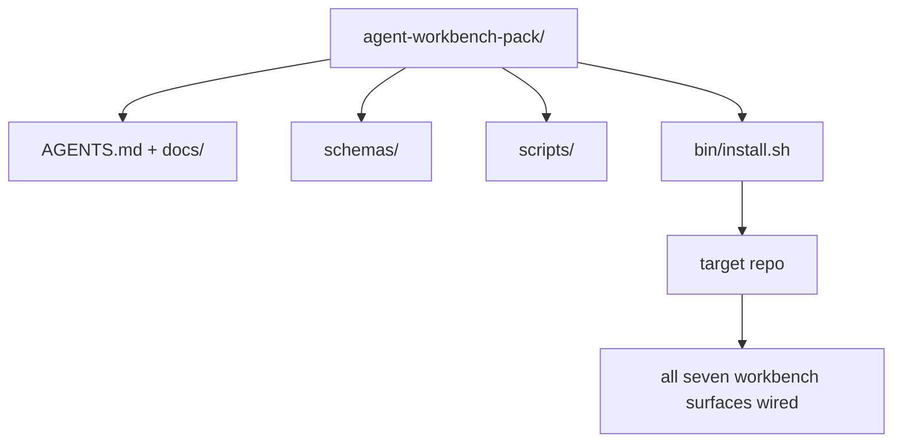

# 综合项目：交付可复用的智能体工作台包

> 这个小专题以一个可放进任意仓库的工作台包（workbench pack）收尾。十一课介绍的工作台要素浓缩在一个目录中，执行 `cp -r` 复制后，第二天早上就能让智能体（agent）可靠地工作。这个综合项目产物正是本课程的价值所在。

**Type:** Build
**Languages:** Python (stdlib)
**Prerequisites:** 阶段 14 · 31 至 14 · 41
**Time:** ~75 分钟

## 学习目标

- 将工作台的七个组成要素打包到一个可直接使用的目录中。
- 固定 schema（结构定义）、脚本和模板的版本，让新仓库获得已知可用的基线。
- 添加一个安装脚本，以幂等方式安装工作台包。
- 决定哪些内容应纳入包中、哪些应排除，并逐项说明取舍理由。

## 要解决的问题

如果工作台散落在一份 Google 文档、一段聊天记录和三个记不太清的脚本里，你每个季度都得重建一次。解决办法是带版本的工作台包：用一个仓库或目录保存各个组成要素、schema、脚本，以及一条命令即可运行的安装程序。

完成本课后，你将在磁盘上得到 `outputs/agent-workbench-pack/`，以及能够将它安装到任意目标仓库的 `bin/install.sh`。

## 核心概念



### 工作台包的目录布局

```text
outputs/agent-workbench-pack/
├── AGENTS.md
├── docs/
│   ├── agent-rules.md
│   ├── reliability-policy.md
│   ├── handoff-protocol.md
│   └── reviewer-rubric.md
├── schemas/
│   ├── agent_state.schema.json
│   ├── task_board.schema.json
│   └── scope_contract.schema.json
├── scripts/
│   ├── init_agent.py
│   ├── run_with_feedback.py
│   ├── verify_agent.py
│   └── generate_handoff.py
├── bin/
│   └── install.sh
└── README.md
```

### 哪些内容纳入，哪些排除

纳入：

- 各个组成要素的 schema。它们定义了契约。
- 上述四个脚本。它们构成运行时。
- 四份文档。它们提供规则和评审准则。

排除：

- 项目专属任务。任务应放在目标仓库的任务看板中，不应放进工作台包。
- 厂商 SDK（软件开发工具包）调用。工作台包不依赖特定框架。
- 入门说明文字。工作台包与团队现有的入门材料并列存在，不嵌入其中。

### 安装程序

一个简短的 `bin/install.sh`（或 `bin/install.py`）应执行以下步骤：

1. 未指定 `--force` 时，拒绝覆盖已有工作台包。
2. 将包复制到目标仓库。
3. 如果存在 `.github/workflows/`，则接入 CI（持续集成）。
4. 打印后续步骤：填写任务看板、设置验收命令、运行初始化脚本。

### 版本管理

包中包含一个 `VERSION` 文件。需要迁移的 schema 升级和脚本变更应提升主版本号；仅涉及文档的变更提升补丁版本号。目标仓库的 `agent_state.json` 记录初始化时使用的工作台包版本。

```figure
wb-pack-install
```

## 动手实现

`code/main.py` 在本课目录中的 `outputs/agent-workbench-pack/` 下组装工作台包，以这个小专题前面课程中的 schema、脚本和你已编写的文档为基础。

运行：

```text
python3 code/main.py
```

脚本复制并固定各组成要素，写入 README，打印目录树，然后以退出码零结束。重复运行是幂等的。

## 实际生产中的模式

一个包只有经得起 fork、更新和不友好的上游变化才有价值。下面四种模式帮助你做到这一点。

**`VERSION` 是契约，不是营销标签。** 主版本号提升要求迁移状态；次版本号提升要求重新运行检查器；补丁版本号提升仅涉及文档。安装程序每次安装时都会在目标仓库中写入 `.workbench-version`；`lint_pack.py` 会在目标仓库锁定的版本与包的 `VERSION` 不一致时拒绝交付。`npm`、`Cargo` 和 `pyproject.toml` 正是靠这种方式应对 10 年间的持续变化；智能体并不会改变这些规则。

**用单一来源跨工具分发。** Nx 提供一条 `nx ai-setup` 命令，从同一份配置生成 `AGENTS.md`、`CLAUDE.md`、`.cursor/rules/`、`.github/copilot-instructions.md` 和一个 MCP 服务器。工作台包也应如此；安装程序生成符号链接（`ln -s AGENTS.md CLAUDE.md`），将同一份权威内容分发给每个编程智能体。为了支持不同工具而分别 fork 工作台包，是一种容易出问题的做法。

**存在不可忽略的状态时拒绝执行的 `uninstall.sh`。** 卸载工作台包不得删除用户的 `agent_state.json`、`task_board.json` 或 `outputs/`。卸载程序移除 schema、脚本、文档和 `AGENTS.md`（可用 `--keep-agents-md` 选择保留该文件）；只要状态文件存在任何未提交的修改，就拒绝继续。状态属于用户，不属于工作台包。

**将技能作为可发布单元，按 SkillKit 的方式分发。** 工作台包以 SkillKit 技能的形式交付：`skillkit install agent-workbench-pack` 从同一来源为 32 个 AI 智能体安装它。包的仓库是权威来源，SkillKit 是分发渠道。这样可以摆脱厂商锁定，而七个组成要素保持不变。

## 实际使用

工作台包有三种交付方式：

- **作为可直接放进仓库的目录。** `cp -r outputs/agent-workbench-pack /path/to/repo`。
- **作为公开的模板仓库。** 先 fork 再定制，用 `VERSION` 控制漂移。
- **作为 SkillKit 技能。** 接入你的智能体产品，一条命令即可安装。

工作台包好比食谱，每次安装就是按食谱做出的一份成品。

## 交付成果

`outputs/skill-workbench-pack.md` 生成针对项目调整的工作台包：根据团队的历史经验完善规则，让用于限定范围的 glob（通配模式）适配仓库结构，并在评审维度中补充一项领域专属条目。

## 练习

1. 决定应将哪一份可选文档作为第五份文档纳入标准工作台包，并说明取舍理由。
2. 用 Python 重写安装程序，添加 `--dry-run` 标志，并与 bash 版本比较使用体验。
3. 添加 `bin/uninstall.sh`，安全移除工作台包；如果状态文件存在不可忽略的历史记录，则拒绝执行。什么情况算“不可忽略”？
4. 添加 `lint_pack.py`，在工作台包偏离 `VERSION` 时检查失败，并将它接入包自身仓库的 CI。
5. 编写从手工搭建的工作台迁移到本工作台包的操作手册。怎样安排步骤才能尽量减少停机时间？

## 关键术语

| 术语 | 常见说法 | 实际含义 |
|------|----------------|------------------------|
| 工作台包 | “入门套件” | 包含全部七个组成要素的版本化目录 |
| 安装程序 | “设置脚本” | 以幂等方式安装工作台包的 `bin/install.sh` |
| 工作台包版本 | “VERSION” | schema/脚本变更提升主版本号，仅文档变更提升补丁版本号 |
| 可直接使用的包 | “cp -r 后就能用” | 第一天使用时无须针对每个仓库定制 |
| 可 fork 的模板 | “GitHub 模板” | 可通过 GitHub 的“Use this template”功能克隆的公开仓库 |

## 延伸阅读

- 阶段 14 · 31 至 14 · 41：本工作台包包含的全部组成要素
- [SkillKit](https://github.com/rohitg00/skillkit)：为 32 个 AI 智能体安装此技能
- [Nx 博客：教你的 AI 智能体在 Monorepo 中工作](https://nx.dev/blog/nx-ai-agent-skills)：覆盖六种工具的单一来源生成器
- [agents.md：开放规范](https://agents.md/)：工作台包中的路由器必须实现的规范
- [HKUDS/OpenHarness](https://github.com/HKUDS/OpenHarness)：与工作台包同类的参考实现
- [Augment Code：好的 AGENTS.md 相当于升级模型](https://www.augmentcode.com/blog/how-to-write-good-agents-dot-md-files)：工作台包文档的质量标准
- [Anthropic：面向长时间运行智能体的有效运行框架](https://www.anthropic.com/engineering/effective-harnesses-for-long-running-agents)
- [Anthropic：面向长时间运行应用开发的运行框架设计](https://www.anthropic.com/engineering/harness-design-long-running-apps)
- 阶段 14 · 30：使用工作台包验证门禁的评测驱动智能体开发
- 阶段 14 · 41：工作台包要改善的前后对比基准
