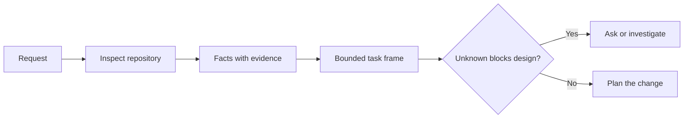

# 在智能体动手写代码前，先界定任务

> 编程智能体（coding agent）能快速实现明确的任务，也能快速实现含糊的任务。速度相同，代价却不同。

**Type:** Learn + Build
**Languages:** Python (stdlib)
**Prerequisites:** 阶段 14 的第 31 和 36 课
**Time:** ~60 分钟

## 学习目标

- 在修改代码前，把需求转化为边界清晰的任务框架（task frame）。
- 区分仓库事实（repository facts）、假设（assumption）和尚待解答的问题。
- 明确允许修改的路径（allowed paths）、禁止修改的路径（forbidden paths）以及验收证据（acceptance evidence）。
- 判断何时已完成足够的前期摸查（reconnaissance），可以开始工作。

## 代价高昂的失败

“加上防止邮箱地址重复的机制”听起来很具体，其实不然。唯一性应该由 API（应用程序编程接口）、领域服务（domain service）还是数据库来保证？比较时是否区分大小写？系统已经对外使用哪种错误响应格式？允许进行数据库迁移吗？用哪个测试来证明这一行为？

能力强的智能体会作出看似合理的选择，填补这些空白。这恰恰危险：实现可能整洁、经过测试，却依然与系统不兼容。

因此，编程智能体工作的第一步不是修改代码，而是形成一份有仓库证据支撑的任务框架。

## 任务框架

一份实用的框架包含六个字段：

| 字段 | 要回答的问题 |
|---|---|
| 目标 | 哪种可观察的行为必须改变？ |
| 仓库事实 | 你在代码、测试、配置或历史记录中核实了什么？ |
| 允许修改的路径 | 可以在哪些位置进行改动？ |
| 禁止修改的路径 | 哪些位置必须保持不变？ |
| 验收证据 | 哪些命令或观察结果能够证明目标已达成？ |
| 未知问题（unknowns） | 哪些决策仍需证据或人工判断？ |

事实需要凭据（receipt）。“API 用 409 表示重复”还不能算事实，除非你能指出相应的现有测试或处理程序。给出文件路径和行号就足够了；如果要确认的是行为，命令运行结果会更有说服力。



## 前期摸查就是寻找约束

不要通读整个仓库。要寻找会约束本次改动的相关部分：

1. 当前行为及其调用方。
2. 最接近的现有测试。
3. 对外契约（public contract）或序列化格式。
4. 适用于相关路径的项目指令。
5. 构建与验证命令。
6. 已经完成的类似改动，从中了解本项目的惯例。

当每项拟作出的决策都有证据支撑、得到明确授权，或已列为未知问题时，就停止摸查。此后继续阅读，往往只是在回避动手。

## 未知问题不等于失败

未知问题是受控的信息空白；假设则是未经控制就为这处空白填上的答案。

对每个未知问题分类：

- **可查明（Discoverable）：** 仓库或运行中的系统能够回答。
- **可自行决定（Decidable）：** 任务契约已授权智能体作出选择。
- **需人工决定（Human）：** 该选择会改变产品行为、成本、风险或对外兼容性（public compatibility）。
- **暂缓处理（Deferred）：** 该选择不在本次工作范围内，应列入非目标。

对于可查明和已获授权决定的未知问题，智能体应继续推进。对于需要人工决定的问题，则应在选择被写进代码之前暂停。

## 先明确验收，再动手实现

先写明所需的验证证据（proof），再编写补丁。验证证据可以是：

- 针对性运行单元测试或集成测试的命令；
- 一段浏览器中的用户旅程（browser journey），明确指定视口和预期状态；
- 实际传输的请求（wire request），以及精确的响应契约；
- 带有阈值的性能测量；
- 确认没有改动无关文件的范围检查。

“测试通过”不是验证计划。要指出以哪个测试为准，以及它能支持什么主张。

## 动手实现

本实验创建一个 `TaskFrame`，校验其边界与证据，并写入 `outputs/task-frame.md`。

在本课目录下运行：

```bash
python3 code/main.py
python3 -m unittest discover code/tests -v
```

用四种方式破坏示例：删除目标、删除一条事实的凭据、让一个路径同时出现在允许修改和禁止修改的范围内，以及删除验收命令。校验器应分别以不同的原因拒绝这些任务框架。

## 在真实仓库中使用

在让智能体修改代码之前：

1. 把目标写成行为变化，而不是文件变更。
2. 记录两三条事实，并附上确切证据。
3. 指定最小的允许修改路径集合。
4. 明确写出不应改动的范围（negative space）。
5. 写出能够证明任务完成的命令或观察结果。
6. 列出目前还没有充分依据作出的决策。

任务框架应能在一屏内呈现。如果做不到，任务中可能包含多项可以独立验证的改动。

## 练习

1. 从自己的某个仓库中选一个真实缺陷，为它界定任务，但先不要提出解决方案。
2. 找出框架中一项实际上只是假设的主张，用证据替换它。
3. 加入一个需要人工决定的未知问题，其答案会改变对外契约。
4. 将一条宽泛的允许修改路径拆分为最小的安全集合。
5. 在验收证据中加入一份范围检查凭据。

## 延伸阅读

- [Nuseibeh and Easterbrook, Requirements Engineering: A Roadmap](https://www.cs.toronto.edu/~sme/papers/2000/ICSE2000.pdf)：了解如何让实现以现实目标和不断变化的约束为依据。
- [Yang et al., SWE-agent: Agent-Computer Interfaces Enable Automated Software Engineering](https://arxiv.org/abs/2405.15793)：了解编程智能体所使用的交互接口如何影响其效能的相关证据。

## 保留成果

保留 `outputs/task-frame.md`。它将作为下一课的输入；下一课会把任务框架转化为有证据支撑的执行计划。
