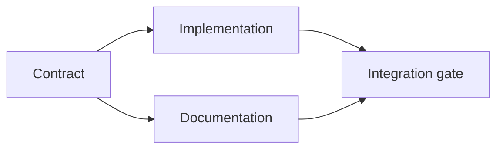

# 制定有证据支撑的执行计划

> 计划不只是排版更好看的待办清单。它是一张依赖图（dependency graph）：每项变更都有理由，每个终止节点都有验证证据（proof）。

**Type:** Learn + Build
**Languages:** Python (stdlib)
**Prerequisites:** 第 14 阶段第 43 课
**Time:** ~65 分钟

## 学习目标

- 将任务框架（task frame）转化为带有证据和验证依据的工作项（work item）。
- 用依赖关系表达执行顺序，而不是仅靠文字排列步骤。
- 在编辑文件前发现缺失的事实、未知的依赖项和依赖环。
- 区分可以同时开展的步骤与必须等待的步骤。

## 智能体的计划为什么会失败

薄弱的计划只是用将来时把请求复述一遍：

1. 更新 API（应用程序编程接口）。
2. 添加测试。
3. 更新文档。

这份清单没有说明发现了什么、为什么应该修改这些文件、先变更哪项契约（contract），也没有说明哪些工作可以并发开展。智能体（agent）即使完成了每一步，仍可能造成返工。

扎实的计划会为每个工作项明确五项承诺：

| 承诺事项 | 用途 |
|---|---|
| 标识符 | 为依赖关系和交接（handoff）提供稳定的引用 |
| 变更 | 最小的行为变更或契约变更 |
| 证据 | 说明为何需要这项变更的仓库事实 |
| 依赖 | 必须先完成的工作 |
| 验证证据 | 用于判定该工作项已完成的具体检查 |

## 先规划契约，再规划各处实现

当多个组成要素（surface）依赖同一行为时，应先定义该行为。这样，测试、实现、文档和集成就能共用一份契约，而不必各自设计一个版本，最终变成四套。



这张图展示了哪些工作可以安全地并发开展。契约确定后，实现和文档可以同时推进；集成则要等两者都完成。

## 证据会改变计划

仓库证据不是装饰。它应当能改变工作安排：

- 发现已有的辅助工具后，便不再需要原计划中的新抽象。
- 兼容性测试表明，必须增加一个迁移步骤。
- 部署约束要求把 schema（结构定义）变更移到另一项任务中。
- 对外公开的响应类型改变了实现与文档的先后顺序。

如果一条证据无法改变计划，它很可能就不是支持该决策的证据。

## 为中断做好设计

编码智能体的会话可能意外结束。可恢复执行的计划应将工作项划分得足够小，使后续会话能够判断：

- 哪个工作项已经完成；
- 执行了哪项验证；
- 哪些产物（artifact）发生了变化；
- 哪些依赖项已经解除阻塞；
- 下一项可以安全开展的工作是什么。

不要只用聊天中的勾选框记录状态。把计划和工作内容存放在一起。

## 计划校验

出现以下情况时，应在执行前拒绝该计划：

- 标识符重复；
- 工作项没有证据；
- 工作项没有验证依据；
- 依赖关系指向未知的工作项；
- 图中存在环；
- 第一个不可逆操作发生在相关不确定性解决之前。

前五项可以机械检查。最后一项需要判断，应明确指出。

## 动手实现

`code/main.py` 对工作项建模，校验其证据凭据，通过拓扑排序（topological sort）计算执行批次（execution wave），并写入 `outputs/evidence-plan.json`。

运行：

```bash
python3 code/main.py
python3 -m unittest discover code/tests -v
```

示例会生成三个执行批次。先定义契约，再同时开展实现与文档工作，最后运行集成门禁（integration gate）。

## 与编码智能体配合使用

在智能体修改文件之前，先让它生成计划。审查计划时，重点检查三点：

1. 每项关于路径和行为的主张，都有仓库中的证据凭据支撑。
2. 每个工作项都有一种明确的完成验证方式。
3. 依赖图会将代价高昂或不可逆的工作推迟到其所依赖的不确定性解决之后。

批准的是计划，而不是一句“我会小心”的含糊承诺。

## 练习

1. 添加一个必须获得明确人工批准的迁移工作项。
2. 创建一个依赖环，并解释它背后隐藏的产品分歧。
3. 拆分一个包含两条验证命令的工作项。
4. 添加一个能在第二批执行、且不涉及现有任一分支的工作项。
5. 将计划渲染为 Markdown，同时继续以 JSON 为唯一事实来源。

## 延伸阅读

- [Nuseibeh and Easterbrook, Requirements Engineering: A Roadmap](https://www.cs.toronto.edu/~sme/papers/2000/ICSE2000.pdf)，了解目标、规格说明、共识与演化之间的迭代关系。
- [Barry Boehm, A Spiral Model of Software Development and Enhancement](https://dl.acm.org/doi/10.1145/12944.12948)，了解如何围绕风险消解安排开发顺序，而不是遵循固定的线性步骤。

## 本课保留的成果

保留 `outputs/evidence-plan.json`。它将成为下一课的委派契约。
