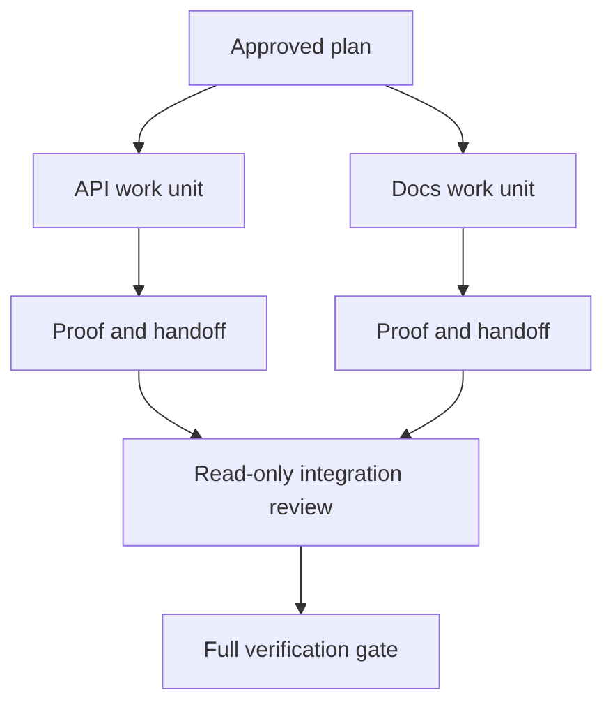

# 通过隔离与合并契约委托智能体工作

> 只有工作彼此独立，并行的智能体（agent）才能节省实际耗时。否则，它们只会把一个清晰的任务变成一个失败频率更高的协调问题。

**Type:** Learn + Build
**Languages:** Python (stdlib)
**Prerequisites:** 阶段 14 的第 39 和 44 课
**Time:** 约 70 分钟

## 学习目标

- 根据工作是否真正独立，判断委托是否合理。
- 为每个工作智能体（worker）约定独占的文件写入权，并明确所需的验证证据（proof）。
- 根据依赖关系计算执行波次（execution waves）。
- 设计合并契约（merge contract），安全地整合智能体的工作。

## 判断工作能否并行

不要仅仅因为有更多智能体可用，就把工作委托出去。至少满足以下一个条件时，才应委托：

- 两项调查能各自独立地回答不同的未知问题；
- 两项实现各自负责互不重叠的文件和契约；
- 审校者能检查已完成的产物，而不修改它；
- 耗时较长的外部检查可以在本地工作继续推进时运行。

如果智能体需要相同的文件、同一个尚未作出的决策，或同一个可变环境，就应保持串行工作。

## 一个工作单元就是一份契约

每个委托出去的工作单元都需要明确以下内容：

| 字段 | 含义 |
|---|---|
| 目标 | 一个可观察的结果 |
| 负责方 | 一个承担责任的工作智能体 |
| 路径 | 独占的写入权归属 |
| 依赖关系 | 开始前必须完成的工作单元 |
| 验证证据 | 交回给集成者的确切证据 |
| 交接（handoff） | 改动的文件、作出的决策、剩余风险 |

“处理后端”不是一个工作单元。“在 `app/accounts.py` 中实现重复项检查，并用针对账户功能的专项测试来验证它”才是。

## 隔离分为三个层次

1. **文件系统隔离：** 使用独立的工作树（worktree）或沙箱，避免意外编辑同一份文件。
2. **写入权归属隔离：** 用契约防止两个工作智能体有意修改同一路径。
3. **状态隔离：** 使用独立的日志和输出，防止一个工作智能体覆盖另一个的证据。

文件系统隔离并不能解决写入权归属问题。两个干净的工作树仍可能产出相互冲突的设计。合并契约必须在工作开始前明确共享接口。



## 集成者不应重做已有工作

集成者应当：

1. 确认每份交接内容都符合相应工作单元的既定范围；
2. 阅读验证输出，而不只是工作智能体的总结；
3. 按依赖顺序整合变更；
4. 运行完整的跨工作单元验证关卡；
5. 拒绝未明示的范围扩张；
6. 把冲突作为新的决策事项记录下来，而不是悄悄修改。

如果集成时需要重写某个工作智能体的大部分成果，就说明最初的任务拆分有误。

## 人与智能体的角色

委托并不能取代人的判断。凡是会改变对外行为、风险、权限（authority）或不可逆成本的选择，仍由人负责。智能体可以负责范围有界的调查、实现、验证和审校。

这就是经过校准的自主性（calibrated autonomy）：当证据充分且回滚保障可靠时，系统赋予自主空间；当后果重大时，则要求设置检查点。

## 动手实现

本实验检查路径重叠、验证依赖关系、计算安全的执行波次，并写入 `outputs/delegation-plan.json`。

运行：

```bash
python3 code/main.py
python3 -m unittest discover code/tests -v
```

把文档工作单元负责的路径改为 `app/`。计划应当阻止执行，因为这个父路径与 API（应用程序编程接口）工作单元的路径重叠。

## 练习

1. 将一项真实变更拆分为两个独立的工作单元，并安排一个集成者。
2. 找出一种只是看起来独立的并行拆分方案。指出其中共享的决策。
3. 添加一个只读的研究工作智能体，让它输出一张事实表。
4. 添加一道合并关卡，依据所有工作单元的契约检查最终改动的文件集合。
5. 为依赖关系失效的工作智能体定义取消规则。

## 延伸阅读

- [Reid Smith, The Contract Net Protocol](https://doi.org/10.1109/TC.1980.1675516)：关于分布式任务分配与结果汇报的早期形式化研究。
- [Eric Horvitz, Principles of Mixed-Initiative User Interfaces](https://dl.acm.org/doi/10.1145/302979.303030)：探讨自动化应何时采取行动、何时将控制权交还给人。

## 保留下来的成果

保留 `outputs/delegation-plan.json`。它记录了为何这种拆分是安全的、每个路径由谁负责，以及集成时必须收到哪些验证证据。
