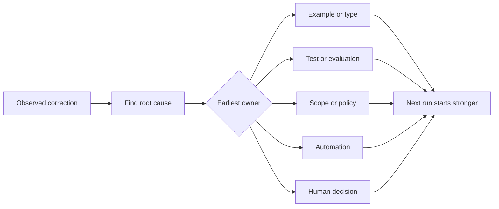

# 将对智能体的每一次纠正转化为系统改进

> 只留在聊天里的纠正，只能解决一次运行中的问题。将纠正转化为测试、边界、示例或工具，就能改进此后的每一次运行。

**Type:** Learn + Build
**Languages:** Python (stdlib)
**Prerequisites:** 第 14 阶段第 37 至 41 课
**Time:** ~65 分钟

## 学习目标

- 将对智能体（agent）的纠正转化为持久控制措施（durable controls）。
- 将每项控制措施放在最早能够防止问题复发的层。
- 用稳定的指纹（fingerprints）去除重复的经验教训。
- 停用不再防范实际风险的控制措施。

## 纠正就是证据

当你告诉智能体“不要修改那个文件”时，你就发现工作范围边界（scope boundary）尚未落实为可执行的约束。当你说“这个输出格式不对”时，你就发现缺少了示例或测试。当环境配置再次失败时，你就发现有关环境的知识应该纳入自动化。

把纠正看作对工作系统的一次观察，而不是编写提示词（prompt）的失败。

## 将纠正落实到最早能奏效的层

按以下顺序选择：

| 反复发生的故障 | 持久措施的落点 |
|---|---|
| 结果错误或质量退步（regression） | 测试或评估 |
| 超出工作范围或不安全的操作 | 范围策略或权限策略 |
| 反复出现的环境配置或命令错误 | 自动化或工具 |
| 反复出现的输出格式错误 | 标准示例加验证器 |
| 不明确的本地约定 | 配有场景检查的指令 |
| 产品决策分歧 | 人工决策记录 |

越早起效的控制措施，成本越低。能阻止无效状态出现的类型，比事后才发现问题的审查意见更有力。针对性测试，比要求智能体记住某事的一段文字更有力。



## 反馈棘轮记录

记录以下内容：

- 问题表现（symptom）；
- 根本原因（root cause）；
- 后果；
- 复发次数（recurrence count）；
- 选定的控制措施；
- 控制措施的验证方式；
- 负责方（owner）；
- 复查或停用日期。

不要把每个一次性的偏好都固化为控制措施。当问题的复发情况或后果值得引入长期复杂性时，再将纠正固化为控制措施。

## 区分原因与问题表现

“智能体修改了 README”是一种问题表现。可能的原因包括：

- 任务把仓库根目录纳入了允许操作的范围；
- 文档被默认视为可以安全修改；
- 计划把实现工作和文档工作捆绑在了一起；
- 两个执行者的责任范围有重叠。

不同原因需要由不同的控制措施来处理。如果规则只是重复描述问题表现，那么下一次情况稍有变化，它就会失效。

## 控制措施也会过时

旧的控制措施可能相互冲突、使上下文臃肿，或保留早已不存在的系统的做法。每条固化下来的规则都需要停用检查（retirement check）。出现以下情况时，应删除或改写规则：

- 底层架构已经改变；
- 已有更强的可执行控制措施取代它；
- 在有实际参考价值的观察窗口内，故障未再发生；
- 控制措施造成的阻力（friction）已大于它所防范的风险。

目标不是拥有最长的指令文件，而是构建一个能保留来之不易的判断经验、且尽可能精简的系统。

## 动手实现

本实验将纠正分类，把它们转化为控制措施，通过指纹识别重复项，并写入 `outputs/feedback-ratchet.json`。

运行：

```bash
python3 code/main.py
python3 -m unittest discover code/tests -v
```

添加两条措辞不同、原因相同的纠正。改进规范化处理（normalization），直到它们能合并为一条控制措施，同时不把无关故障合并到一起。

## 练习

1. 从近期的一次编程会话中选取五次纠正，根据实际责任归属进行分类。
2. 将一条文字规则替换为可执行测试。
3. 加入后果权重，让首次发生的严重问题也能立即被转化为控制措施。
4. 在实验输出中加入负责方和停用日期。
5. 审查一条现有的智能体指令，只有证明存在更强的控制措施后，才能删除它。

## 延伸阅读

- [Basili, Caldiera, and Rombach, The Goal Question Metric Approach](https://www.cs.toronto.edu/~sme/CSC444F/handouts/GQM-paper.pdf)：了解如何将目标转化为问题和可实际执行的测量。
- [Shinn et al., Reflexion](https://arxiv.org/abs/2303.11366)：了解如何利用反馈轨迹改进后续决策，而无需改变模型权重。
- [Madaan et al., Self-Refine](https://arxiv.org/abs/2303.17651)：了解如何在任务循环中反复反馈和修订。

## 保留下来的成果

保留 `outputs/feedback-ratchet.json`。它是智能体辅助工程（Agent-Assisted Engineering）学习路径最终留下的持久成果，也是今后改进工作台（workbench）的输入。
