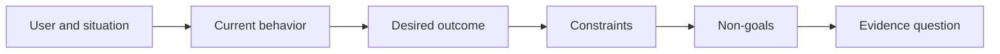

# 先明确预期结果，再选择产出

> 实现得越快，选错问题的代价就越大。先明确预期结果，让速度用在正确的方向上。

**Type:** Learn + Build
**Languages:** Python (stdlib)
**Prerequisites:** 无
**Time:** ~60 分钟

## 学习目标

- 写出不预设解决方案的结果框架。
- 明确用户、情境、当前行为和期望的改变。
- 明确约束与非目标。
- 在预设方案固化为工作范围之前，识别它已混入结果描述。

## 产出不等于结果

“构建一个事件处理助手”说的是产出（output）。它并未说明谁需要它、哪些方面会改善，或哪些方面必须保持安全。

结果框架（outcome frame）会这样描述：

> 当生产告警到来时，值班工程师能在两分钟内识别故障服务，并确定一个安全的下一步行动，同时确保诊断过程保持只读且可审计。

软件、操作手册（runbook）、一次数据修复，或者一次更小的界面改动，都可能满足这句话描述的要求。它让团队始终关注结果，而不是某个人最先设想的产物。

## 六要素框架

| 要素 | 问题 |
|---|---|
| 用户 | 谁直接面临这个问题？ |
| 情境 | 问题在何时、何地出现？ |
| 当前行为 | 目前会发生什么，包括人们采取的变通办法？ |
| 期望结果 | 哪种可观察的状态应当改善？ |
| 约束 | 哪些安全、政策、成本或兼容性限制是固定的？ |
| 非目标 | 哪些有吸引力的相邻工作不在范围内？ |



## 找出混入的预设方案

如果结果描述中包含尚未得到证据支持的产品形态、界面、模型选择、框架或架构，就发生了预设方案混入（solution leakage）。

- “用户每周收到一份 AI 摘要”预设了摘要这一形式及其发送频率。
- “用户在批准之前了解账户变更”描述的是结果。
- “部署一个向量数据库”预设了基础设施。
- “审核时能够获取相关的政策证据”描述的是一种能力。

当兼容性确实限定了技术选择时，约束可以写明所用技术。要记录这一选择为何是固定的。

## 约束保护预期结果

约束不是实现细节，而是现实目标的一部分：

- 诊断期间不向生产环境写入；
- 在事件处置的时间预算内作出响应；
- 现有审计事件仍然具有权威性；
- 不新增运行时依赖；
- 无障碍功能的行为保持完整。

如果实现是靠违反约束来达成结果，那就没有真正达成结果。

## 非目标划定边界

非目标能防止一项范围有限的有用工作逐渐变成一个平台。好的非目标要足够具体，能够据此拒绝不在范围内的工作：

- 不做自动修复；
- 不新建告警路由系统；
- 不取代事件指挥员；
- 本次工作不包含历史分析。

## 动手实现

实践任务会校验一个 `OutcomeFrame`，并写入 `outputs/outcome-frame.json`。

```bash
python3 code/main.py
python3 -m unittest discover code/tests -v
```

将期望结果改成“use the incident assistant”。校验器应当提示：拟议产出已经混入了结果描述。

## 练习

1. 将待办列表中的一项功能请求改写为结果框架。
2. 添加一项会改变可选解决方案的约束。
3. 添加两个非目标，让第一阶段的工作保持小范围。
4. 找出最早能够证伪该期望结果的观察证据。
5. 写出三种能够满足同一期望结果的不同产出。

## 延伸阅读

- [Nuseibeh and Easterbrook, Requirements Engineering: A Roadmap](https://www.cs.toronto.edu/~sme/papers/2000/ICSE2000.pdf)，介绍如何将现实世界的目标作为软件工作的依据。
- [Dardenne, van Lamsweerde, and Fickas, Goal-Directed Requirements Acquisition](https://doi.org/10.1016/0167-6423(93)90021-G)，介绍如何将高层目标细化为约束和可操作的需求。

## 需要保留的内容

保留 `outputs/outcome-frame.json`。下一课会将它与人们实际执行的工作流进行对照检验。
