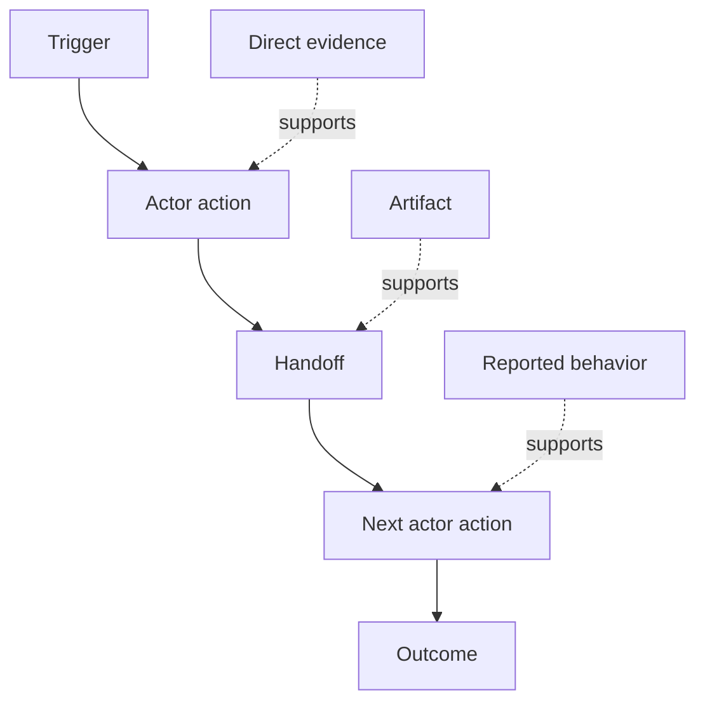

# 发现人们实际执行的工作流

> 需求并不是现成地摆在会议中，等着你去收集。它们分散在行动、变通做法（workaround）、记录与分歧之中。

**Type:** Learn + Build
**Languages:** Python (stdlib)
**Prerequisites:** 第 14 阶段第 47 课
**Time:** ~70 分钟

## 学习目标

- 将当前工作流（workflow）建模为有证据支撑的有序行动。
- 区分直接观察（direct observation）与人们陈述的行为（reported behavior）或推断出的行为。
- 找出阻力（friction）、交接（handoff）、权限归属（authority）与隐性状态（hidden state）。
- 让不确定的主张保持可见，而不是将其变成需求。

## 从当前系统入手

不要一开始就问人们想要什么功能。先重建当前实际发生的过程。

针对每个步骤，记录以下内容：

| 字段 | 示例 |
|---|---|
| 执行者（actor） | 值班工程师 |
| 触发条件（trigger） | 收到生产环境告警 |
| 行动 | 打开告警，然后搜索仪表板 |
| 输入 | 告警载荷与部署记录（deployment record） |
| 产出 | 候选服务及其负责人 |
| 阻力 | 在三种工具之间进行上下文切换（context switching） |
| 权限归属 | 事件指挥员批准写入操作 |
| 证据 | 屏幕录制、事件日志、操作手册（runbook） |

工作流的范围不止屏幕上看到的内容。它还包括等待、复制粘贴、非正式沟通渠道（side channel）、审批、错误恢复，以及人们已经习以为常、不再留意的步骤。

## 证据有强弱之分

采用一个简单的证据层级（evidence ladder）：

1. **直接行为证据（direct behavior）：** 观察、行为轨迹（trace）、录制记录或系统事件。
2. **产物（artifact）：** 工单、操作手册、日志、表单或已经完成的产出。
3. **陈述的行为：** 某人描述自己如何行动。
4. **推断（inference）：** 团队对可能发生的事情作出判断。

这四类证据都可能有用。只有前两类能直接证明当前行为。为其余类别做好标注，避免置信度（confidence）在不知不觉中被拔高。



## 重点查找四个方面

- **阻力：** 重复劳动、延迟、重复录入或恢复。
- **隐性状态：** 存在于记忆、聊天或个人笔记中的事实。
- **权限归属：** 获准作出有重要影响的变更的人或系统。
- **例外情况（exception）：** 正常工作流不再按常态运行的情况。

AI 功能经常在交接和例外情况下失效，因为设计时只考虑了正常路径（happy path）。

## 不要用平均值抹去分歧

两个用户采用不同的工作流，可能各有合理的原因。先保留这些工作流变体（workflow variant），直到你弄清楚它们是否反映了以下差异：

- 角色不同；
- 风险等级不同；
- 旧流程与当前流程的区别；
- 专业水平不同；
- 真正存在的政策分歧。

取平均后得到的工作流，可能不符合任何人的实际做法。

## 动手实现

本实验在每个工作流步骤上保存证据，校验顺序与置信度，计算直接证据占比（direct-evidence ratio），并写入 `outputs/workflow-evidence.json`。

```bash
python3 code/main.py
python3 -m unittest discover code/tests -v
```

新增一条部署记录缺失的例外路径。保持主流程顺序不变，并记录分支从何处开始。

## 练习

1. 不采访任何人，仅依据一份日志重建一个工作流。
2. 采访一位用户，标出每一条仍缺少直接证据的主张。
3. 添加一个权限边界和一个故障恢复步骤。
4. 为两个工作流变体分别建模，不要将它们合并。
5. 找出一项拟议功能：它移除了一个可见步骤，却没有触及隐性工作。

## 延伸阅读

- [Nuseibeh and Easterbrook, Requirements Engineering: A Roadmap](https://www.cs.toronto.edu/~sme/papers/2000/ICSE2000.pdf)，重点关注它如何将需求获取（elicitation）视为解释、建模与验证，而非简单的收集。
- [Gotel and Finkelstein, An Analysis of the Requirements Traceability Problem](https://doi.org/10.1109/ICRE.1994.292398)，了解维系需求与其来源之间关系的难点。

## 保留下来的成果

保留 `outputs/workflow-evidence.json`。下一课将用它把观察到的阻力和不确定性转化为假设图（assumption map）。
