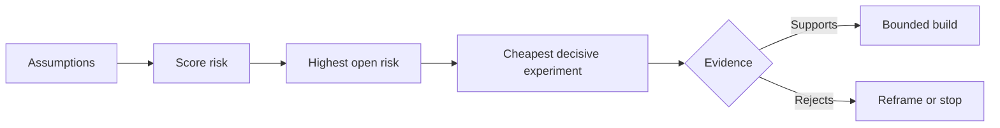

# 绘制假设图，优先厘清风险最高的一项

> 路线图（roadmap）把不确定性（uncertainty）藏在一个个功能里。假设图（assumption map）则揭示：哪些条件必须成立，这些功能才值得存在。

**Type:** Learn + Build
**Languages:** Python (stdlib)
**Prerequisites:** 第 14 阶段第 48 课
**Time:** ~65 分钟

## 学习目标

- 将拟开展的工作转化为明确的假设。
- 分别为影响程度（impact）、不确定性和不可逆性（irreversibility）评分。
- 根据风险，而非热情，选择下一个实验。
- 用证据和决策取代已经过检验的假设。

## 每次构建都押注于一些假设

一个事件处理工具可能依赖以下条件全部成立：

- 告警上下文包含足够的信息，能够识别出服务；
- 工程师信任并非由自己推导出的建议；
- 期望的响应时间对实际运维有意义；
- 无须使用不安全的权限（authority），就能访问所需数据；
- 这一工作流（workflow）发生得足够频繁，值得为之投入维护成本。

这些不是实现任务，而是让构建的系统有价值、可用、可行且安全的条件。

## 假设的类别

| 类别 | 问题 |
|---|---|
| 价值（value） | 预期结果是否足够重要？ |
| 可用性（usability） | 用户能否理解它并据此采取行动？ |
| 可行性（feasibility） | 系统能否利用现有数据，在既定约束下得出这一结果？ |
| 可持续性（viability） | 组织能否在成本、责任承担和运行方面长期维持下去？ |
| 安全性（safety） | 即使失败，是否也不会造成不可接受的后果？ |

将假设写成可证伪的陈述（falsifiable statements）。“这个功能很有用”无法检验。“十名值班工程师中，有八名能借助只读结果更快地找到正确的服务”则可以检验。

## 风险不只是一个数字

本实验使用三个维度，每个维度的评分从一到五：

- **影响程度：** 假设不成立时造成的损害。
- **不确定性：** 现有证据的薄弱程度。
- **不可逆性：** 作出投入或承诺后，才弄清事实所付出的代价。

示例中的评分先将影响程度与不确定性相乘，再加上不可逆性。这个公式并不通用。它的目的是迫使团队说清楚：为什么应当先厘清某个未知问题，再处理另一个。



## 要设计实验，而不是走确认的过场

有用的检验需要具备：

- 一个可能不成立的主张；
- 一个研究总体或贴近现实的样本；
- 一个可观察的结果；
- 在结果出现之前就确定的阈值；
- 针对通过、未通过以及证据尚不足以明确判断的情况，分别作出的下一步决策。

避免只用来证明团队能把这个想法做出来的检验。

## 可逆性会改变先后顺序

后果重大且不可逆的选择，需要更早获得证据。可以先做只读回放，再进行生产环境集成；先使用临时适配器，再迁移数据；先提供经人工批准的建议，再采取自动操作。

如何构建，应当取决于不确定性体现在哪里、以何种形式存在。

## 动手实现

本实验对假设进行排序，区分经过检验和尚未验证的主张，选出尚未验证的风险中最高的一项，并写入 `outputs/assumption-map.json`。

```bash
python3 code/main.py
python3 -m unittest discover code/tests -v
```

修改风险最高的假设所对应的证据，观察下一个实验如何变化。

## 练习

1. 为你想开发的一个功能写出五项假设。
2. 补充一项功能列表中遗漏的安全性假设。
3. 定义一个会让你停止构建的阈值。
4. 将一个大型实验换成成本更低、足以作出决策的检验。
5. 比较风险排序与路线图中的优先级，并解释两者为何不一致。

## 延伸阅读

- [Barry Boehm, A Spiral Model of Software Development and Enhancement](https://dl.acm.org/doi/10.1145/12944.12948)，介绍以风险为驱动的开发周期，在作出更大投入或承诺之前先厘清不确定性。
- [Dardenne, van Lamsweerde, and Fickas, Goal-Directed Requirements Acquisition](https://doi.org/10.1016/0167-6423(93)90021-G)，介绍如何在细化目标的同时揭示障碍与约束。

## 保留下来的成果

保留 `outputs/assumption-map.json`。下一课会用它选出最小的工作范围，以获得足以作出决策的证据。
