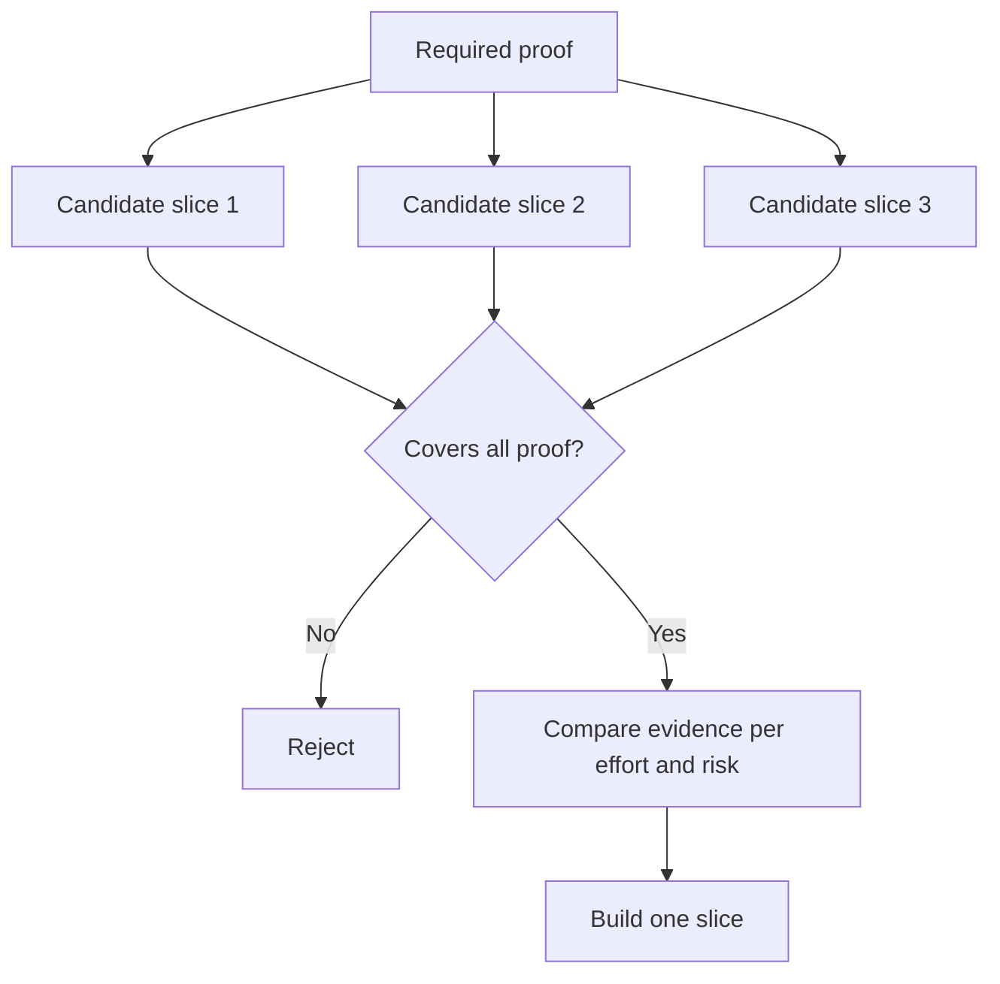

# 选择能改变决策的最小工作范围

> 只有验证了重要的事情，缩小范围才有意义。一个小规模实现若无法改变下一步决策，就仅仅是个未完成的实现。

**Type:** Learn + Build
**Languages:** Python (stdlib)
**Prerequisites:** 阶段 14 第 49 课
**Time:** ~65 分钟

## 学习目标

- 根据工作范围（slice）能够验证哪些假设，来界定它的边界。
- 权衡结果价值、不确定性的降低程度、投入和后果。
- 优先通过可逆的方式获取证据，避免过早作出生产环境投入。
- 排除那些绕开工作流风险环节的工作范围。

## 纵向贯通，才能获得端到端证据

一个有用的工作范围，应贯穿观察结果所必需的最小真实工作流（workflow）。可以限制用户、数据、持续时间和能力的范围，但不能为了缩小范围而删掉恰恰需要检验的不确定性。

例如：

- 对十起真实事件进行只读回放，可以检验服务识别能力和操作人员的信任程度。
- 使用合成数据制作的精美仪表盘，或许能检验用户能否理解所呈现的信息，却无法检验数据可行性。
- 生产环境中的自动修复系统一次检验了所有方面，但由此产生的后果不可接受。

## 先明确必须验证的事项

找出风险最高、尚未验证的假设，把它们整理成一组必须验证的事项（required proof set）。候选工作范围只有覆盖这组事项，才有资格进入比较。

随后，按以下维度比较符合条件的工作范围：

| 维度 | 取向 |
|---|---|
| 结果价值 | 越高越好 |
| 不确定性的降低程度 | 越大越好 |
| 投入 | 越少越好 |
| 后果 | 越小越好 |
| 可逆性 | 越高越好 |

本实验有意采用简单的评分方法。是否具备候选资格，比具体分数更重要。



## 常见的伪“最小”方案

- **只做用户界面（UI）的最小方案：** 将数据和实际运行中的不确定性排除在检验之外。
- **只做基础设施的最小方案：** 验证了技术上可行，却没有验证用户价值。
- **只走正常路径的最小方案：** 略去了造成大部分风险的例外情况。
- **只做演示的最小方案：** 做出了有说服力的产物，却没有可重复进行的测量。
- **先做平台的最小方案：** 还没有任何一个工作流证明有必要，就先构建了可复用的基础机制。

## 加入停止规则

在实现之前，写清楚如果这次小范围验证失败，接下来怎么做：

- 放弃这个预期结果；
- 更换目标用户或目标情境；
- 检验另一种机制；
- 收集更好的证据；
- 进一步缩小权限范围。

如果无论结果如何，下一步都是“继续构建”，那么这次小范围验证就算不上实验。

## 动手实现

本实验按照必须验证的事项筛选候选工作范围，对符合条件的工作范围评分，并写入 `outputs/slice-decision.json`。

```bash
python3 code/main.py
python3 -m unittest discover code/tests -v
```

添加一个投入更少、却只能验证其中一项必需假设的候选方案。即使它的数值评分很高，也仍然不应具备候选资格。

## 练习

1. 针对同一个预期结果，设计三个后果程度不同的工作范围。
2. 在评分之前，列明必须验证的事项集合。
3. 去掉一项能力，同时保留足以作出决策的证据。
4. 为失败的试点加入停止规则。
5. 找出一个应等这次小范围工作完成后再构建的可复用平台组件。

## 延伸阅读

- [Barry Boehm, A Spiral Model of Software Development and Enhancement](https://dl.acm.org/doi/10.1145/12944.12948)，了解如何让每轮开发与该轮必须解决的风险相匹配。
- [Lenarduzzi and Taibi, MVP Explained: A Systematic Mapping Study on the Definitions of Minimal Viable Product](https://arxiv.org/abs/1609.07592)，了解软件产品实践中“最小”与“可行”这两个概念的歧义。

## 最后留下什么

保留 `outputs/slice-decision.json`。它记录了为什么这一工作范围是能够改变决策的最小范围。
