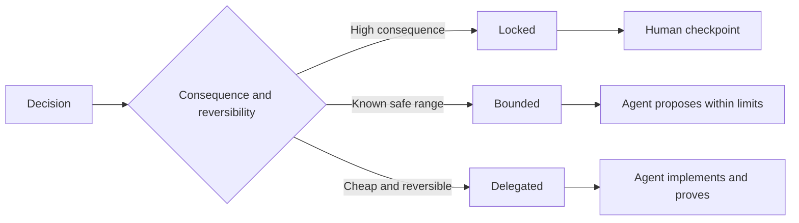

# 编写保留判断空间的规格说明

> 实用的规格说明（specification）会明确不变条件（invariant）和所需证据，同时为可逆的实现选择留出空间。它划定的是决策边界，而不是规定每一步的剧本。

**Type:** Learn + Build
**Languages:** Python (stdlib)
**Prerequisites:** 阶段 14 第 50 课
**Time:** ~75 分钟

## 学习目标

- 区分结果、不变条件、示例、非目标和验证证据（proof）。
- 将决策标为锁定（locked）、有界（bounded）或委托（delegated）三类。
- 当选择成本低且可逆时，为智能体（agent）保留自主判断的空间。
- 当后果或对外行为发生变化时，要求设置人工检查点。

## 两种不好的极端

任务描述不足，就等于让智能体猜测系统应该是什么样；任务规定得过细，就等于让它照搬一个可能已经有问题的设计。

两者之间实用的做法，是建立一份可执行契约（executable contract）：

| 组成要素 | 用途 |
|---|---|
| 结果 | 可观察到的结果 |
| 不变条件 | 必须始终成立的条件 |
| 示例 | 揭示意图的具体案例 |
| 非目标 | 有意排除的相邻行为 |
| 决策策略 | 哪些选择属于锁定、有界或委托决策 |
| 验证证据 | 完成前必须提供的证据 |

## 三种决策模式

- **锁定（Locked）：** 智能体不得自行选择。适用于对外兼容性、权限（authority）、安全性、不可挽回的成本或产品承诺。
- **有界（Bounded）：** 智能体可以在明确的限制内选择。适用于搜索预算、重试次数、允许使用的依赖项或已知的一类接口。
- **委托（Delegated）：** 由智能体负责作出选择，并且必须解释理由。适用于局部结构、命名、可逆的重构和实现细节。



## 通过示例规定行为

示例比形容词更能简洁地传达意图。“有帮助”“稳健”“可用于生产环境”都无法直接执行。少量涵盖正常情况、边界情况、失败情况和禁止行为的示例，能让构建者与验证者都有具体依据。

示例不能替代不变条件。一个通过的案例无法证明一条普遍适用的安全规则。

## 验证证据必须与主张相匹配

- 单元测试验证局部函数的契约。
- 传输测试（wire test）验证序列化和传输行为。
- 浏览器中的用户旅程验证一条界面操作路径。
- 一组回放案例验证系统在代表性案例中的行为。
- 审计日志证明权限边界得到了遵守。

不要拿较低层次的证据来证明较高层次的主张。

## 有意保留尚未确定的部分

规格说明可以写成：“实现可以选择任何能在时间预算内返回结果的只读数据源。”这并不含糊，而是有意将决策委托出去，同时明确边界和验证证据。

证据变化时，规格说明也应随之演进。保留锁定决策和有界决策背后的理由，让后续团队无需翻查历史、追溯来龙去脉，就能修订这些选择。

## 动手实现

本实验会校验契约的每个组成要素、检查决策模式，并写入 `outputs/executable-specification.json`。

```bash
python3 code/main.py
python3 -m unittest discover code/tests -v
```

把生产环境写入操作对应的决策从锁定改为委托。解释为什么 schema（结构定义）接受这个值，但从产品风险角度却不能接受。

## 练习

1. 将一张待办工单转化为规格说明的六个组成要素。
2. 将三条实现指令替换为一个不变条件和两个示例。
3. 为每项决策标明模式，并说明每项锁定决策或有界决策的理由。
4. 为每个不变条件补充一份验证凭据。
5. 删除一项既无证据支持、也无风险理由的约束。

## 延伸阅读

- [Nuseibeh and Easterbrook, Requirements Engineering: A Roadmap](https://www.cs.toronto.edu/~sme/papers/2000/ICSE2000.pdf)，了解目标、精确的规格说明、验证、共识和演进之间的关系。
- [Zave and Jackson, Four Dark Corners of Requirements Engineering](https://doi.org/10.1145/237432.237434)，了解如何区分环境假设、需求和规格说明。
- [Gotel and Finkelstein, An Analysis of the Requirements Traceability Problem](https://doi.org/10.1109/ICRE.1994.292398)，了解如何保留需求存在的理由及其来源。

## 留下什么

保留 `outputs/executable-specification.json`。它将成为编码智能体和人工审阅者共用的契约。
