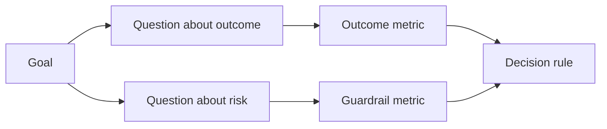

# 在结果出现之前设计成功指标

> 测量应为决策提供依据，而不是装点仪表盘。从目标出发，推导出问题，再选择能回答这些问题的最精简的一组指标。

**Type:** Learn + Build
**Languages:** Python (stdlib)
**Prerequisites:** 阶段 14 的第 47 和 51 课
**Time:** 约 70 分钟

## 学习目标

- 从预期结果（outcome）目标推导出问题和指标。
- 在观察结果之前，定义阈值、测量窗口、数据来源和比较方向。
- 为结果指标（outcome metric）配上安全护栏（guardrail）和制衡指标（counter-metric）。
- 让评估证据与所构建的方案需要支持的决策相匹配。

## 目标、问题、指标

从一个目标开始：

> 在不增加不安全操作的前提下，缩短识别受影响服务所需的时间。

推导出问题：

- 多快能识别出正确的服务？
- 识别出的服务有多大比例是正确的？
- 诊断过程是否仍然只读？
- 工作流（workflow）是否增加了告警忽略情况或操作人员的工作量？

然后选择指标，把这些问题转化为可测量的量。



## 指标需要契约

每个指标都需要：

| 字段 | 示例 |
|---|---|
| 名称 | `median_identification_seconds` |
| 比较方向 | 不超过 |
| 阈值 | 120 |
| 测量窗口 | 十次事件回放 |
| 数据来源 | 回放事件日志 |
| 总体（population） | 参与试点的值班工程师 |
| 类型 | 结果指标或安全护栏指标 |

没有数据来源和测量窗口，数值就无法复现。没有阈值，数值就无法驱动决策。

## 结果指标、安全护栏和制衡指标

- **结果指标：** 预期状态是否改善了？
- **安全护栏：** 固定约束是否仍然成立？
- **制衡指标：** 局部改善是否把成本或危害转移到了别处？

对于事件处理工作流，仅有速度还不够。还要衡量正确性、生产环境写入操作、操作人员的工作量和漏掉的告警，防止出现速度快却不安全的结果。

## 离线证据与在线证据

离线回放有助于重复验证并覆盖边界情况。范围受限的试点（bounded pilot）有助于了解真实行为、信任程度和对工作流的影响。两者不能相互替代。

使用成本最低、又能支持当前决策的证据。不要仅仅因为实现已经就绪，就让真实用户承担风险。

## 先作决定，再测量

在看到结果之前，就写好通过、失败以及尚无法明确判断这三种情况下的处理路径。否则，团队就会为保住所构建的方案而移动阈值。

示例：

- 通过：服务识别正确率至少为 0.9，且耗时中位数不超过 120 秒；
- 失败：出现任何生产环境写入操作，或正确率低于 0.75；
- 尚无法明确判断：改善幅度较小且方差较大，需要扩大回放集。

## 动手实现

本实验会校验测量计划，按包含等号的阈值条件进行评估，记录缺失值，并写入 `outputs/measurement-report.json`。

```bash
python3 code/main.py
python3 -m unittest discover code/tests -v
```

移除安全护栏指标，观察为什么即使结果指标仍在，计划也会变为无效。

## 练习

1. 从一个预期结果目标推导出三个问题。
2. 添加一个制衡指标，用来发现转移给其他角色的成本。
3. 为每个指标定义数据来源、总体和测量窗口。
4. 在生成数值之前，写好通过、失败以及尚无法明确判断时的决策。
5. 找出一个容易收集、却无法改变决策的指标，然后将它移除。

## 延伸阅读

- [Basili, Software Modeling and Measurement: The Goal/Question/Metric Paradigm](https://drum.lib.umd.edu/items/8119803a-362b-42ec-b6ce-2311713e7236)，介绍如何从明确的目标推导出可操作的测量方式。
- [Basili, Caldiera, and Rombach, The Goal Question Metric Approach](https://www.cs.toronto.edu/~sme/CSC444F/handouts/GQM-paper.pdf)，介绍如何将该方法应用为反馈与改进系统。

## 你将保留的成果

保留 `outputs/measurement-report.json`。它定义了原型、试点或生产阶段的证据门槛（evidence gate）。
