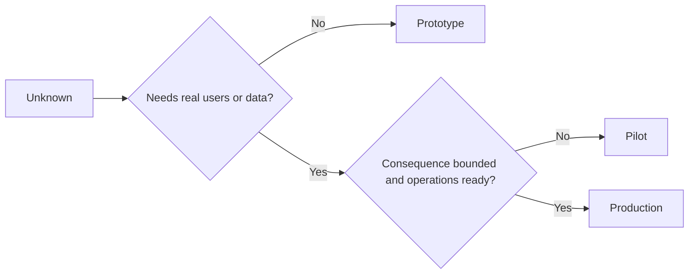

# 审慎选择原型、试点或生产阶段

> 这些是不同的学习与验证环境，并非打磨程度的高低之分。选择能解答当前未知问题、又尽量少带来不必要后果的阶段。

**Type:** Learn + Build
**Languages:** Python (stdlib)
**Prerequisites:** 第 14 阶段第 50 至 52 课
**Time:** ~70 分钟

## 学习目标

- 根据未知问题、受众、数据、后果和就绪程度，选择构建阶段。
- 为各阶段定义相应的控制措施和退出条件。
- 防止原型在不知不觉中变成生产系统。
- 在证据和运维条件足以支持之前，暂不赋予实际权限（authority）。

## 三个不同的问题

| 阶段 | 首要问题 |
|---|---|
| 原型（prototype） | 这一机制究竟能否产生所需证据？ |
| 试点（pilot） | 面对限定范围内的真实受众，在真实条件下能否安全运作？ |
| 生产阶段（production） | 我们能否持续为其负责，并达到所承诺的可靠性与风险水平？ |

一个原型即使在技术上已经完整实现，仍然可以是用后即弃的。试点可以使用生产数据，同时限制受众与权限范围。当组织接受持续承担责任时，生产阶段才真正开始。

## 原型

如果解答未知问题不需要真实用户或真实数据，就使用原型。让它具备以下特点：

- 可弃用；
- 保持隔离；
- 行为范围有限；
- 明确要验证的问题；
- 不作虚假的运维保证。

在这一机制证明值得进入下一阶段之前，不要急着优化架构。

## 试点

如果解答未知问题需要真实行为、贴近实际的数据或真实工作流（workflow），但后果或就绪程度尚不适合大范围发布，就采用试点。

试点需要：

- 明确指定的受众；
- 由人担任负责人；
- 受限的持续时间与权限范围；
- 审计与回滚；
- 结果与安全护栏（guardrail）的阈值；
- 用于决定扩大范围、修订或停止的退出条件。

## 生产阶段

进入生产阶段，需要的不只是部署：

- 服务等级目标（service level objective，SLO）；
- 值班与事件处置的责任归属；
- 安全与隐私审查；
- 成本与容量控制；
- 回滚与恢复；
- 持续监控；
- 退役路径。



## 阶段漂移

当原型代码获得了用户、数据或权限，却没有相应的责任归属时，它就会变得危险。应在配置、访问控制、遥测和文档中明确原型与试点的边界。仅有警告横幅是不够的。

应当能从系统本身观察到它所处的阶段。

## 动手实现

本实验根据决策上下文选择阶段，返回所需控制措施，并写入 `outputs/stage-decisions.json`。

```bash
python3 code/main.py
python3 -m unittest discover code/tests -v
```

将试点示例改为后果较轻、运维已就绪的情况。解释还需要哪些额外证据，才能证明进入生产阶段是合理的。

## 练习

1. 按照学习与验证阶段，而非部署状态，对当前的三个项目进行分类。
2. 编写包含停止决定的试点退出条件。
3. 添加一项技术控制措施，防止原型访问生产数据。
4. 找出使所构建的系统进入生产阶段的第一项运维责任。
5. 为范围受限的试点设计一份回滚凭据。

## 延伸阅读

- [Barry Boehm, A Spiral Model of Software Development and Enhancement](https://dl.acm.org/doi/10.1145/12944.12948)，用于了解如何让每次迭代的投入与已化解的风险相匹配。
- [Fagerholm et al., Building Blocks for Continuous Experimentation](https://doi.org/10.1145/2601248.2601276)，用于了解持续开展实验所需的组织与技术条件。

## 留下的成果

保留 `outputs/stage-decisions.json`。它记录了选择各个阶段的理由，以及进入下一阶段前必须具备的控制措施。
