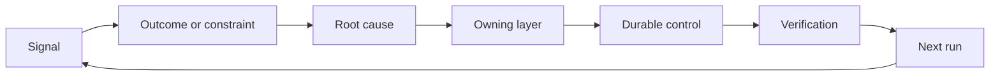

# 构建明确责任归属和停用机制的反馈棘轮

> 交付让一轮构建结束，也开启了学习循环。证据必须推动系统改变，否则就会沦为无人负责的遥测数据。

**Type:** Learn + Build
**Languages:** Python (stdlib)
**Prerequisites:** 阶段 14 第 46 课和第 53 课
**Time:** 约 75 分钟

## 学习目标

- 将事件（incident）、评估（evaluation）、用户行为和纠正意见转化为有明确负责方的行动。
- 将每个信号（signal）分流到上下文（context）、评估、策略（policy）、运行时（runtime）或待办清单（backlog）。
- 根据严重程度和发生频率，确定防止问题复发的优先级。
- 为每项控制措施（control）设定停用条件（retirement condition）。

## 反馈就是基础设施

团队可以收集行为轨迹（trace）、评估结果、支持工单和事件日志，却没有从中学到任何东西。缺失的是将观察提升为系统改进的机制（promotion）：通过一条明确的路径，把观察转化为有负责方、有验证证据的持久变更。

这个循环包括：

1. 观察一个具体信号；
2. 将它与结果、约束或假设联系起来；
3. 找出系统中最早能够负责解决问题根因的层次；
4. 作出范围受限的变更；
5. 验证问题再次发生的可能性是否降低；
6. 审查是否应继续保留该控制措施。

## 把信号分流到负责的系统层

| 信号 | 去向 |
|---|---|
| 误报、质量退步、错误结果 | 评估或测试 |
| 上下文缺失、重复工作、过时事实 | 上下文来源或检索路径 |
| 不安全的操作或权限缺口 | 策略或权限边界 |
| 超时、重试风暴、依赖不可用 | 运行时控制措施 |
| 新的产品需求或尚未解决的权衡 | 经梳理明确的待办项 |

在最早能够奏效的系统层处理问题根因。如果测试或权限控制能让某种故障根本不会发生，就不要再往提示词（prompt）里添一段话。



## 责任归属是控制措施的一部分

每项反馈棘轮改进行动（ratchet action）都需要：

- 一个负责方；
- 根据后果和复发情况确定的优先级；
- 要修改的产物（artifact）；
- 证明变更有效的验证；
- 审查或到期的时间窗口；
- 停用条件。

没有负责方的改进，不过是排版更漂亮的观察记录。

## 停用过时的控制措施

反馈系统会不断积累策略。这些策略可能相互矛盾，也可能带来高昂成本。出现以下情况时，应审查控制措施：

- 架构或工作流（workflow）发生变化；
- 较低层的不变条件（invariant）取代了较高层的指令；
- 在选定的窗口内，该措施所防范的故障一直没有出现；
- 该措施阻碍正常工作的次数比防止危害的次数还多。

停用也需要证据。不要仅仅因为觉得一项控制措施已经陈旧，就把它删除。

## 打通构建工作与编程智能体的反馈

同一套反馈棘轮机制服务于这两条路径：

- 产品证据会改变结果框架（outcome frame）、假设、工作范围或测量计划。
- 对编程智能体（agent）的纠正会改变测试、上下文、范围、自动化或交接（handoff）。
- 事件可能同时改变产品边界和智能体工作台（workbench）。

因此，对构建工作的梳理并不是一个在编码开始前就结束的阶段。每次接受变更时，这项工作都仍在继续。

## 动手实现

本实验对信号进行分类，生成有明确负责方的反馈改进行动，确定它们的优先级，并写入 `outputs/feedback-backlog.json`。

```bash
python3 code/main.py
python3 -m unittest discover code/tests -v
```

添加一个运行时超时信号，确认它被分流到运行时，而不是通用待办清单。

## 练习

1. 将一次事件和一条用户投诉转化为反馈改进行动。
2. 指出能够最早防止各个问题再次发生的系统层。
3. 为实验输出补充验证命令或观察结果。
4. 为一条策略规则定义停用条件。
5. 跟踪一条已接受的纠正意见，查看它如何反馈到下一次任务框架中。

## 延伸阅读

- [Basili, Caldiera, and Rombach, The Goal Question Metric Approach](https://www.cs.toronto.edu/~sme/CSC444F/handouts/GQM-paper.pdf)，介绍如何通过面向目标的测量促进组织学习。
- [Fagerholm et al., Building Blocks for Continuous Experimentation](https://doi.org/10.1145/2601248.2601276)，介绍将证据与持续产品开发相连的技术和组织循环。
- [Nuseibeh and Easterbrook, Requirements Engineering: A Roadmap](https://www.cs.toronto.edu/~sme/papers/2000/ICSE2000.pdf)，介绍如何看待需求在系统整个生命周期中的演进。

## 最终保留的成果

保留 `outputs/feedback-backlog.json`。它既是“产品判断与交付”（Product Judgment and Delivery）学习路径的收尾产物，也是下一次结果框架的输入。
