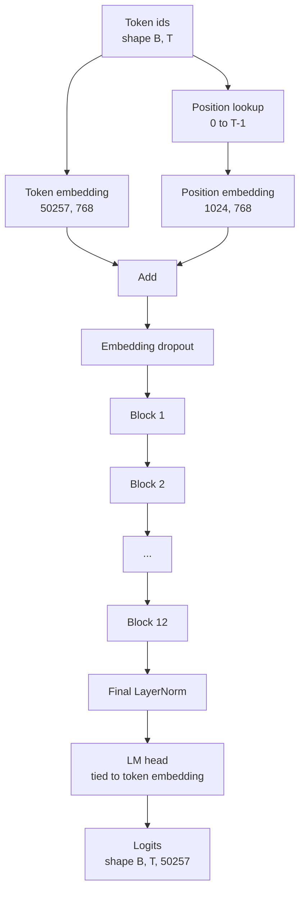
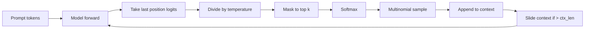

# 组装 GPT 模型

> 堆叠十二个块，再加上 token（词元，即模型处理文本的单位）嵌入（embedding）、一个可学习的位置嵌入、最后的 LayerNorm，以及一个共享权重的语言模型输出头，这就是整个拥有 124 million（百万）个参数的 GPT 模型。本课会将这些组件组装成一个可用的类，统计参数量以确认模型结构与 124M 参考模型一致，并通过多项式采样、温度参数和 top-k 生成文本。

**Type:** Build
**Languages:** Python
**Prerequisites:** 阶段 19，第 30 至 34 课
**Time:** ~90 分钟

## 学习目标

- 将第 34 课的 Transformer 块组装成完整的 GPT 模型：token 嵌入、位置嵌入、N 个块、最后的 LayerNorm，以及语言模型输出头。
- 复现拥有 124 million 个参数的配置：词表大小为 50257，上下文长度为 1024，嵌入维度为 768，十二个注意力头，十二层。
- 将语言模型输出头的权重与 token 嵌入绑定，并解释为什么在这一规模下可节省 ~38 million 个参数。
- 根据提示词（prompt）使用多项式采样、温度缩放和 top-k 截断生成文本，并利用滑动窗口控制上下文长度。
- 以 124M 为目标，衡量参数量与前向传播的计算开销。

## 要解决的问题

单个 Transformer 块无法独立发挥作用。你需要将 token ID 转换为向量，融入位置信息，使其通过堆叠的块，再投影回词表上的 logits（未经归一化的分数）。漏掉这四步中的任何一步，模型就可能无法执行前向传播、丢失准确的位置信息，或无法输出文本。

模型的结构也很重要。参考模型 GPT-2 small 采用的正是上述配置，参数量为 124 million。这些数字并不神秘。词表大小 50257 乘以嵌入维度 768，就是 token 嵌入表。位置数 1024 乘以 768，就是位置嵌入表。十二个块，每块约有 7 million 个参数，总计 84 million。最后的输出头通过权重共享复用 token 嵌入表。把各部分加起来，就得到 124 million。如果构建的模型参数量与参考模型不符，就说明组件连接可能有误。

## 核心概念



token ID 转换成 token 向量，位置 ID 转换成位置向量。两者相加后送入堆叠的块。最后的 LayerNorm 是位于这些块之外、在所有现代变体中都保留下来的组件。语言模型输出头（LM head）复用 token 嵌入矩阵，这就是权重共享的含义。

### 权重共享

token 嵌入的形状为 `(vocab, d_model)`。语言模型输出头需要将 `d_model` 投影回 `vocab`。这两个映射互为转置。将两者绑定，就是让同一个参数张量真正被使用两次。当 vocab 为 50257、d_model 为 768 时，该矩阵包含 38 million 个参数。不共享权重，就要为它支付两份开销；共享权重，就只需一份开销。由于嵌入层和输出头会同步更新，梯度信号也会稍微更清晰。

### 位置嵌入通过学习获得，而非使用正弦函数

GPT-2 采用可学习的位置嵌入。位置表是形状为 `(1024, 768)` 的单个参数张量。每次前向传播时，模型都会查询位置 0 到 T-1 的嵌入，并将查询结果加到 token 嵌入上。这是最简单的位置编码方案（其他方案包括 RoPE、ALiBi 和 T5 相对位置偏置），也是 124M 参考模型所使用的方案。

### 生成：温度、top-k 与多项式采样

生成采用自回归方式。每一步，模型都会返回每个位置上覆盖整个词表的 logits。只取最后一个位置的 logits，除以温度；也可以选择将前 k 大之外的所有 logits 都屏蔽为负无穷，再用 softmax 得到概率，最后从所得分布中采样一个 token。



三个调节项，对应三种不同的行为。温度接近零时，会趋于贪心选择。温度为一时，保持模型原本的分布。Top-k 为一时，就是贪心选择。Top-k 为四十时，会滤除长尾。这些参数的组合很重要；下一课讲训练时，会把生成结果作为定性评估信号。

```figure
cc-gpt-assembly
```

## 动手实现

`code/main.py` 实现了以下内容：

- `class GPTConfig` 数据类，用于保存 124M 的默认配置：`vocab_size=50257`、`context_length=1024`、`d_model=768`、`num_heads=12`、`num_layers=12`、`mlp_expansion=4`、`dropout=0.1`、`use_bias=True`、`weight_tying=True`。
- `class GPTModel` 模型类，包含 token 嵌入、位置嵌入、嵌入层 dropout、十二个 `TransformerBlock`、最后的 LayerNorm，以及一个 `lm_head`；相应标志开启时，该输出头与 token 嵌入共享权重。
- 一个 `count_parameters` 辅助函数，返回去重后的参数量，因此统计结果会正确计入权重共享的影响。
- 一个 `generate` 函数，实现温度、top-k、多项式采样和滑动窗口上下文。
- 一个演示程序，构建模型，打印参数量并与 124M 参考值并列展示，再根据固定提示词生成一小段序列，展示完整流程。

运行：

```bash
python3 code/main.py
```

输出包括：与 124M 参考值并列显示的参数量、从随机提示词生成的 token ID，以及开启权重共享时语言模型输出头和 token 嵌入是否共用存储空间的确认结果。

为了让演示快速运行，脚本还会用一个微型配置（`d_model=64`、`num_layers=2`）跑通完整流程，并直接打印生成的 token 序列。对于 124M 配置，脚本会构建模型，但只统计参数量并执行一次前向传播。

## 技术栈

- 使用 `torch` 进行张量计算、自动微分和模块组装。
- `code/main.py` 在本地重新实现了第 34 课的块结构。

## 生产环境中的实践模式

下面三种做法，决定了模型只是能运行，还是能真正交付使用。

**将残差投影初始化为较小的值。** 注意力的输出投影和 MLP 的第二个线性层都会直接参与残差相加。如果用与其他线性层相同的标准差初始化它们，残差流的幅值就会随深度增长，使最后的 LayerNorm 进入数值偏大的工作区间。将这两个投影的标准差乘以 `1 / sqrt(2 * num_layers)`，残差流就能在经过十二层时始终保持在合理范围内。

**缓存位置 ID 张量，不要重复计算。** `torch.arange(T)` 在每次前向传播时都会分配新的内存。在 `__init__` 中按最大上下文长度分配一次，每次调用时切出前 T 项，即可省去反复调用内存分配器的开销。

**在参数层面共享权重，而不是仅仅复制数值。** 设置 `lm_head.weight = token_embedding.weight` 会共享张量；复制则不会。优化器应只更新一个参数，自动微分图也应只进行一次梯度累积。如果只是复制，输出头就会逐渐偏离嵌入层，权重共享也就失去了意义。

## 实际使用

- 本课模型类的结构，与下一课要训练的模型相同。
- 将可学习的位置嵌入替换为 RoPE，就能得到 LLaMA 系列模型，无需改动块或输出头。
- 将 GELU 替换为 SiLU、将 LayerNorm 替换为 RMSNorm，就能完成 LLaMA 系列的其余改动。
- 生成函数适用于任何来源的 logits，不仅限于本课模型。你可以在第 37 课中从预训练 GPT-2 文件获取 logits，并复用同一个生成循环。

## 练习

1. 解除语言模型输出头与 token 嵌入之间的权重共享，重新统计参数量。验证增量为 50257 乘以 768 = 38 million。
2. 将可学习的位置嵌入替换为在构造时计算的正弦位置表。确认模型仍能执行前向传播，且参数量减少 786,432。
3. 为生成函数添加 `greedy=True` 标志，跳过采样，直接选择 argmax。确认多次运行生成的序列一致。
4. 添加一个 `repetition_penalty` 调节项，在 softmax 之前，将提示词或已生成历史中出现过的任意 token 的 logit 除以一个常数。用固定提示词展示：该值大于一时，输出中的重复次数会减少。
5. 在 `top_k` 之外添加 `top_p`（核采样）选项。用两行代码检查保留 token 的概率之和是否超过 `top_p`。

## 关键术语

| 术语 | 常见说法 | 实际含义 |
|------|-----------------|------------------------|
| 权重共享 | “绑定嵌入” | 语言模型输出头与 token 嵌入共享同一个参数张量；节省 vocab 乘以 d_model 个参数，并与 GPT-2 参考模型保持一致 |
| 位置嵌入 | “学习得到的位置表示” | 一个形状为 (context length, d_model) 的独立表，与 token 向量相加；通过端到端训练学习得到 |
| 滑动窗口上下文 | “上下文上限” | 当提示词与已生成 token 的总长度超过上下文长度时，丢弃最早的 token，使当前窗口不超出限制 |
| Top-k 采样 | “K 截断” | 保留数值最大的 K 个 logits，将其余值屏蔽为负无穷，再对保留部分执行 softmax |
| 温度 | “采样温度” | 在 softmax 之前将 logits 除以 T；T 小于 1 时分布变尖锐，T 等于 1 时保持原本的分布，T 大于 1 时分布变平坦 |

## 延伸阅读

- 阶段 19 第 34 课：介绍本模型所堆叠的块。
- 阶段 19 第 36 课：介绍使用交叉熵损失训练本模型的训练循环。
- 阶段 19 第 37 课：介绍如何将预训练 GPT-2 权重加载到这一完全相同的架构中。
- 阶段 7 第 07 课（GPT 因果语言建模）：介绍下一个 token 预测的数学原理。
- 阶段 10 第 04 课（预训练微型 GPT）：介绍同一架构上的原始训练流程。
