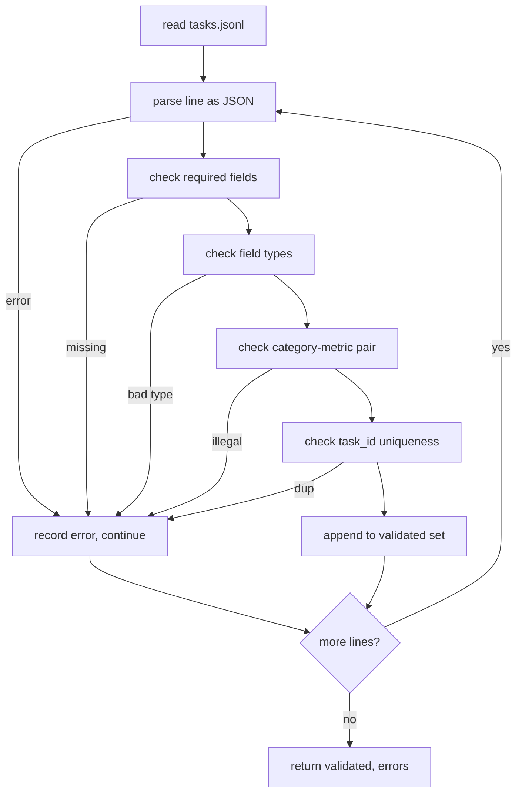

# 任务规范格式

> 评测框架的质量，取决于其任务所遵守的契约。在编写任何评分函数之前，先固定 JSONL 的结构和指标名称集合。

**Type:** Build
**Languages:** Python
**Prerequisites:** 阶段 19 路线 B 基础内容
**Time:** ~90 分钟

## 学习目标

- 定义 JSONL 任务记录的 schema（结构定义），用同一种结构涵盖算术、选择题、代码执行、分类和自由文本摘要任务。
- 固定一组封闭的指标名称，让后续课程（71-73）可以根据单个字段分派处理。
- 将少样本示例和后处理规则定义为任务的一部分，而非运行器的一部分，从而让同一个提示词（prompt）在不同模型下对应同一个目标。
- 实现严格的验证器，在格式有误的记录到达运行器之前将其拒绝。
- 交付一个包含 10 个任务的测试样例集，覆盖规范中的每个分支，让验证器有真实材料可供检验。

```figure
ci-task-spec-gate
```

## 为什么要固定规范

研究代码库积累评测脚本的速度，往往比积累测试的速度更快。六个月后，每个 notebook 都有自己的 JSON 结构，每个指标都被重复实现了两次，不同运行之间也无从比较。解决方法很朴素：选定一个 schema，编写验证器，拒绝其他所有不符合要求的内容。这就是本课要做的事。

这个结构借鉴了 BIG-bench、HELM 和 lm-eval 风格评测框架的思路，但字段名由我们自己定义。每个字段都只有一个负责处理它的组件。运行器读取任务，指标读取目标列表，后处理步骤对生成结果进行规范化。流水线运行过程中不允许修改任何字段。

## 记录结构

一个任务就是占据单行的 JSON 对象。评测框架读取 `tasks.jsonl`，逐行独立验证。某一行有误时，只中止该记录的处理，不中止整次运行。

```json
{
  "task_id": "arith_001",
  "category": "arithmetic",
  "prompt": "Compute the result. Question: 17 + 24\nAnswer:",
  "targets": ["41"],
  "metric_name": "exact_match",
  "few_shot_examples": [
    {"prompt": "Question: 2 + 2\nAnswer:", "completion": "4"}
  ],
  "post_process": "strip_whitespace",
  "metadata": {"difficulty": "easy"}
}
```

必填字段为 `task_id`、`category`、`prompt`、`targets`、`metric_name`、`post_process`。`few_shot_examples` 和 `metadata` 为可选字段。出现未知的顶层字段时，验证失败。

## 字段规则

`task_id` 是不含空白字符的字符串。验证器确保它在整个文件中唯一。

`category` 必须为 `arithmetic`、`mcq`、`code_exec`、`classification`、`summary` 之一。类别决定哪些指标与后处理规则的组合是合法的。`code_exec` 任务必须使用 `metric_name = code_exec`，而 `mcq` 任务必须使用 `metric_name = exact_match`，并与单个字母的目标进行比较。

`prompt` 是非空字符串。验证器禁止尾随空白字符，并拒绝提示词正文中已经包含少样本示例块的记录。少样本示例由运行器负责拼接，而不是由任务作者直接写入提示词。

`targets` 是非空的字符串列表。对于 `exact_match`，匹配其中任意一个元素即算匹配成功。对于 `f1` 和 `rouge_l`，取分数最高的目标。对于 `mcq`，列表恰好包含一个元素。

`metric_name` 必须为 `exact_match`、`f1`、`bleu_4`、`rouge_l`、`accuracy`、`code_exec` 之一。这个名称集合是封闭的。新增指标需要新增一课，并在这里添加一个条目。

`few_shot_examples` 是由 `{prompt, completion}` 对组成的列表。验证器将列表长度限制为最多八项，以控制提示词长度。

`post_process` 必须为 `none`、`strip_whitespace`、`lower`、`extract_letter`、`extract_code_block`、`extract_first_line` 之一。每条规则都只有一种确定的行为。验证器禁止组合使用多条规则。

## 验证器的行为



验证器返回两个列表：通过验证的记录，以及包含出错行、违反的规则和出错字段的错误记录。如果错误列表非空，运行器将拒绝启动，除非显式设置了 `--allow-bad-tasks` 标志。

## 少样本示例的拼接

运行器将少样本示例拼接在提示词之前，以空行分隔。所有模型都使用同一条代码路径，因此唯一的差异来源就是模型本身。作者只需编写一次示例，不必为每家提供商各写一遍。

```python
def render(task):
    parts = []
    for ex in task.get("few_shot_examples", []):
        parts.append(ex["prompt"] + " " + ex["completion"])
    parts.append(task["prompt"])
    return "\n\n".join(parts)
```

## 后处理规则

后处理步骤在生成之后、指标计算之前运行。它是确定性的，并且无状态。

- `none` 原样返回字符串。
- `strip_whitespace` 去除开头和结尾的空白字符。
- `lower` 将字符串转换为小写。
- `extract_letter` 返回第一个匹配 `[A-E]` 的字符，用于选择题。
- `extract_code_block` 返回第一个由三个反引号围起的代码块的正文，用于代码执行任务。
- `extract_first_line` 返回第一个非空行，用于摘要分类。

如果任务需要此列表之外的规则，就应该放入新的一课。

## 本课不涉及的内容

本课不评分、不调用模型，也不运行代码。这些内容将在第 71、72 和 75 课中介绍。本课固定的是它们共同遵守的契约。

包含 10 个任务的测试样例集涵盖两道算术题、两道选择题、两项代码执行任务、两项分类任务和两项摘要任务。全部 10 个任务都能通过验证。另一个独立的测试样例集（`tasks_bad.jsonl`）会触发每条规则，验证器返回的错误数量与之准确对应。

## 如何阅读代码

`main.py` 定义了 `TaskSpec`、`validate_task`、`validate_file` 和一个命令行接口（CLI）入口。测试样例加载器是 `load_fixtures`。拼接和后处理辅助函数与验证逻辑放在一起，因此第 75 课的运行器只需导入一个模块。

从头到尾阅读 `main.py`，然后阅读 `code/tests/test_spec.py`。测试固定了每条验证规则和每种后处理行为。`main.py` 底部的演示会验证随附的测试样例集，并打印摘要。

## 进一步探索

真实评测套件增加类别，就像 schema 增加列一样。稳妥的做法是：除非同时增加一个指标、一条后处理规则以及至少一个测试样例任务，否则不添加类别。像对待数据库迁移一样对待这份规范。每次变更都要经过审查、纳入版本管理，并配套测试。本课的验证器就是把关环节。
